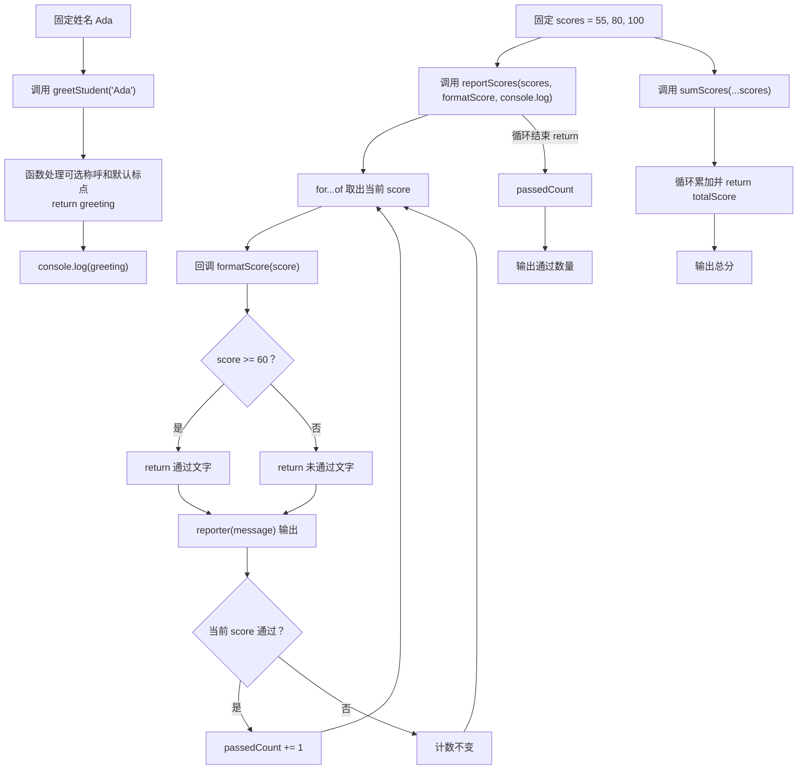

# DAY12 · Practice 01：函数类型、箭头函数与回调

[返回当天课程](../README.md)

## 文件位置

- 作答文件：[practice.ts](../../../day12/practice01/practice.ts)
- 完整参考答案：[solution.ts](../../../day12/practice01/solution.ts)
- 方案说明：[SOLUTION.md](./SOLUTION.md)

## 场景背景

你正在为助教制作一份学生成绩报告。系统提供学生姓名和一组分数，还允许调用方决定怎样格式化成绩、怎样展示每一行。你需要交付问候语、逐项反馈、总分和通过数量，使计算逻辑以后也能复用于其他展示方式。

这是一道完整、独立的主练习。不要导入其他 practice 文件夹中的代码。

## 数据流

先沿变量名看数据怎样分叉和汇合；`──>` 表示值被交给下一步。

```text
scores
   ├── sumScores(...scores) ──> 总分
   └── reportScores(scores, formatter, reporter)
          └── 每个 score ──> formatScore 回调 ──> 格式文字
                                                   └── reporter 回调 ──> 逐行输出
studentName + 默认标点 ──> greetStudent ──> 问候输出
```

## 代码流程图



## 起始代码

下面提前给出类型、固定分数、函数签名、调用位置和输出位置。你需要完成条件判断、循环、回调内容和所有 `return`。

```ts
type ScoreFormatter = (score: number) => string;
type Reporter = (message: string) => void;

const formatScore: ScoreFormatter = (score) => {
  throw new Error("TODO：判断是否达到 60 分，并 return 对应文字");
};

function greetStudent(name: string, title?: string, punctuation = "!"): string {
  throw new Error("TODO：处理缺席称呼并 return 问候语");
}

function sumScores(...scores: number[]): number {
  throw new Error("TODO：用循环累加并 return 总分");
}

function reportScores(
  scores: readonly number[],
  formatter: ScoreFormatter,
  reporter: Reporter,
): number {
  throw new Error("TODO：循环执行 formatter 和 reporter，统计通过数量并 return");
}

const scores = [55, 80, 100] as const;
const greeting = greetStudent("Ada");
console.log(greeting);
const passedCount = reportScores(scores, formatScore, console.log);
const totalScore = sumScores(...scores);
console.log(`总分：${totalScore}`);
console.log(`通过数量：${passedCount}`);
```

请在 `practice.ts` 中从头编写“学生成绩报告器”。

必须创建：

- `ScoreFormatter`：接收 `number`、返回 `string` 的函数类型。
- `Reporter`：接收 `string`、返回 `void` 的函数类型。
- `formatScore`：符合 `ScoreFormatter` 的箭头函数；60 分及以上返回“成绩：分数（通过）”，否则返回“成绩：分数（未通过）”。
- `greetStudent(name, title?, punctuation = "!")`：缺少称呼时使用“同学”。
- `sumScores(...scores)`：返回所有分数之和。
- `reportScores(scores, formatter, reporter)`：逐项调用回调，并返回及格数量。
- 固定数组 `scores`，内容为 `55、80、100`。

> **先看清输出标点：** 代码语法中的函数括号 `()` 和类型冒号 `:` 必须使用英文半角符号。下面 `成绩：55（未通过）` 中的 `：`、`（ ）` 是输出文字使用的中文全角标点。运行器不会因这些显示标点的全半角差异判你失败，但其他文字、数字和顺序仍要一致。

用 `console.log` 作为 `Reporter`，精确输出：

~~~text
你好，Ada同学!
成绩：55（未通过）
成绩：80（通过）
成绩：100（通过）
总分：235
通过数量：2
~~~

限制：

- 不得使用 `any` 或类型断言。
- `formatScore` 必须写花括号并明确 `return`。
- `reportScores` 不能把输出写死；它必须调用收到的 `formatter` 和 `reporter`。
- `sumScores` 必须使用 rest 参数，`reportScores` 的数组参数必须是只读数组。
- `console.log` 只负责展示，计算函数必须用 `return` 交付结果。

完成标准：右键运行后显示 PASS；能分别解释可选参数、默认参数、rest 参数与 `void`。

## 本题易漏语法

函数类型中的 => 描述返回类型；箭头函数值中的 => 后面是实现。? 表示可选参数，...args 收集剩余实参。

## 写完后自检

- 把分数改成 `59、60` 后，两条反馈和通过数量分别会怎样变化？先预测再运行。
- 如果调用 `greetStudent("Ada", undefined, "?")`，哪个参数使用回退值，哪个参数使用显式传入值？
- 为什么 `reportScores` 要接收 `formatter` 和 `reporter`，而不是在函数内部固定拼接文字并直接 `console.log`？

## 文件

- 在 `practice.ts` 中独立作答。
- 完成并运行通过后，再查看 `solution.ts` 的完整参考答案与 `SOLUTION.md` 的调用说明。
