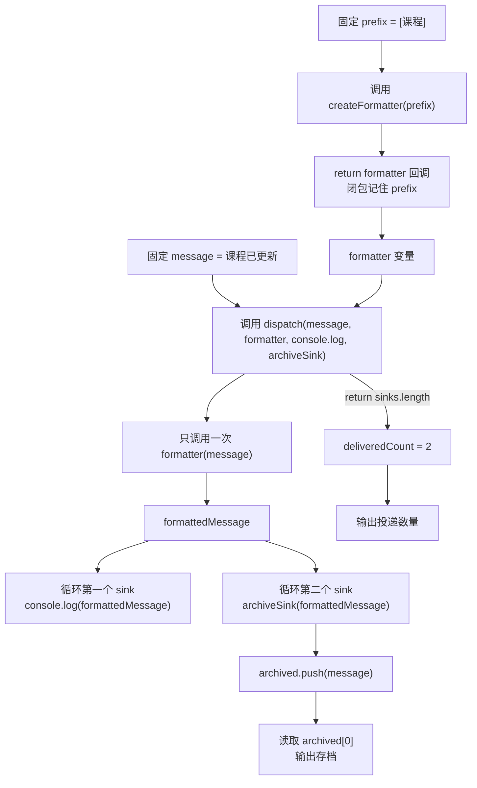

# DAY12 · Practice 02：消息格式化与多路投递

[返回当天课程](../README.md)

## 文件位置

- 作答文件：[practice.ts](../../../day12/practice02/practice.ts)
- 完整参考答案：[solution.ts](../../../day12/practice02/solution.ts)
- 方案说明：[SOLUTION.md](./SOLUTION.md)

## 场景背景

课程后台产生一条“课程已更新”消息，需要同时交给终端和内存存档。消息前缀由创建格式器时决定，投递函数不应该知道每个接收方具体做什么。它只负责把同一条格式化结果交给收到的所有回调，并报告投递了几路。

## 和 Practice 01 的区别

Practice 01 遍历分数，由格式回调和单个报告回调共同处理数据。本题由函数返回另一个格式函数，并通过 rest 参数一次接收多个 `void` 接收方；格式化只做一次，结果会分叉到终端与存档。

## 关联复习

存档数组会用到 Day06 的追加操作，回调数据流则延续 Day07 对“当前项进入函数”的追踪方法。这次还要区分格式器的返回值和 sink 的副作用。

## 数据流

先沿变量名看数据怎样分叉和汇合；`──>` 表示值被交给下一步。

```text
prefix ──> createFormatter ──> formatter 闭包
message + formatter ──> dispatch ──> formattedMessage
                                     ├── console.log sink ──> 终端
                                     └── archiveSink ──> archived[]
sinks.length ──> 投递数量
archived[0] ──> 存档输出
```

## 代码流程图



## 起始代码

固定消息、函数签名、两个 sink、调用和输出已经提供。你需要完成返回 formatter 的回调、`dispatch` 中的循环与 `return`，以及 `archiveSink` 的回调内容。

```ts
type MessageFormatter = (message: string) => string;
type MessageSink = (message: string) => void;

function createFormatter(prefix = "[系统]"): MessageFormatter {
  throw new Error("TODO：return 一个使用 prefix 的 formatter 回调");
}

function dispatch(
  message: string,
  formatter: MessageFormatter,
  ...sinks: MessageSink[]
): number {
  throw new Error("TODO：格式化一次，循环执行每个 sink，再 return 实际数量");
}

const archived: string[] = [];
const archiveSink: MessageSink = (message) => {
  // TODO：把 message 加入 archived。
};

const formatter = createFormatter("[课程]");
const deliveredCount = dispatch(
  "课程已更新",
  formatter,
  console.log,
  archiveSink,
);
console.log(`投递数量：${deliveredCount}`);
console.log(`存档：${archived[0]}`);
```

## 要完成的功能

- `MessageFormatter`：接收 `string`，返回 `string`。
- `MessageSink`：接收 `string`，返回 `void`。
- `createFormatter(prefix = "[系统]"): MessageFormatter`：返回一个箭头函数；该函数使用创建时的 `prefix` 格式化之后收到的消息。
- `dispatch(message, formatter, ...sinks): number`：只格式化一次，再把同一结果交给每个 sink，返回实际调用的 sink 数量。
- `archived: string[]` 与 `archiveSink`：接收消息后把它加入存档数组。
- 使用前缀 `[课程]`、消息 `课程已更新`，并把 `console.log` 和 `archiveSink` 一起交给 `dispatch`。

## 约束

- 不得导入 `practice01` 或直接调用其他练习的实现。
- 不得使用 `any` 或类型断言。
- `dispatch` 必须用 rest 参数接收接收方，不能把两个 sink 写死在函数内部。
- formatter 每次 dispatch 只能调用一次；两个 sink 必须收到相同字符串。
- `MessageSink` 的 `void` 表示调用方不依赖它的返回结果，投递数量由 `dispatch` 自己计算。
- 输出必须由变量、计算或函数返回值产生，不把整行结果写死。
- 每个参数、局部变量和返回值都应能在流程图中找到位置。

## 精确期望输出

```text
[课程] 课程已更新
投递数量：2
存档：[课程] 课程已更新
```

完成标准：右键运行显示 PASS；formatter 每次投递只执行一次，两个 sink 收到同一字符串，返回数量来自实际 sink 个数。

## 写完后自检

- 只传 `archiveSink` 而不传 `console.log` 时，投递数量和终端输出会怎样变化？
- 不传 prefix 调用 `createFormatter()` 时，闭包以后格式化消息会使用哪个值？
- 为什么 `dispatch` 应把同一条 `formattedMessage` 交给所有 sink，而不是为每个 sink 重复调用 formatter？

## 文件

在上方链接的 `practice.ts` 作答；独立完成后再查看 `solution.ts` 的完整参考答案。
