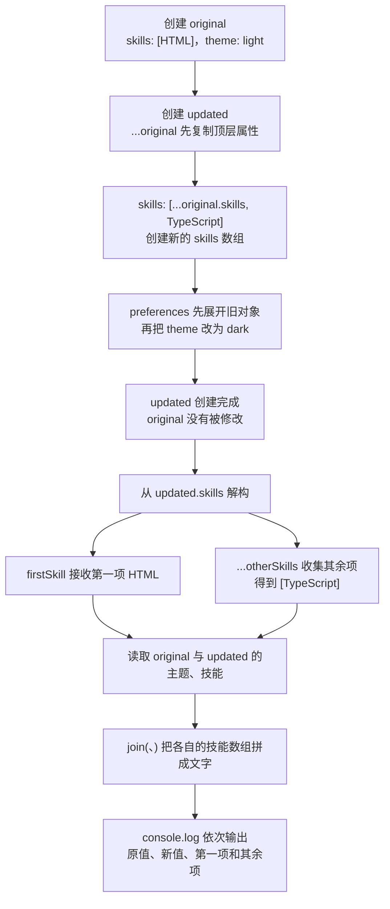

# Day 13：解构、spread、rest 与不可变更新

预计用时：75–90 分钟。

今天处理两件事：从对象或数组中拿出需要的值，以及根据旧数据做出一个新版本。新版本做好后，旧版本仍保持原样，这叫不可变更新。

先分清 `const`：它不允许变量改为指向另一个对象，但普通对象里面的字段仍然可能被修改。要保护旧数据，不能只靠 `const`，还要在更新时创建新的对象或数组。

## 核心讲解

已有对象或数组时，可以在赋值左侧照着它的结构写变量名，把需要的部分取出来，这叫解构：

~~~ts
const { title } = course;
const [first, ...remaining] = topics;
~~~

第一行把 `course.title` 取出并放进变量 `title`。第二行把数组第一个元素放进 `first`，剩下的元素收进新数组 `remaining`。这里的 `...remaining` 是“把剩余值收起来”（rest）。

三个点写在创建新对象或新数组的位置时，意思相反：把旧容器里的内容展开，放进新容器。这叫 spread：

~~~ts
const newTopics = [...topics, "泛型"];
const renamed = { ...course, title: "TypeScript 入门" };
~~~

判断三个点是 rest 还是 spread，可以看它出现的位置：

| 出现的位置 | 三个点在做什么 | 得到什么 |
| --- | --- | --- |
| 解构赋值左侧 | 收集没有单独取出的剩余值（rest） | 一个剩余值数组或对象 |
| 新对象或新数组内部 | 展开旧内容（spread） | 包含旧内容的新容器 |

spread 只新建当前这一层。假设 `profile` 里面还有 `preferences` 对象，只展开 `profile` 时，新旧两个外层对象仍会指向同一个 `preferences`。因此，要修改 `preferences.theme`，外层和 `preferences` 这一层都要分别创建新对象：

~~~ts
const updated = {
  ...profile,
  preferences: {
    ...profile.preferences,
    theme: "dark",
  },
};
~~~

更新完成后，新旧数据的关系是：外层对象不同，`preferences` 也不同；没有改动的字段可以继续复用旧值。这样读取旧 `profile` 时仍能看到原来的主题，读取 `updated` 时才看到 `"dark"`。

数组里只更新某一项时，通常让 `map` 逐项检查：当前项是目标，就 `return` 一个新对象；不是目标，就 `return` 当前原项。`map` 会把每次 `return` 的结果组成新数组。忘记 `return` 时，新数组对应位置会变成 `undefined`。

`readonly` 只让 TypeScript 在编写代码时阻止修改；`as const` 也不会在程序运行时自动把嵌套数据全部冻结。

## 为什么要这样设计

对象和数组会被多个变量共同引用。直接修改其中一处时，其他地方看到的内容也会悄悄变化，排查“是谁改了旧数据”会很困难。解构让读取重点更清楚，spread 则帮助你从旧值创建一个新版本，让新旧版本可以同时存在。

语言负责按位置或属性取值，并把旧容器的内容展开到新容器。你仍要决定哪些字段要改、变化经过了哪几层对象或数组，以及每一层是否都要创建新容器；只写一层 spread 不会自动复制所有嵌套内容。

不可变更新会多创建对象和数组，也可能增加代码长度。它适合需要保留历史版本、比较新旧引用或避免共享修改的场景；数据很大或更新非常频繁时，还要考虑复制成本和更合适的数据结构。

## 阅读示例

打开并右键运行 `example.ts`。先找出原对象，再找出每个新对象是在哪一行创建的。运行后比较输出：如果原对象和新对象能同时保留不同的主题，说明更新过程没有回头修改旧对象。

## 数据更新追踪

按下面的顺序看一次更新：

1. `profile` 保存旧版本。
2. `{ ...profile }` 创建新的外层对象，并把旧字段复制进来。
3. `{ ...profile.preferences }` 再创建新的内层设置对象。
4. `theme: "dark"` 只覆盖新设置对象里的主题。
5. 新对象交给 `updated`；`profile` 仍指向旧版本。

看到嵌套更新时，从真正要改的字段往外走：字段在哪几层容器里，就要沿这条路径逐层创建新容器。

## Example 实际输出

运行 `example.ts` 后，终端会按下面的顺序显示。先用代码推测结果，再逐行对照：

```text
原主题：light
新主题：dark
原技能：HTML
新技能：HTML、TypeScript
第一项：HTML
其余：TypeScript
```

## Example 代码流程图

运行 `example.ts` 前先沿图预测执行顺序；运行后再把每个节点对应到代码行。



## 官方手册扩展阅读（可选）

完成当天教程后，可从 [Day 13 对应阅读](../OFFICIAL-READING.md#day-13) 中只选 1 篇继续看。它不是练习前置，不需要在写 Practice 前读完。

## 独立练习导航

本日共有 2 道独立练习。每道题都有单独目录、说明、作答文件和解题结构；题目之间不共享代码。

| 目录 | 场景 | 类型 |
| --- | --- | --- |
| [practice01](./practice01/README.md) | 解构、spread、rest 与不可变更新 | 主任务 |
| [practice02](./practice02/README.md) | 购物车的更新、删除与不变分支 | 闭卷迁移 |

右击任意练习目录中的 `practice.ts` 即可单独检查；命令行也可运行 `npm run beginner -- day13 practice02`。

## 容易出错的地方

- 写 `const updated = original`，两个名称仍指向同一对象。
- 只 spread 外层，随后修改共享的 `preferences`。
- 使用 `map` 却忘记返回值。
- 直接修改原数组元素或调用 `push`。
- 误以为 `readonly` 或 `as const` 会在运行时深度冻结。

### 错误代码示例

```ts
const updated = { ...original };
updated.preferences.theme = "dark";
// ❌ spread 只复制外层；两个对象仍共享 preferences，original 也被改了。
```

### 正确写法

```ts
const updated = {
  ...original,
  preferences: {
    ...original.preferences,
    theme: "dark", // ✅ 沿着要修改的路径逐层创建新对象。
  },
};
```

## 面试时怎么回答

**问：对象 spread 是深复制吗，为什么顺序还会影响结果？**

**答：**spread 解决的是快速创建一层新容器，它只复制当前层的属性值。嵌套对象仍可能是同一个引用，因此不是深复制。属性从左到右写入，同名属性以后出现的值覆盖以前的值：

```ts
const next = { ...profile, name: "Ada Lin" }; // 新 name 覆盖旧 name
const wrong = { name: "Ada Lin", ...profile }; // 旧 name 又把新值覆盖
```

语言负责展开和覆盖，开发者仍要判断真正修改的路径，并为那条路径上的每一层创建新容器。复制会增加对象分配，数据很大时也要考虑成本。

**问：`readonly` 是否会把对象彻底冻结？**

**答：**不会。属性上的 `readonly` 和 `Readonly<T>` 主要在编译阶段阻止重新赋值，而且默认只约束当前层；嵌套对象内部仍可能可写。即使 `as const` 能得到更深的只读字面量类型，也不会在运行时自动调用 `Object.freeze`。

**容易答错或追问：**不要把类型检查当成运行时保护；外部 JavaScript、断言或共享引用仍可能改变真实对象。

## 拓展思考（不要求写代码）

如果每个任务内部又有一个 `history` 数组，要给第二项任务追加历史记录且保留所有旧数据，哪些层级必须创建新容器，哪些未改变的值可以安全复用？
