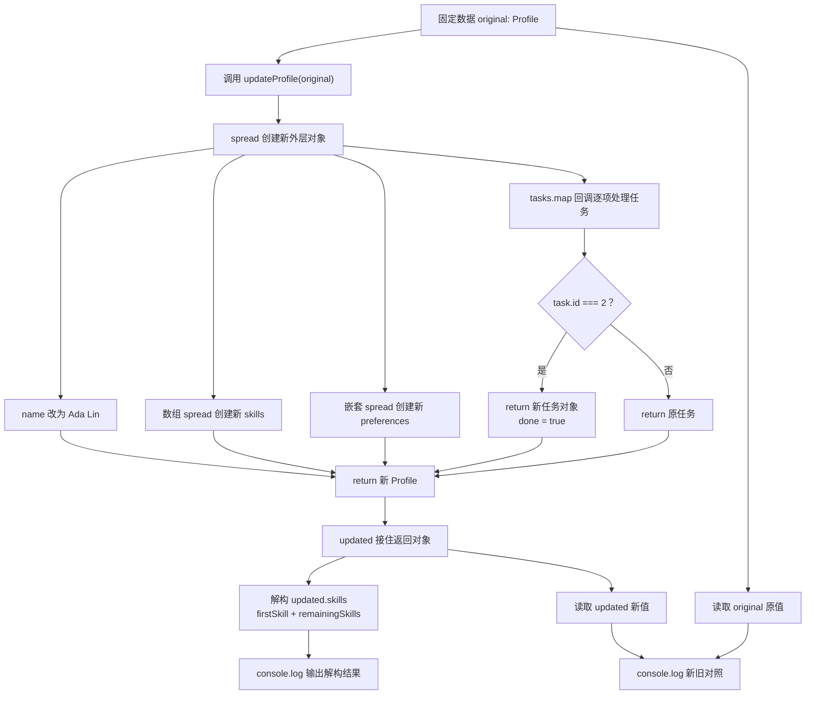

# DAY13 · Practice 01：解构、spread、rest 与不可变更新

[返回当天课程](../README.md)

## 文件位置

- 作答文件：[practice.ts](../../../day13/practice01/practice.ts)
- 完整参考答案：[solution.ts](../../../day13/practice01/solution.ts)
- 方案说明：[SOLUTION.md](./SOLUTION.md)

## 场景背景

你正在实现学习平台的个人资料编辑功能，旧资料还要保留给取消修改和历史对比使用。输入是一份包含姓名、技能、偏好和任务的原始资料，用户会同时修改多个层级。你需要生成一份全新的更新结果，并用旧值与新值的对比证明原始资料没有被连带改变。

这是一道完整、独立的主练习。不要导入其他 practice 文件夹中的代码。

## 数据流

先沿变量名看数据怎样分叉和汇合；`──>` 表示值被交给下一步。

```text
original ───────────────────────────────┐
patch ──> updateProfile ──> spread 合并 ──> updated
   │                                      │
   └── 只覆盖传入字段                     └── 新对象

original + updated ──> 对照输出（原对象不变）
```

## 代码流程图



## 起始代码

类型、原始资料、函数签名、调用和对照输出已经准备好。你只需要完成不可变更新中的 spread、`map` 回调、判断和 `return`。

```ts
type Profile = {
  readonly id: number;
  name: string;
  skills: readonly string[];
  preferences: { theme: "light" | "dark"; notifications: boolean };
  tasks: readonly { id: number; title: string; done: boolean }[];
};

const original: Profile = {
  id: 1,
  name: "Ada",
  skills: ["HTML", "CSS"],
  preferences: { theme: "light", notifications: true },
  tasks: [
    { id: 1, title: "复习变量", done: false },
    { id: 2, title: "练习对象", done: false },
  ],
};

function updateProfile(profile: Profile): Profile {
  throw new Error("TODO：创建新外层和嵌套对象；用 map 判断 id 并 return 每项任务");
}

const updated = updateProfile(original);
const [firstSkill, ...remainingSkills] = updated.skills;
console.log(`原姓名：${original.name}`);
console.log(`新姓名：${updated.name}`);
console.log(`原主题：${original.preferences.theme}`);
console.log(`新主题：${updated.preferences.theme}`);
console.log(`原技能：${original.skills.join("、")}`);
console.log(`新技能：${updated.skills.join("、")}`);
console.log(`第一项：${firstSkill}`);
console.log(`其余：${remainingSkills.join("、")}`);
console.log(`原状态：${original.tasks.map((task) => task.done).join(",")}`);
console.log(`新状态：${updated.tasks.map((task) => task.done).join(",")}`);
```

请在 `practice.ts` 中从头编写“学习资料不可变更新器”。

声明 `Profile`，包含：

- `readonly id: number`
- `name: string`
- `skills: readonly string[]`
- `preferences: { theme: "light" | "dark"; notifications: boolean }`
- `tasks: readonly { id: number; title: string; done: boolean }[]`

创建固定 `original`：

- id 为 1，name 为 `Ada`
- skills 为 `HTML、CSS`
- preferences 为 `light` 和 `true`
- 两项任务分别为 `复习变量`、`练习对象`，初始都未完成

实现 `updateProfile(profile: Profile): Profile`，返回 `updated`，要求：

- name 改为 `Ada Lin`
- skills 末尾加入 `TypeScript`
- theme 改为 `dark`，notifications 保持不变
- 只把 id 为 2 的任务改为完成
- 任何层级都不得修改 `original`

再从 `updated.skills` 解构出 `firstSkill` 和 `remainingSkills`，精确输出：

~~~text
原姓名：Ada
新姓名：Ada Lin
原主题：light
新主题：dark
原技能：HTML、CSS
新技能：HTML、CSS、TypeScript
第一项：HTML
其余：CSS、TypeScript
原状态：false,false
新状态：false,true
~~~

限制：

- 不得使用 `any`、类型断言、非空断言、`push`、`splice` 或直接属性赋值。
- 必须使用对象 spread、数组 spread、嵌套 spread、`map` 和数组 rest。
- `map` 的目标分支返回新任务对象，其他分支返回原任务。
- 输出必须同时读取 `original` 和 `updated`，证明两者没有共享修改。

完成标准：右键运行后显示 PASS；能解释为什么只 spread 最外层仍不足以更新嵌套对象。

## 本题易漏语法

const { name, ...rest } = object 是解构收集；{ ...object, name: next } 是展开新对象，位置决定含义。

## 写完后自检

- 如果把目标任务 id 从 `2` 改为不存在的 `99`，`original` 与 `updated` 的任务状态和引用关系应怎样变化？
- 更新完成后再读取 `original.skills`，为什么它不能出现 `TypeScript`？沿着数据流指出必须新建的每一层容器。
- 为什么任务更新适合用 `map` 返回新数组，而不是先复制外层对象后再对原任务执行直接赋值？

## 文件

- 在 `practice.ts` 中独立作答。
- 完成并运行通过后，再查看 `solution.ts` 的完整参考答案与 `SOLUTION.md` 的调用说明。
