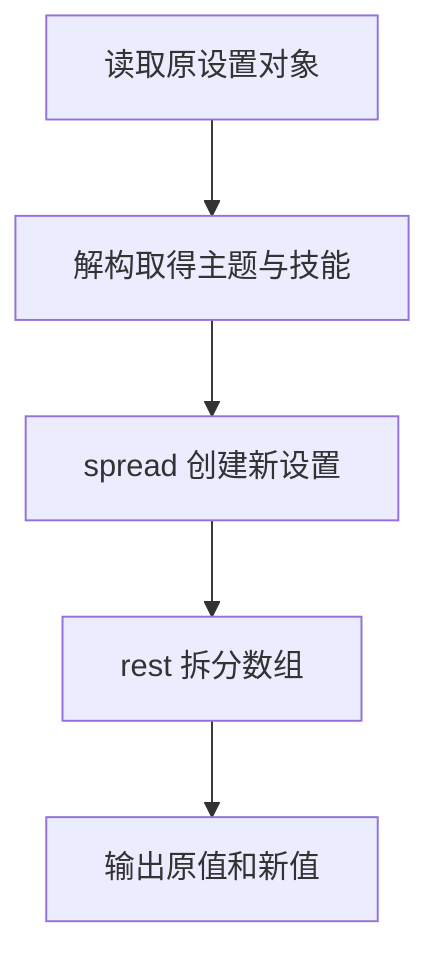

# DAY13 · Practice 02：主题设置不可变更新

[返回当天课程](../README.md)

## 文件位置

- 作答文件：[practice.ts](../../../day13/practice02/practice.ts)
- 结构提示代码：[solution.ts](../../../day13/practice02/solution.ts)
- 方案说明：[SOLUTION.md](./SOLUTION.md)

## 场景背景

你在开发学习工具的设置面板，用户准备切换主题并添加一项技能。为了支持“放弃更改”，程序不能直接改动当前保存的设置。你需要根据原设置创建新设置，再展示主题和技能在更新前后的差异。

这是一道与 Practice 01 文件完全分开的闭卷迁移题。先理解并运行当天 `example.ts`，然后关闭它；不要复制代码，仅根据下面的流程与输出从空白重新实现。

## 代码流程图



## 必须练到的能力

使用解构、spread、rest 创建不可变的新数据。

- 不得导入 `practice01` 或直接调用其他练习的实现。
- 输出必须由变量、计算或函数返回值产生，不把整行结果写死。
- 每个参数、局部变量和返回值都应能在流程图中找到位置。

## 精确期望输出

```text
原主题：light
新主题：dark
原技能：HTML
新技能：HTML、TypeScript
第一项：HTML
其余：TypeScript
```

## 文件

在上方链接的 `practice.ts` 作答；独立完成后再查看 `solution.ts` 的 TODO 解题结构。
