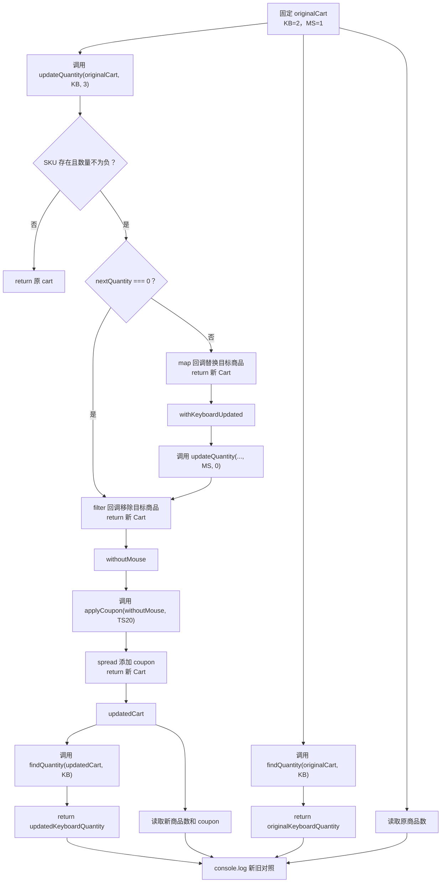

# DAY13 · Practice 02：购物车的更新、删除与不变分支

[返回当天课程](../README.md)

## 文件位置

- 作答文件：[practice.ts](../../../day13/practice02/practice.ts)
- 完整参考答案：[solution.ts](../../../day13/practice02/solution.ts)
- 方案说明：[SOLUTION.md](./SOLUTION.md)

## 场景背景

购物车状态可能还被结算预览和撤销功能引用，因此数量修改不能污染旧对象。同一个 `nextQuantity` 参数有三种含义：正数表示更新数量，`0` 表示移除商品，负数或不存在的 SKU 表示拒绝这次操作并保留原购物车。数量处理完成后还要不可变地加入优惠券。

## 和 Practice 01 的区别

Practice 01 对一份资料执行预先确定的多层字段更新。本题的数组更新由输入决定：`map` 更新、`filter` 删除或直接返回原对象三条路径必须分开，之后再串联一次优惠券更新。

## 关联复习

正数分支复用 Day07 的 `map`，删除分支复用 `filter`，但两者都要遵守本日的不可变更新规则。最后的可选 `coupon` 也会用到 Day08 对“缺席值”的理解。

## 数据流

先沿变量名看数据怎样分叉和汇合；`──>` 表示值被交给下一步。

```text
originalCart + sku + nextQuantity ──> updateQuantity
   ├── nextQuantity < 0 / sku 不存在 ──> 原 cart
   ├── nextQuantity === 0 ──> filter ──> 新 items
   └── nextQuantity > 0 ──> map ──> 目标商品新对象

数量更新结果 + "TS20" ──> applyCoupon ──> updatedCart
originalCart + updatedCart ──> 对照输出
```

## 代码流程图



## 起始代码

类型、固定购物车、三个函数签名、连续调用和最终输出都已给出。你要完成存在性判断、`filter`/`map` 回调以及各条路径的 `return`。

```ts
type CartItem = { readonly sku: string; name: string; quantity: number };
type Cart = { readonly id: string; items: readonly CartItem[]; coupon?: string };

const originalCart: Cart = {
  id: "cart-1",
  items: [
    { sku: "KB", name: "机械键盘", quantity: 2 },
    { sku: "MS", name: "鼠标", quantity: 1 },
  ],
};

function updateQuantity(cart: Cart, sku: string, nextQuantity: number): Cart {
  throw new Error("TODO：判断 SKU 和数量；用 filter 或 map 生成 items，并 return 对应 Cart");
}

function applyCoupon(cart: Cart, coupon: string): Cart {
  throw new Error("TODO：使用 spread 并 return 带 coupon 的新 Cart");
}

function findQuantity(cart: Cart, sku: string): number | undefined {
  throw new Error("TODO：查找匹配 SKU，并 return 它的可选数量");
}

const withKeyboardUpdated = updateQuantity(originalCart, "KB", 3);
const withoutMouse = updateQuantity(withKeyboardUpdated, "MS", 0);
const updatedCart = applyCoupon(withoutMouse, "TS20");
const originalKeyboardQuantity = findQuantity(originalCart, "KB");
const updatedKeyboardQuantity = findQuantity(updatedCart, "KB");
console.log(`原商品数：${originalCart.items.length}`);
console.log(`新商品数：${updatedCart.items.length}`);
console.log(`原键盘数量：${originalKeyboardQuantity}`);
console.log(`新键盘数量：${updatedKeyboardQuantity}`);
console.log(`优惠券：${updatedCart.coupon}`);
```

## 要完成的功能

先在文件顶层**单独声明**下面两个类型。这里的“单独声明”是指先写出有名字的 `CartItem` 和 `Cart`，后面的变量、参数和返回值再使用这两个名字：

```ts
type CartItem = {
  readonly sku: string;
  name: string;
  quantity: number;
};

type Cart = {
  readonly id: string;
  items: readonly CartItem[];
  coupon?: string;
};
```

把对象结构直接写进函数参数，例如 `cart: { id: string; items: ... }`，在 TypeScript 中可以通过，但不符合本题“声明并复用命名类型”的结构练习。

接着完成这些函数：

- 函数 `updateQuantity(cart: Cart, sku: string, nextQuantity: number): Cart`：
  - SKU 不存在或数量为负数时返回原 `cart`。
  - 数量为 `0` 时返回移除目标商品的新购物车。
  - 数量为正数时只替换目标商品，其他商品保留。
- 函数 `applyCoupon(cart: Cart, coupon: string): Cart`：返回带新优惠券的新购物车，不修改传入对象。

最后创建并使用这些变量：

- 变量 `originalCart: Cart`：包含 `KB` 机械键盘（数量 `2`）和 `MS` 鼠标（数量 `1`）。
- 变量 `withKeyboardUpdated`：保存把 `KB` 改为 `3` 后的返回值。
- 变量 `withoutMouse`：保存继续把 `MS` 改为 `0` 后的返回值。
- 变量 `updatedCart`：保存最后应用优惠券 `TS20` 后的返回值。

每个函数都返回一个 `Cart`。其中 `Cart` 返回对象的 `items` 是商品数组，`coupon` 是可选的优惠券字符串；不要把整个返回对象的结构重新内联写在函数返回类型中。

## 约束

- 不得导入 `practice01` 或直接调用其他练习的实现。
- 不得使用 `any`、类型断言、`push`、`splice` 或直接属性赋值。
- 更新数量使用 `map`，删除商品使用 `filter`；不能先改原数组再复制。
- 被拒绝的操作不得制造看似成功的新状态。
- 输出必须由变量、计算或函数返回值产生，不把整行结果写死。
- 每个参数、局部变量和返回值都应能在流程图中找到位置。

## 精确期望输出

```text
原商品数：2
新商品数：1
原键盘数量：2
新键盘数量：3
优惠券：TS20
```

完成标准：右键运行显示 PASS；原购物车保持两项且键盘数量仍为 `2`，新购物车只剩一项、数量为 `3` 并带 `TS20`。

## 写完后自检

- 把 `nextQuantity` 改成 `-1`，函数应返回原引用还是一个内容相同的新对象？为什么？
- 用不存在的 SKU 调用更新函数后，后续 `applyCoupon` 还能否独立创建新状态？
- 为什么数量为 `0` 使用 `filter`，正数使用 `map`？如果统一用直接赋值，会破坏哪份历史数据？

## 文件

在上方链接的 `practice.ts` 作答；独立完成后再查看 `solution.ts` 的完整参考答案。
