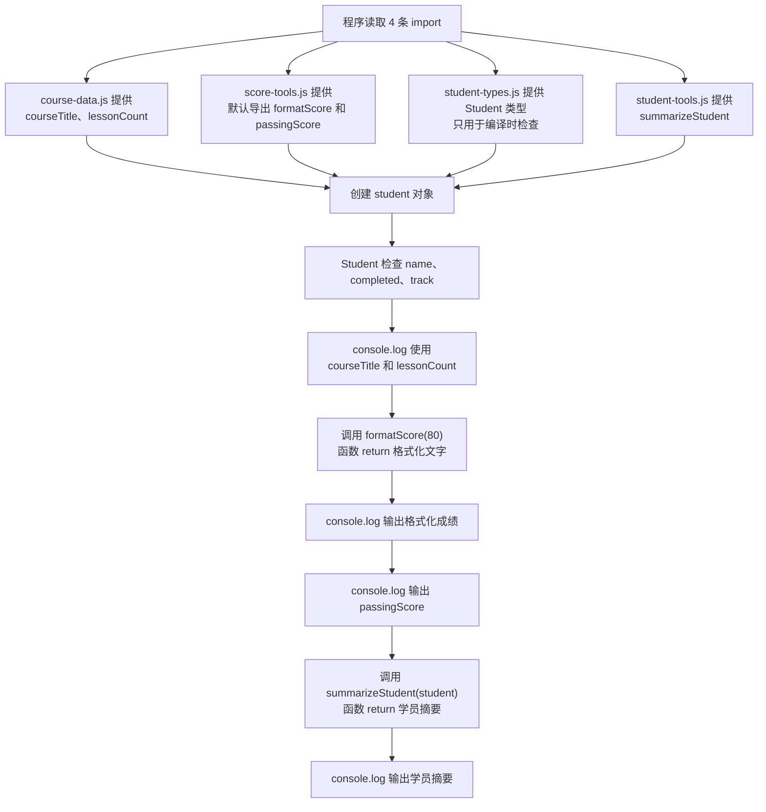

# Day 14：现代 ES Modules 与类型导入

预计用时：60–80 分钟。

一个文件写得太长时，可以把数据、函数和类型分到不同文件。提供内容的文件用 `export` 标出“外部可以使用什么”，需要内容的文件再用 `import` 取进来。今天只练习三种常见情况：按名字导入、导入一个默认值，以及只导入类型。

## 核心讲解

先看“按名字取内容”（具名导入）。一个文件可以导出多个成员；另一个文件必须在 `{}` 中写出对应名字：

~~~ts
export const courseTitle = "TypeScript";
export const lessonCount = 21;

import { courseTitle, lessonCount } from "./course-data.js";
~~~

上面的导入可以这样读：从 `course-data.js` 取出名为 `courseTitle` 和 `lessonCount` 的两个值。名字拼错或源文件没有导出它们，TypeScript 就会报错。

另一个写法是默认导出。一个模块最多有一个默认导出，所以导入它时不写 `{}`，本地名称可以自己决定。默认导入和具名导入也能写在同一行：

~~~ts
import formatScore, { passingScore } from "./score-tools.js";
~~~

三种导入方式放在一起看：

| 需要什么 | 写法特征 | 运行时是否需要真实值 |
| --- | --- | --- |
| 具名导出值 | 名字放在 `{}` 中 | 需要 |
| 默认导出值 | 默认名称写在 `{}` 外 | 需要 |
| 只用于类型检查 | 使用 `import type` | 不需要，编译后会移除 |

如果 `Student` 只用来标注变量或参数类型，就明确写 `import type`：

~~~ts
import type { Student } from "./student-types.js";
~~~

`Student` 只在 TypeScript 检查代码时使用。生成 JavaScript 后，这行类型导入会消失，所以不能用 `console.log(Student)` 把它当成真实值输出。`courseTitle`、`formatScore` 这类值导入会留到运行时，对应模块必须真的导出它们。

你现在编辑的是 `.ts` 文件，导入路径却写 `.js`，这是 Node ES Modules 的运行方式决定的：程序最终运行生成后的 JavaScript 文件。项目使用 `NodeNext`，TypeScript 检查时会根据 `.js` 路径找到对应的 `.ts` 源文件。这里不要自行删掉 `.js`。

只要文件顶层出现 `import` 或 `export`，这个文件就是模块。文件内部声明默认只属于本文件；其他文件想使用它，必须先导出再导入。共享类型也只保留一份，然后让各文件导入它。否则以后新增字段时，复制出来的多份定义很容易只改到其中一份。

## 为什么要这样设计

所有变量和函数都写在一个文件里时，名称容易冲突，依赖从哪里来只能靠人记，任何文件也可能碰到本不该公开的细节。模块用 `export` 明确对外入口，用 `import` 明确当前文件依赖什么，让代码可以按职责拆开。

运行环境负责加载值模块，TypeScript 负责检查导入名、导出形式和类型是否匹配。你仍要决定哪些内容值得公开、使用默认导出还是具名导出，以及模块之间应该朝哪个方向依赖；`import type` 只处理类型，不会在运行时加载一个值。

模块不会自动消除设计问题。循环依赖、过细的文件拆分和错误的运行时路径仍会造成故障；在 NodeNext 中，源码相对导入保留 `.js` 扩展名也是运行环境规则，不是 TypeScript 随意增加的写法。

## 阅读示例

打开并右键运行 `example.ts`，然后沿着四条导入路径查看 `course-data.ts`、`score-tools.ts`、`student-types.ts` 与 `student-tools.ts`。这些辅助模块不要修改。

## 模块数据怎么进入入口文件

读一条 `import` 时，按下面顺序找：

1. 先看 `from` 后面的路径，确定内容来自哪个文件。
2. 到源文件中找对应的 `export`。
3. 回到入口文件，看导入的是运行时值还是只用于检查的类型。
4. 值导入可以参与创建对象、调用函数和输出；类型导入只能出现在类型位置。

这样排查导入错误时，就能分清是路径不对、导出方式不对，还是把类型当成了值。

## Example 实际输出

运行 `example.ts` 后，终端会按下面的顺序显示。先用代码推测结果，再逐行对照：

```text
课程：TypeScript 零基础课（21 课）
80：通过
及格线：60
Ada：完成 12 课（beginner）
```

## Example 代码流程图

运行 `example.ts` 前先沿图预测执行顺序；运行后再把每个节点对应到代码行。



## 官方手册扩展阅读（可选）

完成当天教程后，可从 [Day 14 对应阅读](../OFFICIAL-READING.md#day-14) 中只选 1 篇继续看。它不是练习前置，不需要在写 Practice 前读完。

## 独立练习导航

本日共有 2 道独立练习。每道题都有单独目录、说明、作答文件和完整参考答案；题目之间不共享代码。

| 目录 | 场景 | 类型 |
| --- | --- | --- |
| [practice01](./practice01/README.md) | 现代 ES Modules 与类型导入 | 主任务 |
| [practice02](./practice02/README.md) | 库存入口与模块边界 | 闭卷迁移 |

右击任意练习目录中的 `practice.ts` 即可单独检查；命令行也可运行 `npm run beginner -- day14 practice02`。

## 容易出错的地方

- 默认导入误放进花括号，或具名导入忘记花括号。
- 导入后仍保留同名本地声明。
- 使用 `import type` 后尝试把类型当作运行时值输出。
- 删除 `NodeNext` 相对路径中的 `.js`。
- 复制共享类型，导致以后只更新其中一份。

### 错误代码示例

项目把金额格式化函数改成默认导出，又把订单结构移到只导出类型的文件。入口文件仍按旧习惯导入，常见结果是两类完全不同的错误：

```ts
// money.ts
export default function formatCurrency(cents: number): string {
  return `¥${cents / 100}`;
}

// order-types.ts
export type Order = {
  id: string;
  totalCents: number;
};

// checkout.ts
import { formatCurrency } from "./money.js"; // ❌ 默认导出不能放进花括号。
//       ~~~~~~~~~~~~~~
// TS2614：模块没有名为 formatCurrency 的具名导出。

import type { Order } from "./order-types.js";

console.log(Order);
//          ~~~~~
// TS2693：Order 只表示类型，却被当作运行时值使用。
```

`formatCurrency` 的函数确实存在，但导入形式与导出形式不匹配；`Order` 在编译后会被移除，运行时根本没有一个名为 `Order` 的对象。把这两个报错都理解成“路径坏了”，往往会让排查越走越偏。

在 `NodeNext` 项目中，下面这条相对路径也常被误删扩展名：

```ts
import { formatScore } from "./score-tools.js";
// 源文件是 score-tools.ts，运行时加载的是生成后的 score-tools.js。
```

### 正确写法

```ts
import formatCurrency from "./money.js"; // ✅ 默认导入写在花括号外。
import type { Order } from "./order-types.js";

const order: Order = {
  id: "order-1",
  totalCents: 39900,
};

console.log(formatCurrency(order.totalCents));
```

实际输出：

```text
¥399
```

排查模块问题时先看源文件的 `export`：`export default` 对应花括号外的默认导入，`export const` 或 `export type` 对应花括号里的具名导入。再判断这个名字在运行时是否真实存在。

## 面试时怎么回答

**问：ES Module、namespace 和 `import type` 分别解决什么问题？**

**答：**ES Module 是 JavaScript 的模块系统，`import` / `export` 同时表达文件边界和运行时依赖，浏览器或 Node.js 负责加载模块。`namespace` 是 TypeScript 用来组织名称的语法，常见于全局脚本或声明文件；普通应用代码已经按文件使用 ESM 时，一般不再靠 namespace 组织模块。`import type` 明确这项依赖只用于类型检查，生成 JavaScript 时会被移除：

```ts
import type { Student } from "./student-types.js";
const student: Student = {
  name: "Ada",
  completed: 12,
  track: "beginner",
};
```

因此用 `import type` 得到的名字不能用于 `new`、`instanceof` 或输出。它也不会执行被导入模块的运行时代码。

**问：为什么 NodeNext 项目的 TypeScript 源码常写 `./tool.js`，磁盘上明明是 `tool.ts`？**

**答：**TypeScript 通常不会改写模块路径字符串。Node ESM 最终加载的是生成后的 JavaScript 文件，所以源码写出运行时会使用的 `.js` 路径；在 `NodeNext` 解析规则下，TypeScript 会用这条路径找到对应的 `.ts` 源文件做检查。是否需要扩展名取决于实际宿主和模块解析模式，不能脱离项目配置死记。

官方参考：

- [TypeScript Handbook：Modules - Theory](https://www.typescriptlang.org/docs/handbook/modules/theory.html)
- [TypeScript Handbook：Modules - Reference 与类型导入](https://www.typescriptlang.org/docs/handbook/modules/reference.html)
- [TypeScript Handbook：Namespaces](https://www.typescriptlang.org/docs/handbook/namespaces.html)

## 拓展思考（不要求写代码）

如果 `Student` 新增必填字段 `email`，哪些文件会立刻收到类型提示，哪些只在运行时依赖值导出？这说明类型依赖和值依赖有什么差异？
