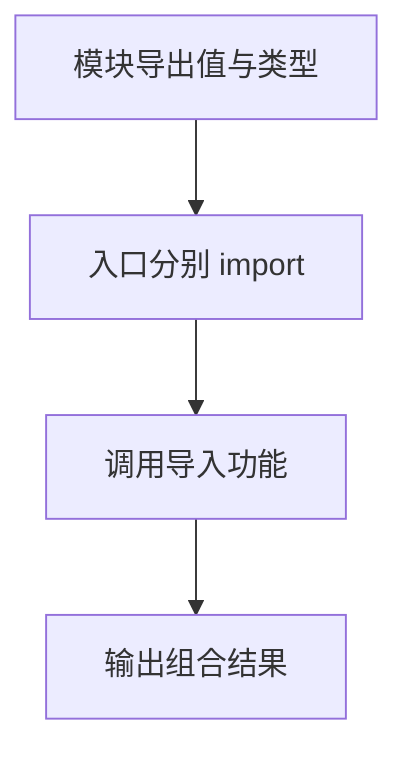

# DAY14 · Practice 01：现代 ES Modules 与类型导入

[返回当天课程](../README.md)

## 文件位置

- 作答文件：[practice.ts](../../../day14/practice01/practice.ts)
- 结构提示代码：[solution.ts](../../../day14/practice01/solution.ts)
- 方案说明：[SOLUTION.md](./SOLUTION.md)

## 场景背景

你负责搭建课程概览页的入口文件，课程信息、成绩工具、学生类型和学生摘要功能已经由不同同事拆成模块。入口会拿到一名学生和一组成绩，需要正确组合这些现有模块。最终页面要依次展示课程概况、学习进度、成绩判断和及格线。

这是一道完整、独立的主练习。不要导入其他 practice 文件夹中的代码。

## 代码流程图

请把 `practice.ts` 当作一个全新的入口文件，组合已经准备好的四个模块：

- 从 `course-data.ts` 具名导入 `courseTitle` 和 `lessonCount`。
- 从 `score-tools.ts` 默认导入 `formatScore`，并具名导入 `passingScore`。
- 从 `student-types.ts` 只导入类型 `Student`。
- 从 `student-tools.ts` 具名导入 `summarizeStudent`。
- 创建 `student: Student`：name 为 `Ada`，completed 为 `12`，track 为 `beginner`。
- 创建只读数组 `scores`，内容为 `55、80`。
- 先输出课程和学生摘要，再逐项调用 `formatScore`，最后输出及格线。

必须精确输出：

~~~text
课程：TypeScript 零基础课（21 课）
Ada：完成 12 课（beginner）
55：未通过
80：通过
及格线：60
~~~

限制：

- 不得修改任何辅助模块，也不得复制它们的常量、函数或 `Student` 类型。
- 相对导入路径必须保留 `.js` 扩展名。
- `Student` 必须使用 `import type`；运行时值使用普通 `import`。
- 不得使用 `any`、类型断言或本地同名占位声明。

完成标准：右键运行 `practice.ts` 后显示 PASS；能指出五个导入中哪些会存在于运行时代码里。

## 本题易漏语法

具名导入导出用 {}，名称之间用逗号，语句以分号结束；只导入类型写 import type。

## 文件

- 在 `practice.ts` 中独立作答。
- 完成并运行通过后，再查看 `solution.ts` 的 TODO 解题结构与 `SOLUTION.md` 的结构提示。
