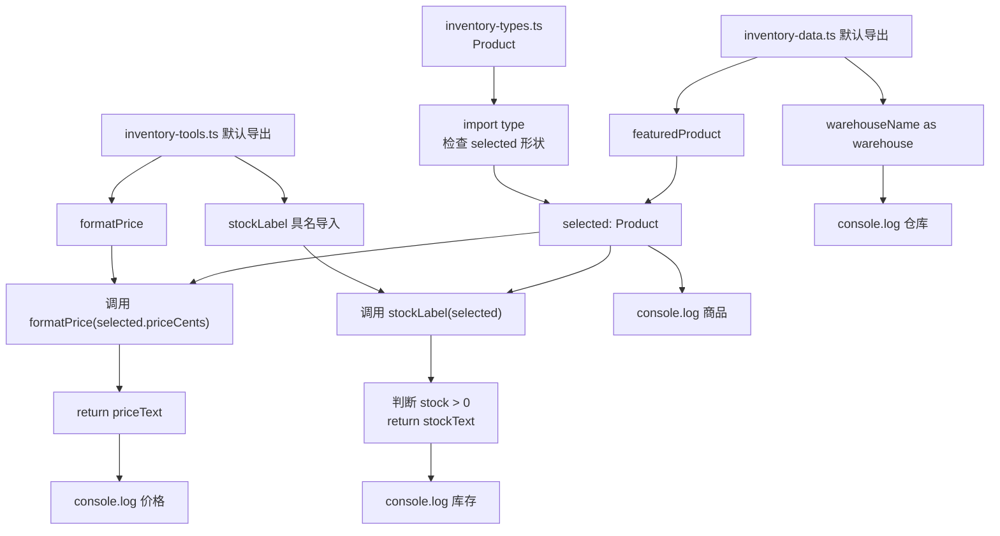

# DAY14 · Practice 02：库存入口与模块边界

[返回当天课程](../README.md)

## 文件位置

- 作答文件：[practice.ts](../../../day14/practice02/practice.ts)
- 完整参考答案：[solution.ts](../../../day14/practice02/solution.ts)
- 方案说明：[SOLUTION.md](./SOLUTION.md)

## 场景背景

商品详情页需要组合库存数据、价格工具和商品类型。三个辅助模块已经放在当前练习目录中：数据模块默认导出主推商品并具名导出仓库名，工具模块默认导出价格格式器并具名导出库存说明，类型模块只导出 `Product`。入口不能复制这些实现。

## 和 Practice 01 的区别

Practice 01 从当天公共模块组合课程和学生信息。本题的模块都属于当前练习，并加入了具名导入别名：入口把 `warehouseName` 改名为 `warehouse`，再把一个默认数据导出和默认函数导出组合起来；数据形状与控制流都不再使用成绩循环。

## 关联复习

入口仍会用 Day09 的对象字段读取和 Day12 的函数调用，但数据与规则来自不同模块。复习时重点追踪每个名称属于类型还是运行时值，以及它从哪个文件进入入口。

## 数据流

先沿变量名看数据怎样分叉和汇合；`──>` 表示值被交给下一步。

```text
inventory-types.ts ── import type ──> Product
inventory-data.ts
   ├── default ──> featuredProduct
   └── warehouseName as warehouse
inventory-tools.ts
   ├── default ──> formatPrice
   └── stockLabel

featuredProduct ──> Product 约束
priceCents ──> formatPrice ──> 价格文字
product ──> stockLabel ──> 库存文字
仓库 + 商品 + 两个工具结果 ──> 输出
```

## 代码流程图



## 起始代码

默认导入、具名导入、别名、`import type`、变量、函数调用和四行输出都已给出。先沿导入名称核对来源，再遮住导入区自己重写一次。

```ts
import featuredProduct, { warehouseName as warehouse } from "./inventory-data.js";
import formatPrice, { stockLabel } from "./inventory-tools.js";
import type { Product } from "./inventory-types.js";

// TODO：先遮住上面的导入区，独立重写一遍后再对照。
const selected: Product = featuredProduct;
const priceText = formatPrice(selected.priceCents);
const stockText = stockLabel(selected);
console.log(`仓库：${warehouse}`);
console.log(`商品：${selected.name}（${selected.sku}）`);
console.log(`价格：${priceText}`);
console.log(`库存：${stockText}`);
```

## 要完成的功能

- 从 `./inventory-types.js` 使用 `import type` 导入 `Product`。
- 从 `./inventory-data.js` 默认导入主推商品；具名导入 `warehouseName`，并在当前入口改名为 `warehouse`。
- 从 `./inventory-tools.js` 默认导入 `formatPrice`，具名导入 `stockLabel`。
- 让本地 `selected` 变量显式标注为 `Product`，值来自默认导入的主推商品。
- 从导入值和函数结果生成四行库存摘要。

## 约束

- 不得导入 `practice01` 或直接调用其他练习的实现。
- 不得修改、复制或重新声明三个辅助模块中的数据、类型和函数。
- 相对导入路径保留 `.js` 扩展名。
- `Product` 不能作为运行时值使用；其他四个导入都参与运行。
- 输出必须由变量、计算或函数返回值产生，不把整行结果写死。
- 每个参数、局部变量和返回值都应能在流程图中找到位置。

> **先看清输出标点：** 代码语法中的函数括号 `()` 和类型冒号 `:` 必须使用英文半角符号。下面 `机械键盘（SKU-KB）`、`可下单（8 件）` 的 `（ ）` 是输出文字使用的中文全角括号。运行器不会因显示文字中的括号或冒号全半角差异判你失败，但其他文字、数字和顺序仍要一致。

## 精确期望输出

```text
仓库：华东一号
商品：机械键盘（SKU-KB）
价格：¥399
库存：可下单（8 件）
```

完成标准：右键运行显示 PASS；入口没有复制辅助模块内容，四行结果分别来自仓库值、默认商品和两个导入函数。

## 写完后自检

- 把库存改为 `0` 后，哪一个辅助函数应该决定显示“缺货”？入口是否需要复制判断？
- 去掉 `as warehouse` 后，本地可用的变量名会是什么？这项改名影响导出模块吗？
- 为什么 `Product` 使用 `import type`，而默认导入的商品和格式函数必须保留为运行时导入？

## 文件

在上方链接的 `practice.ts` 作答；独立完成后再查看 `solution.ts` 的完整参考答案。
