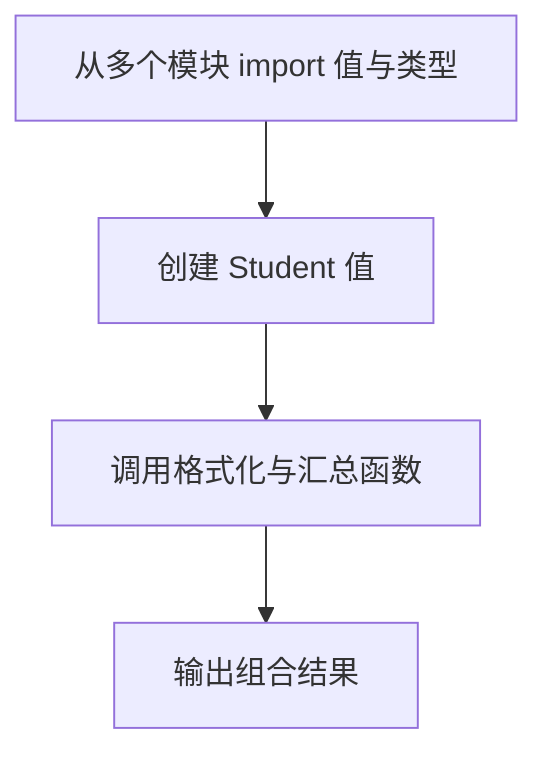

# DAY14 · Practice 02：课程模块组合

[返回当天课程](../README.md)

## 文件位置

- 作答文件：[practice.ts](../../../day14/practice02/practice.ts)
- 结构提示代码：[solution.ts](../../../day14/practice02/solution.ts)
- 方案说明：[SOLUTION.md](./SOLUTION.md)

## 场景背景

你在为另一个课程页面编写启动入口，需要复用项目中已有的数据、格式化函数和学生类型。输入包括课程元数据、一条成绩以及学生进度，不能在入口里重新复制模块内容。你需要把各模块提供的能力组合成四行页面摘要。

这是一道与 Practice 01 文件完全分开的闭卷迁移题。先理解并运行当天 `example.ts`，然后关闭它；不要复制代码，仅根据下面的流程与输出从空白重新实现。

## 代码流程图



## 必须练到的能力

使用具名/默认导入导出，并把类型导入写成 import type。

- 不得导入 `practice01` 或直接调用其他练习的实现。
- 输出必须由变量、计算或函数返回值产生，不把整行结果写死。
- 每个参数、局部变量和返回值都应能在流程图中找到位置。

## 精确期望输出

```text
课程：TypeScript 零基础课（21 课）
80：通过
及格线：60
Ada：完成 12 课（beginner）
```

## 文件

在上方链接的 `practice.ts` 作答；独立完成后再查看 `solution.ts` 的 TODO 解题结构。
