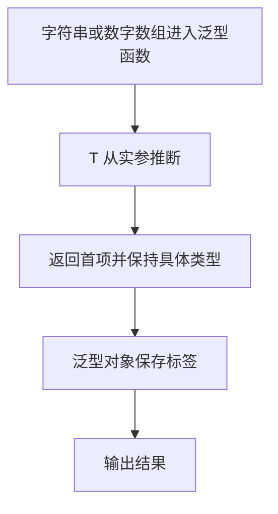

# Day 15：泛型基础与输入输出关系

预计用时：70–90 分钟。

“取数组最后一项”这件事，对字符串数组和数字数组都一样。我们希望只写一个函数，同时让 TypeScript 记住：传入字符串，返回的还是字符串；传入数字，返回的还是数字。用一个临时类型名称把这些位置连起来，这就是泛型。

## 核心讲解

先看函数手里有什么：一个数组，以及数组为空时使用的回退值。`Item` 是一个类型占位名，表示“本次调用实际传进来的那种类型”。它同时出现在数组元素、回退值和返回值的位置，要求三者保持一致。

~~~ts
function lastOrFallback<Item>(
  items: readonly Item[],
  fallback: Item,
): Item {
  let result = fallback;
  for (const item of items) result = item;
  return result;
}
~~~

按执行顺序读这个函数：

1. `items` 接收一个只读数组，数组元素类型暂时叫 `Item`。
2. `fallback` 也必须是同一个 `Item`。
3. `result` 一开始就是 `fallback`，所以即使数组为空，函数手里也有一个真实可返回的值。
4. `for` 每读到一项，就把 `result` 换成当前项。
5. `return result` 最终交回的仍然是 `Item`。

调用者传入字符串数组时，TypeScript 会把本次 `Item` 推断为 `string`；传入数字数组时，本次 `Item` 就是 `number`。通常不需要手写尖括号里的类型。

`any` 不会保留这条关系。参数和返回值都写成 `any` 后，即使传入数字，TypeScript 也不会再阻止你把返回结果当成字符串使用。泛型保留“输入元素类型 = 回退值类型 = 返回类型”的联系。

如果两个输入不要求是同一种类型，就用两个类型参数分别记录。下面的 `Left` 来自第一个参数，`Right` 来自第二个参数，返回元组仍按这个顺序保留两种类型：

~~~ts
function makePair<Left, Right>(left: Left, right: Right): [Left, Right] {
  return [left, right];
}
~~~

泛型对象也可以用同样方法记录内部值的类型。要注意，`Item` 只代表“调用时确定的一种类型”，不表示它一定有 `id`、`name` 或其他属性。函数想读取某个属性时，必须明确说明这个类型至少具备什么；下一章的泛型约束会解决这个问题。

## 为什么要这样设计

没有泛型时，同一个“取第一项”逻辑可能要为字符串、数字各写一遍；若改用 `any`，输入和输出之间的关系又会消失，错误值也能混进来。泛型用一个类型参数记住本次调用的具体类型，让一份实现服务多种数据，同时保留“放进去什么，拿出来仍是什么”的关系。

TypeScript 负责根据实参推断类型，并检查函数体是否对所有允许的类型都成立。你仍要决定真正需要保持的关系：返回的是同一种值、数组元素、二元组中的对应位置，还是可能缺席的值；空数组、负数次数等业务边界也不会由泛型替你规定。

类型参数不是越多越好。没有实际关系的泛型会让报错和阅读更困难，而且泛型只在编译阶段工作，不会在运行时验证接口数据的类型。

## 阅读示例

打开并右键运行 `example.ts`。在编辑器中悬停观察 `firstName`、`firstScore` 与 `course.value`。先看调用时传入了什么，再预测 TypeScript 会把类型参数推断成什么，最后核对变量的返回类型。

## 函数变量追踪

泛型函数运行时仍然只是普通函数：实参进入参数，函数处理数据，`return` 把值交回调用处。

`T` 或 `Item` 只在编写和检查代码时存在：

1. TypeScript 根据实参推断本次调用的具体类型。
2. 它检查其他参数和返回值是否保持这条类型关系。
3. 生成 JavaScript 后，类型参数会消失，程序不会得到一个名为 `T` 的变量。

所以不能输出 `T`，也不能在运行时询问 `T` 是什么；真正参与运行的仍然是传入的数组、回退值和返回值。

## Example 实际输出

运行 `example.ts` 后，终端会按下面的顺序显示。先用代码推测结果，再逐行对照：

```text
第一位：Ada
第一个分数：80
标签：课程=TypeScript
```

## Example 代码流程图

运行 `example.ts` 前先沿图预测执行顺序；运行后再把每个节点对应到代码行。



## 官方手册扩展阅读（可选）

完成当天教程后，可从 [Day 15 对应阅读](../OFFICIAL-READING.md#day-15) 中只选 1 篇继续看。它不是练习前置，不需要在写 Practice 前读完。

## 独立练习导航

本日共有 2 道独立练习。每道题都有单独目录、说明、作答文件和解题结构；题目之间不共享代码。

| 目录 | 场景 | 类型 |
| --- | --- | --- |
| [practice01](./practice01/README.md) | 泛型基础与输入输出关系 | 主任务 |
| [practice02](./practice02/README.md) | 安全读取首项与空数组 | 闭卷迁移 |

右击任意练习目录中的 `practice.ts` 即可单独检查；命令行也可运行 `npm run beginner -- day15 practice02`。

## 容易出错的地方

- 用 `any` 假装实现泛型，返回类型信息随即丢失。
- 声明一个只出现一次的类型参数，没有表达关系。
- 为每次调用都手写类型参数，忽略推断。
- 以为 `Item` 自动拥有任意属性。
- 通过 `as Item` 伪造一个运行时并不存在的值。
- 忘记空数组可能没有最后一项。

### 错误代码示例

```ts
function first<Item>(items: readonly Item[]): Item {
  // ❌ 空数组的第 0 项是 undefined，断言只是隐藏风险，不会创造 Item。
  return items[0] as Item;
}

function firstWithAny(items: any[]): any {
  return items[0]; // ❌ any 切断了“输入元素类型 = 返回类型”的关系。
}
```

### 正确写法

```ts
function firstOrUndefined<Item>(
  items: readonly Item[],
): Item | undefined {
  return items[0]; // ✅ 返回类型如实表达空数组的可能性。
}

function firstOrFallback<Item>(
  items: readonly Item[],
  fallback: Item,
): Item {
  return items[0] ?? fallback; // ✅ 调用者提供真实回退值，函数才能保证返回 Item。
}
```

## 面试时怎么回答

**问：泛型和 `any` 都能接收多种类型，它们真正的区别是什么？**

**答：**先看要解决的问题：同一段逻辑既要复用，又要保留输入和输出之间的关系。`any` 会关闭关键检查，调用者不知道返回值是否仍与输入一致；泛型把本次调用推断出的具体类型记录下来：

```ts
function first<Item>(items: Item[]): Item | undefined {
  return items[0];
}
const name = first(["Ada"]); // string | undefined
const score = first([90]);   // number | undefined
```

TypeScript 负责推断并传递 `Item` 的关系，开发者仍要决定空数组为什么返回 `undefined`、哪些位置必须保持同一种类型。泛型在运行时会被擦除，不会验证接口数据。

**容易答错或追问：**不要回答“泛型就是不确定类型”。更准确地说，它是有关系的类型占位符；同一个类型参数出现在多个位置，才表达了约束。若函数只处理一种固定类型，或者输入输出没有需要保留的关系，硬加泛型只会让签名和报错更难读。

## 拓展思考（不要求写代码）

为什么不带回退值的 `firstOrUndefined<Item>` 必须返回 `Item | undefined`，而本题的 `lastOrFallback<Item>` 可以只返回 `Item`？这个区别是谁提供的保证？
