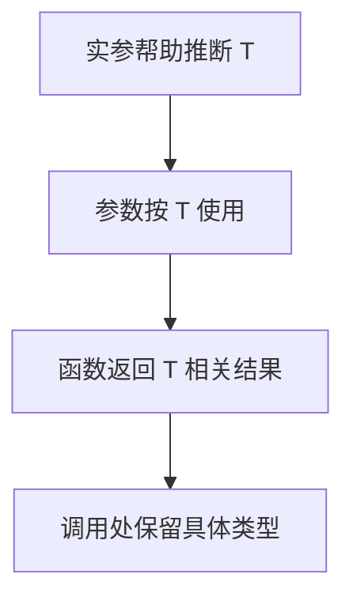

# DAY15 · Practice 01：泛型基础与输入输出关系

[返回当天课程](../README.md)

## 文件位置

- 作答文件：[practice.ts](../../../day15/practice01/practice.ts)
- 结构提示代码：[solution.ts](../../../day15/practice01/solution.ts)
- 方案说明：[SOLUTION.md](./SOLUTION.md)

## 场景背景

你正在为课程项目整理一组可复用的小工具，它们既可能处理字符串，也可能处理数字或其他数据。调用方会提供列表、回退值、标签、重复次数和一对不同类型的值。你需要让每个工具在交付结果时保留输入的具体类型，供后续业务代码安全使用。

这是一道完整、独立的主练习。不要导入其他 practice 文件夹中的代码。

## 代码流程图

请在 `practice.ts` 中从头编写一个小型“泛型工具箱”，必须包含：

- `lastOrFallback<Item>(items, fallback): Item`：返回最后一项；空数组返回同类型回退值。
- `Box<Value>`：包含 `label: string` 和 `value: Value`。
- `makeBox<Value>(label, value): Box<Value>`：保留标签和值。
- `repeat<Item>(value, count): Item[]`：创建含 `count` 个相同值的新数组。
- `makePair<Left, Right>(left, right): [Left, Right]`：保持输入顺序。

使用以下固定调用：

- `lastOrFallback(["变量", "泛型"], "无")`
- `lastOrFallback([], 0)`
- `makeBox("课程", "TypeScript")`
- `repeat(7, 3)`
- `makePair("level", 3)`

精确输出：

~~~text
最后主题：泛型
空分数：0
盒子：课程=TypeScript
重复：7+7+7
配对：level=3
~~~

限制：

- 不得使用 `any`、`unknown`、类型断言或非空断言。
- 每个类型参数必须至少出现在两个有关系的位置。
- `lastOrFallback` 必须安全处理空数组，不能直接断言最后一项存在。
- `repeat` 必须根据 `count` 生成数组，不能写死三项。
- `makePair` 的返回类型与返回值顺序都必须是 `[Left, Right]`。

完成标准：右键运行后显示 PASS；能用一句话解释每个泛型函数保存了什么类型关系。

## 本题易漏语法

泛型参数放函数名后的尖括号，如 function first<T>(items: T[]): T；T 应连接至少两个位置。

## 文件

- 在 `practice.ts` 中独立作答。
- 完成并运行通过后，再查看 `solution.ts` 的 TODO 解题结构与 `SOLUTION.md` 的结构提示。
