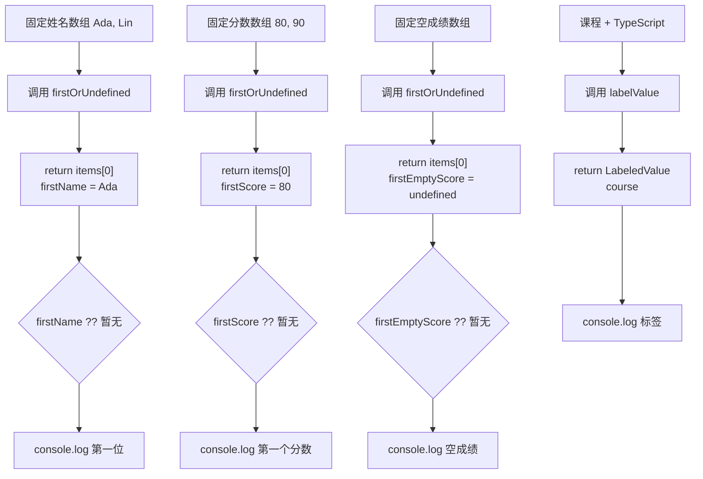

# DAY15 · Practice 02：安全读取首项与空数组

[返回当天课程](../README.md)

## 文件位置

- 作答文件：[practice.ts](../../../day15/practice02/practice.ts)
- 完整参考答案：[solution.ts](../../../day15/practice02/solution.ts)
- 方案说明：[SOLUTION.md](./SOLUTION.md)

## 场景背景

课程首页要读取报名名单和成绩列表的第一项，但接口返回空数组是正常情况：新课程可能还没有成绩。通用工具不能凭空编造一个 `number`，也不应该替页面决定显示“暂无”还是 `0`。你需要让读取函数诚实返回“元素或缺席”，再由调用方选择展示文字。

同一个函数会处理字符串数组和数字数组。重点不是复写两套逻辑，而是保留每次调用自己的元素类型。

## 和 Practice 01 的区别

Practice 01 要求调用方提供同类型 fallback，因此函数总能返回 `Item`。本题不接收 fallback，空数组必须交回 `undefined`，界面层再通过 `??` 决定“暂无”等展示文字；调用方责任和返回类型都不同。

## 关联复习

空数组路径会再次用到 Day08 的 `undefined` 与 `??`。区别是这次缺席值来自泛型函数的真实返回类型，调用方必须先处理后才能把结果当成普通元素使用。

## 数据流

先沿变量名看数据怎样分叉和汇合；`──>` 表示值被交给下一步。

```text
names: string[] ──> firstOrUndefined<string> ──> firstName
scores: number[] ──> firstOrUndefined<number> ──> firstScore
emptyScores: number[] ──> firstOrUndefined<number>
                              ├── 有元素 ──> number
                              └── 空数组 ──> undefined ──> 调用方 ?? "暂无"
value + label ──> labelValue<T> ──> LabeledValue<T>

三个首项结果 + course ──> 输出
```

## 代码流程图



## 起始代码

类型、固定数组、函数签名、调用和输出已给出。你需要完成两个函数的对象创建与 `return`；空值展示继续由调用处的 `??` 负责。

```ts
function firstOrUndefined<Item>(items: readonly Item[]): Item | undefined {
  throw new Error("TODO：return 第一项；空数组自然得到 undefined");
}

type LabeledValue<Value> = { label: string; value: Value };
function labelValue<Value>(label: string, value: Value): LabeledValue<Value> {
  throw new Error("TODO：return 由参数组成的标签对象");
}

const firstName = firstOrUndefined(["Ada", "Lin"]);
const firstScore = firstOrUndefined([80, 90]);
const emptyScores: readonly number[] = [];
const firstEmptyScore = firstOrUndefined(emptyScores);
const course = labelValue("课程", "TypeScript");
console.log(`第一位：${firstName ?? "暂无"}`);
console.log(`第一个分数：${firstScore ?? "暂无"}`);
console.log(`空成绩：${firstEmptyScore ?? "暂无"}`);
console.log(`标签：${course.label}=${course.value}`);
```

## 要完成的功能

先在文件顶层**单独声明**泛型类型 `LabeledValue<Value>`：

```ts
type LabeledValue<Value> = {
  label: string;
  value: Value;
};
```

`Value` 是类型参数，表示 `value` 字段要保留本次传入值的类型。把这个对象结构直接写进 `labelValue` 的返回类型虽然合法，但不符合本题“声明并复用 `LabeledValue<Value>`”的结构练习。

接着实现两个**泛型函数**：

- 函数 `firstOrUndefined<Item>(items: readonly Item[]): Item | undefined`：数组有内容时返回第一项，空数组返回 `undefined`。`Item | undefined` 是函数返回值的类型，不是让你额外创建一个对象。
- 函数 `labelValue<Value>(label: string, value: Value): LabeledValue<Value>`：返回一个对象；对象的 `label` 字段来自参数 `label`，`value` 字段来自参数 `value`。

可以先写出下面的结构，再完成 `TODO`：

```ts
function firstOrUndefined<Item>(
  items: readonly Item[],
): Item | undefined {
  // TODO：读取并返回第一项；空数组应自然得到 undefined。
}

function labelValue<Value>(
  label: string,
  value: Value,
): LabeledValue<Value> {
  // TODO：返回由这两个参数组成的对象。
}
```

最后创建这些变量：

- `firstName`：把姓名数组 `["Ada", "Lin"]` 交给 `firstOrUndefined` 后的返回值。
- `firstScore`：把分数数组 `[80, 90]` 交给该函数后的返回值。
- `emptyScores: readonly number[]`：单独声明的空成绩数组。
- `firstEmptyScore`：读取 `emptyScores` 后得到的 `number | undefined`。
- `course`：调用 `labelValue("课程", "TypeScript")` 得到的标签对象。

空成绩的“暂无”必须在调用处通过 `firstEmptyScore ?? "暂无"` 处理，不能塞进通用读取函数。

## 约束

- 不得导入 `practice01` 或直接调用其他练习的实现。
- 不得使用 `any`、类型断言或非空断言。
- `firstOrUndefined` 不能接收或制造业务回退值；它只报告数组里是否有首项。
- 输出必须由变量、计算或函数返回值产生，不把整行结果写死。
- 每个参数、局部变量和返回值都应能在流程图中找到位置。

## 精确期望输出

```text
第一位：Ada
第一个分数：80
空成绩：暂无
标签：课程=TypeScript
```

完成标准：右键运行显示 PASS；非空字符串和数字数组保留各自元素类型，空数字数组输出“暂无”，且通用函数没有写入界面文案。

## 写完后自检

- 把姓名数组也改为空数组，调用方需要在哪一行决定显示什么？泛型函数本身是否需要修改？
- 如果把返回类型强行写成 `Item`，空数组时你只能伪造值、抛错或断言。哪一种都与当前需求有什么冲突？
- 什么时候应改用 Practice 01 那种“由调用方传入同类型 fallback”的设计，而不是返回 `undefined`？

## 文件

在上方链接的 `practice.ts` 作答；独立完成后再查看 `solution.ts` 的完整参考答案。
