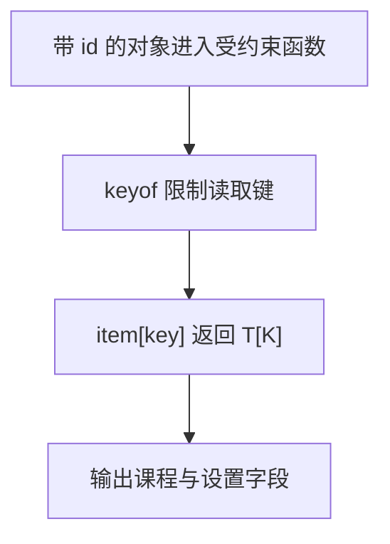

# Day 16：泛型约束、keyof、T[K] 与 typeof

预计用时：75–90 分钟。

上一天的泛型能接收不同类型，但函数不能凭空认为这些类型都有 `id` 或其他字段。今天先给参数加一条进入函数的条件：“传进来的对象至少要有这些字段”。然后再让 TypeScript 根据对象实际拥有的键，检查你读的字段是否存在、返回值是什么类型。

## 核心讲解

如果函数内部要读取 `item.id`，就必须先把“对象至少有一个数字 `id`”写进类型条件。这个条件叫泛型约束：

~~~ts
function describeId<Item extends { id: number }>(item: Item): string {
  return "ID=" + item.id;
}
~~~

这里的 `extends` 可以先理解成入场条件：

- `{ id: 12, name: "Ada" }` 可以传入，因为它有数字 `id`；多出的 `name` 不受影响。
- `{ name: "Ada" }` 不能传入，因为函数随后要读取的 `id` 不存在。
- `{ id: "12" }` 也不能传入，因为 `id` 类型不是 `number`。

只写 `Item extends object` 只能说明它是对象，不能保证 `item.id` 存在。用类型断言硬说“它有 `id`”也不会在运行时补出这个字段。

接下来解决“按字段名读取值”。`keyof Item` 会列出 `Item` 允许的所有属性名。让参数 `key` 只能从这些名字中选择，就能阻止调用者传入不存在的字段：

~~~ts
function getProperty<Item, Key extends keyof Item>(
  item: Item,
  key: Key,
): Item[Key] {
  return item[key];
}
~~~

这段函数里有两条关系：

1. `Key extends keyof Item`：`key` 必须是 `item` 真正拥有的键。
2. `Item[Key]`：返回类型就是这个具体键对应的值类型。

例如一个课程对象有 `title: string` 和 `lessons: number`：

| 传入的 `key` | 本次 `Key` | `item[key]` 的类型 |
| --- | --- | --- |
| `"title"` | `"title"` | `string` |
| `"lessons"` | `"lessons"` | `number` |

同理，如果对象有数字属性 `age`，传入 `"age"` 时返回类型就是 `number`；具体键和值类型会保持对应。

如果返回类型写成 `Item[keyof Item]`，结果会变成“所有字段值类型的合集”，读取 `title` 时也只能得到 `string | number`，具体键和值的对应关系就丢了。

有时类型要跟着一个现有对象变化。写在类型位置的 `typeof` 可以取得这个值的静态类型，再让 `keyof` 取出它的属性名：

~~~ts
const flags = { search: true, comments: false };
type FlagName = keyof typeof flags;
~~~

上面的步骤是：`typeof flags` 先得到类似 `{ search: boolean; comments: boolean }` 的对象类型，`keyof` 再得到 `"search" | "comments"`。因此 `FlagName` 只能是这两个名字之一。

两种 `typeof` 不要混在一起：

| 写在哪里 | 作用 | 会得到什么 |
| --- | --- | --- |
| 普通代码中的 `typeof value` | 程序运行时检查值 | `"string"`、`"number"`、`"object"` 等字符串 |
| 类型位置的 `typeof flags` | TypeScript 检查时读取已有值的类型 | 一个类型，不能直接输出 |

`keyof` 也只在类型检查阶段工作。它不会像 `Object.keys()` 那样在运行时生成键数组。

## 为什么要这样设计

普通泛型虽然能保留类型，却不知道 `item` 一定有什么属性；把属性名放宽成 `string`，拼错键名也要到运行时才发现。约束先说明可依赖的最低能力，`keyof` 再把键限制为对象真实拥有的键，`T[K]` 则保留该键对应的准确值类型。

TypeScript 负责检查键是否存在，并把返回类型跟所选键关联起来。你仍要决定函数最低需要哪些属性、调用方可以读取哪些键，以及从用户输入得到的普通字符串怎样先验证后再缩窄。

约束和 `keyof` 都是编译期规则，不会检查服务器返回的真实对象。约束写得太严会拒绝本来可复用的数据，写得太松又无法在函数体内安全工作，因此只承诺实现真正需要的最小结构。

## 阅读示例

打开并右键运行 `example.ts`。分别找到 `getProperty(course, "title")` 和 `getProperty(course, "lessons")`：对象参数相同，但键参数不同，所以 TypeScript 选中的 `Key` 不同，最终返回类型也不同。把鼠标悬停在接收结果的变量上核对。

## 函数变量追踪

按一次 `getProperty(course, "title")` 调用追踪：

1. `course` 进入参数 `item`，TypeScript 记住它的完整对象类型。
2. `"title"` 进入参数 `key`，并先通过 `keyof` 的合法键检查。
3. `item[key]` 在运行时读取课程对象的 `title` 值。
4. `Item[Key]` 在检查时说明这个返回值是 `title` 对应的类型。
5. `return` 把实际值交回调用处。

函数要读取的是传进来的 `key`，不要在内部改读某个写死的外部键；否则类型关系看似正确，运行行为却不是调用者要求的字段。

## Example 实际输出

运行 `example.ts` 后，终端会按下面的顺序显示。先用代码推测结果，再逐行对照：

```text
ID=7
标题：TypeScript
课数：21
设置：theme=dark
```

## Example 代码流程图

运行 `example.ts` 前先沿图预测执行顺序；运行后再把每个节点对应到代码行。



## 独立练习导航

本日共有 2 道独立练习。每道题都有单独目录、说明、作答文件和解题结构；题目之间不共享代码。

| 目录 | 场景 | 类型 |
| --- | --- | --- |
| [practice01](./practice01/README.md) | 泛型约束、keyof、T[K] 与 typeof | 主任务 |
| [practice02](./practice02/README.md) | 安全读取配置字段 | 闭卷迁移 |

右击任意练习目录中的 `practice.ts` 即可单独检查；命令行也可运行 `npm run beginner -- day16 practice02`。

## 容易出错的地方

- 约束写成 `object`，却期待所有对象都有 `id`。
- 把 `keyof` 当成运行时的 `Object.keys`。
- 写 `key: string`，允许不存在的任意键。
- 返回 `Item[keyof Item]`，丢失具体键与值的关系。
- 混淆运行时与类型位置的 `typeof`。
- 用断言强迫外部字符串成为对象键。

### 错误代码示例

```ts
function getProperty<Item>(
  item: Item,
  key: string,
): Item[keyof Item] {
  return item[key]; // ❌ string 可能不是 Item 的键，而且返回值丢失了具体键关系。
}
```

### 正确写法

```ts
function getProperty<Item, Key extends keyof Item>(
  item: Item,
  key: Key,
): Item[Key] {
  return item[key]; // ✅ Key 只能取合法键，Item[Key] 保留该键对应的精确值类型。
}
```

## 面试时怎么回答

**问：为什么读取对象属性时要写 `Key extends keyof Item` 和 `Item[Key]`？**

**答：**它解决“键名可能拼错”和“返回类型过宽”两个问题。`keyof Item` 得到对象真实键名的联合，`Key extends ...` 保留本次选中的那个键，`Item[Key]` 再取出它对应的值类型：

```ts
function read<Item, Key extends keyof Item>(
  item: Item,
  key: Key,
): Item[Key] {
  return item[key];
}
const title = read({ title: "TS", lessons: 21 }, "title"); // string
```

TypeScript 负责检查 `"title"` 存在并推断 `string`；开发者仍要决定函数允许读取哪些对象和哪些字段。

**容易答错或追问：**约束不会在运行时给对象补属性，也不会把用户输入的任意字符串自动变成合法键。来自输入框的 `string` 仍需先检查。`keyof T` 也不保证只得到 `string`：数字或 symbol 键、索引签名都可能让结果包含 `number` 或 `symbol`，需要拼接字符串时应主动限制为 `Key & string`。约束还应只描述实现真正依赖的最小结构；写得太严会降低复用，写得太松又无法安全访问属性。

## 拓展思考（不要求写代码）

如果键来自地址栏或输入框，它在运行时只是普通 `string`。在不使用类型断言的前提下，你需要做什么验证，才能安全地把它交给本题的 `getProperty`？

## 官方资料

- [Generics：Generic Constraints](https://www.typescriptlang.org/docs/handbook/2/generics.html#generic-constraints)
- [Keyof Type Operator](https://www.typescriptlang.org/docs/handbook/2/keyof-types.html)
- [Indexed Access Types](https://www.typescriptlang.org/docs/handbook/2/indexed-access-types.html)
