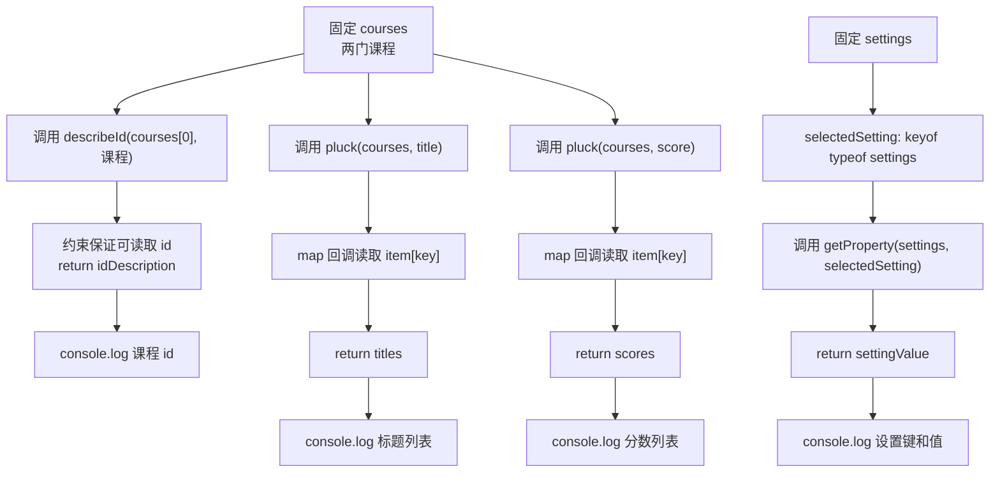

# DAY16 · Practice 01：泛型约束、keyof、T[K] 与 typeof

[返回当天课程](../README.md)

## 文件位置

- 作答文件：[practice.ts](../../../day16/practice01/practice.ts)
- 完整参考答案：[solution.ts](../../../day16/practice01/solution.ts)
- 方案说明：[SOLUTION.md](./SOLUTION.md)

## 场景背景

你在为课程管理后台编写通用的字段读取工具，表格可能需要课程标题、分数，也可能要读取界面设置。调用方会传入对象或对象列表以及希望读取的字段名。你需要只允许真实存在的字段，并让返回结果保留该字段原本的类型，最后生成课程和设置摘要。

这是一道完整、独立的主练习。不要导入其他 practice 文件夹中的代码。

## 数据流

先沿变量名看数据怎样分叉和汇合；`──>` 表示值被交给下一步。

```text
courses/settings + 合法 key
   ├── getProperty<Item, Key> ──> Item[Key]
   └── pluck<Item, Key> ──> 多个 Item[Key]
带 id 的对象 ──> describeId(泛型约束) ──> id 描述
settings ──> keyof typeof settings ──> SettingName ──> selectedSetting
各条精确类型结果 ──> 输出
```

## 代码流程图



## 起始代码

函数签名、固定课程和设置、调用以及四行输出已给出。你需要完成属性读取、`map` 回调和每个函数的 `return`。

```ts
function getProperty<Item, Key extends keyof Item>(
  item: Item,
  key: Key,
): Item[Key] {
  throw new Error("TODO：读取 item[key] 并 return");
}

function pluck<Item, Key extends keyof Item>(
  items: readonly Item[],
  key: Key,
): Item[Key][] {
  throw new Error("TODO：用 map 回调读取同一 key，并 return 数组");
}

function describeId<Item extends { id: number }>(item: Item, prefix: string): string {
  throw new Error("TODO：使用 item.id 并 return 描述文字");
}

const courses = [
  { id: 7, title: "变量", score: 80, published: true },
  { id: 8, title: "泛型", score: 95, published: false },
] as const;
const settings = { theme: "dark", fontSize: 16, compact: false };
type SettingName = keyof typeof settings;
const selectedSetting: SettingName = "theme";
const idDescription = describeId(courses[0], "课程");
const titles = pluck(courses, "title");
const scores = pluck(courses, "score");
const settingValue = getProperty(settings, selectedSetting);
console.log(idDescription);
console.log(`标题：${titles.join("、")}`);
console.log(`分数：${scores.join("、")}`);
console.log(`设置：${selectedSetting}=${settingValue}`);
```

请从头编写“类型安全的课程取值工具”。

必须实现：

- `getProperty<Item, Key extends keyof Item>(item, key): Item[Key]`
- `pluck<Item, Key extends keyof Item>(items, key): Item[Key][]`，使用 `map` 收集同一属性
- `describeId<Item extends { id: number }>(item, prefix): string`
- 固定对象 `settings = { theme: "dark", fontSize: 16, compact: false }`
- `SettingName = keyof typeof settings`
- `selectedSetting: SettingName = "theme"`

固定课程数据：

~~~text
{id: 7, title: "变量", score: 80, published: true}
{id: 8, title: "泛型", score: 95, published: false}
~~~

精确输出：

~~~text
课程#7
标题：变量、泛型
分数：80、95
设置：theme=dark
~~~

限制：

- 不得使用 `any`、类型断言或非空断言。
- `getProperty` 与 `pluck` 的返回类型必须写成 `Item[Key]` 和 `Item[Key][]`。
- `pluck` 必须根据收到的 `key` 读取属性，不能为标题和分数写两套函数。
- `describeId` 只约束真正需要的数字 `id`。
- `SettingName` 必须从 `settings` 的真实值派生，不能手写字符串联合。

完成标准：右键运行后显示 PASS；能解释为什么任意 `string` 不能直接安全索引对象。

## 本题易漏语法

keyof T 产生键联合，T[K] 用方括号取属性类型；运行时读取写 object[key]。

## 写完后自检

- 把 `selectedSetting` 改成 `"fontSize"` 后，读取结果的类型和值应怎样变化？
- 尝试把 `"missing"` 交给 `getProperty`，TypeScript 应在哪个参数位置拒绝它？为什么任意 `string` 不够安全？
- 为什么函数还需要独立的 `Key extends keyof Item`，不能只接收 `keyof Item` 再统一返回所有属性类型的联合？

## 文件

- 在 `practice.ts` 中独立作答。
- 完成并运行通过后，再查看 `solution.ts` 的完整参考答案与 `SOLUTION.md` 的调用说明。
