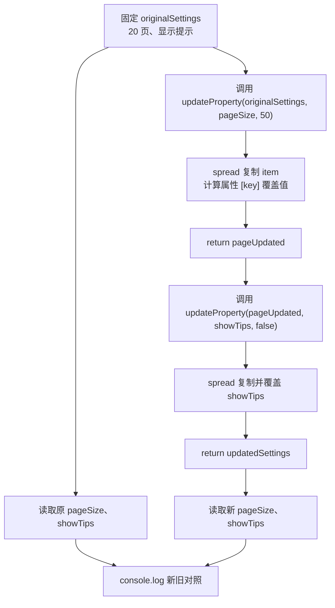

# DAY16 · Practice 02：类型安全的配置更新

[返回当天课程](../README.md)

## 文件位置

- 作答文件：[practice.ts](../../../day16/practice02/practice.ts)
- 完整参考答案：[solution.ts](../../../day16/practice02/solution.ts)
- 方案说明：[SOLUTION.md](./SOLUTION.md)

## 场景背景

设置面板会把“要改的字段名”和“新值”交给同一个更新函数。危险点不只是假字段名：即使键存在，把 `"50"` 写进数字 `pageSize` 也会制造错误状态。函数需要让键决定新值类型，并返回新对象供撤销功能保留旧设置。

## 和 Practice 01 的区别

Practice 01 用 `Key` 决定读取结果 `Item[Key]`，还会从数组批量收集字段。本题把同一关系放到写入边界：`key` 决定 `nextValue` 的类型，并且每次更新都创建新对象；没有 `pluck`，控制流是连续两次不同类型的更新。

## 关联复习

返回新对象会复用 Day13 的对象 spread；键和值的关系则来自本日的 `keyof` 与 `T[K]`。两者结合后，编译期和值更新时的引用边界都能得到检查。

## 数据流

先沿变量名看数据怎样分叉和汇合；`──>` 表示值被交给下一步。

```text
originalSettings
   ├── key: "pageSize" + nextValue: number
   │      └── updateProperty ──> pageUpdated
   └── 保持原对象不变

pageUpdated
   └── key: "showTips" + nextValue: boolean
          └── updateProperty ──> updatedSettings

originalSettings + updatedSettings ──> 对照输出
```

## 代码流程图



## 起始代码

固定设置、泛型函数签名、两次连续调用和四行输出已给出。你需要完成创建新对象的表达式并 `return` 它。

```ts
type Settings = {
  theme: "light" | "dark";
  pageSize: number;
  showTips: boolean;
};
type SettingName = keyof Settings;

function updateProperty<Item, Key extends keyof Item>(
  item: Item,
  key: Key,
  nextValue: Item[Key],
): Item {
  throw new Error("TODO：使用 spread 和 [key] 创建并 return 新对象");
}

const originalSettings: Settings = {
  theme: "light",
  pageSize: 20,
  showTips: true,
};
const pageSizeKey: SettingName = "pageSize";
const pageUpdated = updateProperty(originalSettings, pageSizeKey, 50);
const updatedSettings = updateProperty(pageUpdated, "showTips", false);
console.log(`原页数：${originalSettings.pageSize}`);
console.log(`新页数：${updatedSettings.pageSize}`);
console.log(`原提示：${originalSettings.showTips}`);
console.log(`新提示：${updatedSettings.showTips}`);
```

## 要完成的功能

- `Settings`：`theme: "light" | "dark"`、`pageSize: number`、`showTips: boolean`。
- `SettingName = keyof Settings`。
- `updateProperty<Item, Key extends keyof Item>(item, key, nextValue: Item[Key]): Item`：返回只覆盖目标字段的新对象。
- 固定原设置：`theme="light"`、`pageSize=20`、`showTips=true`。
- 先通过变量 `pageSizeKey: SettingName = "pageSize"` 把页数改成 `50`，再把 `showTips` 改成 `false`。

## 约束

- 不得导入 `practice01` 或直接调用其他练习的实现。
- 不得使用 `any`、类型断言或直接修改传入对象。
- `key` 不能放宽成任意 `string`，`nextValue` 不能写成所有字段类型的宽联合。
- 两次更新必须调用同一个泛型函数，不能为数字和布尔值各写一套函数。
- 输出必须由变量、计算或函数返回值产生，不把整行结果写死。
- 每个参数、局部变量和返回值都应能在流程图中找到位置。

## 精确期望输出

```text
原页数：20
新页数：50
原提示：true
新提示：false
```

完成标准：右键运行显示 PASS；数字键只接收数字、布尔键只接收布尔值，两次更新都来自同一函数且原设置不变。

## 写完后自检

- 尝试调用 `updateProperty(originalSettings, "pageSize", "50")`，哪一个参数应该报错？
- 把 key 改成 `"missing"`，为什么代码应在运行前就失败？
- 为什么第三个参数写成 `Item[Key]`，而不是 `Item[keyof Item]`？后者会放过哪些键和值错配？

## 文件

在上方链接的 `practice.ts` 作答；独立完成后再查看 `solution.ts` 的完整参考答案。
