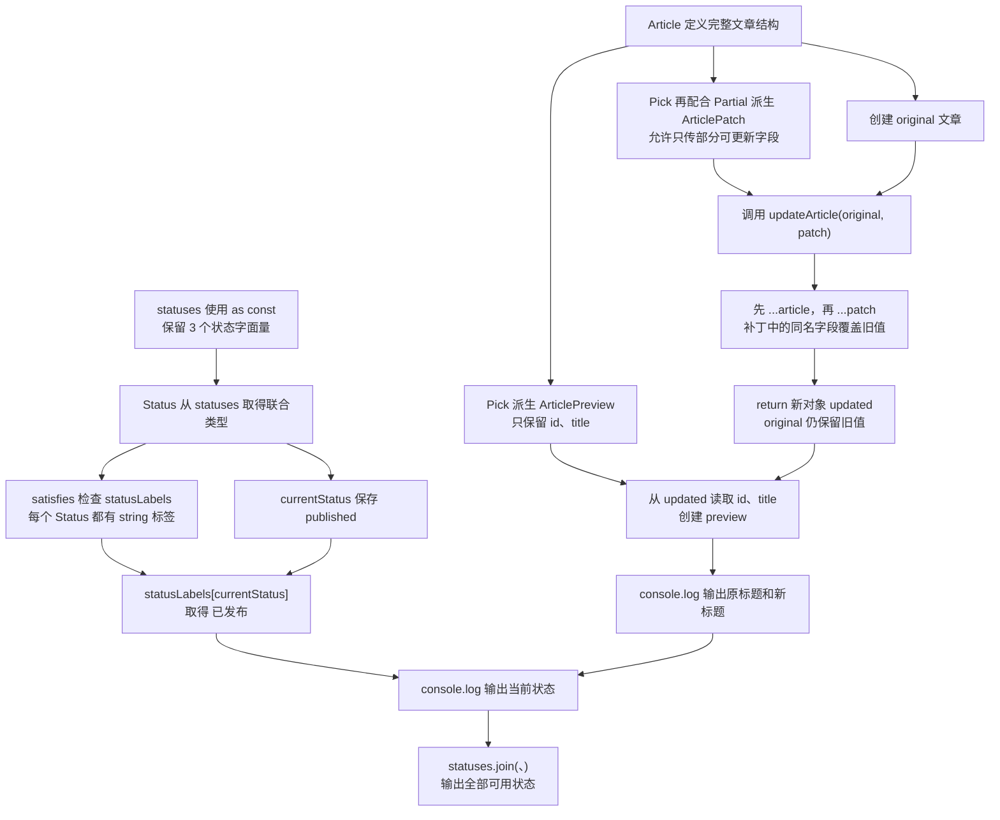

# Day 17：Utility Types、as const 与 satisfies

预计用时：75–90 分钟。

项目里已经有 `Article` 类型时，更新表单、文章预览和状态文字表通常都与它有关。重新复制一份接口很容易漏改字段。今天学习从已有类型或已有值生成新的类型规则，让 TypeScript 在源类型变化时提醒你检查相关位置。

## 核心讲解

工具类型（Utility Types）不会创建新对象。它们只拿已有类型当原料，生成另一套检查规则：

- `Partial<T>`：把每个字段变成可选。适合“这次只更新传进来的几个字段”的补丁对象。
- `Required<T>`：把每个字段变成必填。少一个字段就会得到类型提示。
- `Readonly<T>`：不允许通过这个类型重新给字段赋值；它是编译期检查，不是运行时冻结。
- `Pick<T, Keys>`：新类型只保留指定字段，例如预览只需要标题和状态。
- `Omit<T, Keys>`：新类型排除指定字段。它只改变允许你怎样使用变量，不会从真实对象中删字段。
- `Record<Keys, Value>`：要求 `Keys` 中的每个键都出现，并且每个键对应的值都符合 `Value`。适合检查状态文字表是否漏项。
- `ReturnType<typeof fn>`：读取函数声明中的返回类型，函数以后改变返回值时，这个类型也会跟着更新。
- `Awaited<PromiseType>`：取得 Promise 被 `await` 后的成功值类型。

这些工具只在 TypeScript 检查代码时工作。它们不会自动复制对象、冻结对象或删除字段。例如，把变量标成 `Omit<Account, "email">`，只是后续代码不能通过这个类型读取 `email`；运行时的原对象仍可能带着 `email`。要真的删除字段，需要用解构 rest 等 JavaScript 操作创建新对象。

接下来从一个真实数组生成类型。普通字符串数组通常只记得“里面是字符串”；加上 `as const` 后，TypeScript 会记住每个位置的具体文字，并把数组视为只读元组：

~~~ts
const levels = ["初级", "中级", "高级"] as const;
type Level = (typeof levels)[number];
~~~

先读 `type Level = (typeof levels)[number]`：`typeof levels` 取得整个元组的类型，后面的 `[number]` 表示“任意数字位置上的成员类型”，所以 `Level` 得到 `"初级" | "中级" | "高级"`。这些步骤只产生类型，不会创建新数组。

先声明状态联合 `type Status = "draft" | "published";`，再用 `satisfies` 检查文字表：每个状态键都必须出现，值也必须是字符串；同时，`labels` 仍保留自身较精确的类型。

~~~ts
const labels = {
  draft: "草稿",
  published: "已发布",
} satisfies Record<Status, string>;
~~~

这里先创建 `labels` 对象，再让 TypeScript 检查它是否满足 `Record<Status, string>`。少一个状态、拼错键名或把值写成非字符串，都会在编辑器中提示。

`satisfies` 是检查，不是强制相信。`as Record<...>` 可能把漏键问题盖住，而 `satisfies` 会把问题显示出来。它同样只在编译期工作，不能替你验证接口返回或 JSON 中的未知数据。

## 为什么要这样设计

手写“文章预览”“文章补丁”“公开文章”这些相似类型时，原类型新增字段后，副本很容易忘记同步。Utility Types 从一个主要类型派生其他用途的形状，`as const` 保留精确字面量，`satisfies` 则检查配置有没有漏键或写错值。

TypeScript 负责计算 `Pick`、`Omit`、`Partial` 等派生结果，并在编译时检查对应关系。你仍要决定哪一个类型是事实来源、哪些字段允许更新或公开，以及运行时到底要构造什么对象；类型工具不会替你删除真实对象里的字段。

这些能力只在编译阶段提供保护。`as const` 不会冻结运行中的对象，`satisfies` 也不会补上缺失数据；派生层次过多时还会让最终形状难以阅读，应该让每个别名都对应清楚的业务用途。

## 阅读示例

打开并右键运行 `example.ts`。给每个派生结果找来源：`ArticlePatch` 和 `ArticlePreview` 来自哪个基础类型，`Status` 来自哪个数组值，`statusLabels` 又在检查哪些键。先找到源头，再看源头变化后哪些位置会收到提示。

## 派生关系怎么读

可以把本日的类型关系看成四条线：

1. `Article` → `Partial`、`Pick` 或 `Omit` → 更新或展示所需的新类型。
2. 状态数组 → `as const` → 保留每个状态文字。
3. `typeof` 加 `[number]` → 从数组成员得到状态联合。
4. 状态联合 → `Record` 加 `satisfies` → 检查每个状态都有对应文字。

这些箭头只描述 TypeScript 的检查关系。运行时要创建新对象、删字段或读取 JSON，仍然需要真正的 JavaScript 代码。

## Example 实际输出

运行 `example.ts` 后，终端会按下面的顺序显示。先用代码推测结果，再逐行对照：

```text
原标题：旧标题
新标题：TypeScript 工具类型
状态：published=已发布
可用状态：draft、published、archived
```

## Example 代码流程图

运行 `example.ts` 前先沿图预测执行顺序；运行后再把每个节点对应到代码行。



## 官方手册扩展阅读（可选）

完成当天教程后，可从 [Day 17 对应阅读](../OFFICIAL-READING.md#day-17) 中只选 1 篇继续看。它不是练习前置，不需要在写 Practice 前读完。

## 独立练习导航

本日共有 2 道独立练习。每道题都有单独目录、说明、作答文件和完整参考答案；题目之间不共享代码。

| 目录 | 场景 | 类型 |
| --- | --- | --- |
| [practice01](./practice01/README.md) | Utility Types、as const 与 satisfies | 主任务 |
| [practice02](./practice02/README.md) | 角色权限矩阵 | 闭卷迁移 |

右击任意练习目录中的 `practice.ts` 即可单独检查；命令行也可运行 `npm run beginner -- day17 practice02`。

## 容易出错的地方

- 复制新接口，原类型改变后忘记同步。
- 认为 `Omit` 会删除运行时字段。
- 使用 `Partial` 后直接修改原对象。
- 把 `as const` 当作运行时深冻结。
- 用 `as Record<...>` 掩盖漏键，而不是使用 `satisfies`。
- 派生数组成员联合时忘记 `[number]`。

### 错误代码示例

通知配置从启动数据中读取渠道列表。开发者给配置加了 `as const`，便以为渠道数组也在运行时被冻结，不会再被别处修改：

```ts
const channelsFromStartup = ["email"];

const notificationConfig = {
  channels: channelsFromStartup,
  retry: {
    maxAttempts: 3,
  },
} as const;

channelsFromStartup.push("sms"); // ❌ 两处仍引用同一个数组。
console.log(notificationConfig.channels.join("、"));
```

实际输出：

```text
email、sms
```

`as const` 负责类型检查：它尽量保留字面量，并把对象属性标记为只读。它不会复制数组，也不会在 JavaScript 运行时调用冻结功能。这里的 `channelsFromStartup` 和 `notificationConfig.channels` 指向同一个数组，所以从前者 `push`，配置里也会看到新增项。

另一类常见错误发生在文件格式与扩展名的对应表。为了尽快消除漏键报错，有人会使用断言：

```ts
type ExportFormat = "csv" | "json" | "xlsx";
const extensions = {
  csv: ".csv",
  json: ".json",
} as Record<ExportFormat, string>;

console.log(extensions.xlsx);
```

实际输出：

```text
undefined
```

断言没有补出 `xlsx`，只是让编译器停止追问。

### 正确写法

下面会用到两个 JavaScript 动作：

- `[...原数组]` 会把数组中的现有项目放进一个新数组，避免新配置继续和外部共用同一个数组。
- `Object.freeze(对象)` 会在运行时冻结这个对象，使它不能再新增、删除或改写当前层的属性。它只处理当前这一层，嵌套的数组或对象要分别冻结。

```ts
const channelsFromStartup = ["email"];

const notificationConfig = Object.freeze({
  // ✅ 先复制外部数组，再冻结配置实际保存的副本。
  channels: Object.freeze([...channelsFromStartup]),
  retry: Object.freeze({
    maxAttempts: 3,
  }),
});

channelsFromStartup.push("sms");
console.log(notificationConfig.channels.join("、"));

const extensions = {
  csv: ".csv",
  json: ".json",
  xlsx: ".xlsx",
} satisfies Record<ExportFormat, string>;
```

实际输出：

```text
email
```

数组展开 `[...channelsFromStartup]` 会创建一个新数组，避免配置继续共享外部数组；`Object.freeze` 是 JavaScript 的运行时冻结方法。它只冻结当前这一层，所以示例把渠道数组、`retry` 对象和最外层对象分别冻结。

`satisfies` 解决的是另一件事：它在编译时检查三种文件格式是否都有扩展名，但不会在运行时补键。类型检查与运行时数据保护不能互相替代。

## 面试时怎么回答

**问：Utility Types、`as const` 和 `satisfies` 各自解决什么问题？**

**答：**Utility Types 根据已有类型计算新类型，例如 `Pick` 选字段、`Omit` 排除字段、`Partial` 把字段变成可选。`as const` 阻止字面量被扩大，并让对象属性成为只读、数组成为只读元组。`satisfies` 检查一个表达式能否赋给目标类型，同时保留表达式本身较精确的推断：

```ts
const environments = ["development", "production"] as const;
type Environment = (typeof environments)[number];
const baseUrls = {
  development: "http://localhost:3000",
  production: "https://api.example.com",
} satisfies Record<Environment, string>;
```

漏掉环境或写错键时会在编译期提示，`baseUrls` 的每个属性仍保留自己的具体类型。

三者都不会进行运行时转换：`Omit` 不会删除真实字段，`as const` 不等于深度 `Object.freeze`，`satisfies` 也不会补齐对象。公开数据、冻结和验证仍要由运行时代码完成。

官方参考：

- [TypeScript Handbook：Utility Types](https://www.typescriptlang.org/docs/handbook/utility-types.html)
- [TypeScript 3.4：`const` assertions](https://www.typescriptlang.org/docs/handbook/release-notes/typescript-3-4.html#const-assertions)
- [TypeScript 4.9：`satisfies` Operator](https://www.typescriptlang.org/docs/handbook/release-notes/typescript-4-9.html#the-satisfies-operator)

## 拓展思考（不要求写代码）

如果 `Article` 增加状态 `scheduled`，你希望哪些派生类型或配置自动更新，哪些位置应该立即报错提醒补充业务内容？为什么？
