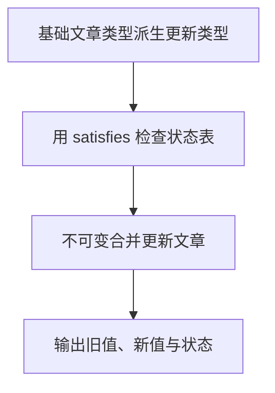

# Day 17：Utility Types、as const 与 satisfies

预计用时：75–90 分钟。

项目里已经有 `Article` 类型时，更新表单、文章预览和状态文字表通常都与它有关。重新复制一份接口很容易漏改字段。今天学习从已有类型或已有值生成新的类型规则，让 TypeScript 在源类型变化时提醒你检查相关位置。

## 核心讲解

工具类型（Utility Types）不会创建新对象。它们只拿已有类型当原料，生成另一套检查规则：

- `Partial<T>`：把每个字段变成可选。适合“这次只更新传进来的几个字段”的补丁对象。
- `Required<T>`：把每个字段变成必填。少一个字段就会得到类型提示。
- `Readonly<T>`：不允许通过这个类型重新给字段赋值；它是编译期检查，不是运行时冻结。
- `Pick<T, Keys>`：新类型只保留指定字段，例如预览只需要标题和状态。
- `Omit<T, Keys>`：新类型排除指定字段。它只改变允许你怎样使用变量，不会从真实对象中删字段。
- `Record<Keys, Value>`：要求 `Keys` 中的每个键都出现，并且每个键对应的值都符合 `Value`。适合检查状态文字表是否漏项。
- `ReturnType<typeof fn>`：读取函数声明中的返回类型，函数以后改变返回值时，这个类型也会跟着更新。
- `Awaited<PromiseType>`：取得 Promise 被 `await` 后的成功值类型。

这些工具只在 TypeScript 检查代码时工作。它们不会自动复制对象、冻结对象或删除字段。例如，把变量标成 `Omit<Account, "email">`，只是后续代码不能通过这个类型读取 `email`；运行时的原对象仍可能带着 `email`。要真的删除字段，需要用解构 rest 等 JavaScript 操作创建新对象。

接下来从一个真实数组生成类型。普通字符串数组通常只记得“里面是字符串”；加上 `as const` 后，TypeScript 会记住每个位置的具体文字，并把数组视为只读元组：

~~~ts
const levels = ["初级", "中级", "高级"] as const;
type Level = (typeof levels)[number];
~~~

先读 `type Level = (typeof levels)[number]`：`typeof levels` 取得整个元组的类型，后面的 `[number]` 表示“任意数字位置上的成员类型”，所以 `Level` 得到 `"初级" | "中级" | "高级"`。这些步骤只产生类型，不会创建新数组。

先声明状态联合 `type Status = "draft" | "published";`，再用 `satisfies` 检查文字表：每个状态键都必须出现，值也必须是字符串；同时，`labels` 仍保留自身较精确的类型。

~~~ts
const labels = {
  draft: "草稿",
  published: "已发布",
} satisfies Record<Status, string>;
~~~

这里先创建 `labels` 对象，再让 TypeScript 检查它是否满足 `Record<Status, string>`。少一个状态、拼错键名或把值写成非字符串，都会在编辑器中提示。

`satisfies` 是检查，不是强制相信。`as Record<...>` 可能把漏键问题盖住，而 `satisfies` 会把问题显示出来。它同样只在编译期工作，不能替你验证接口返回或 JSON 中的未知数据。

## 阅读示例

打开并右键运行 `example.ts`。给每个派生结果找来源：`ArticlePatch` 和 `ArticlePreview` 来自哪个基础类型，`Status` 来自哪个数组值，`statusLabels` 又在检查哪些键。先找到源头，再看源头变化后哪些位置会收到提示。

## 派生关系怎么读

可以把本日的类型关系看成四条线：

1. `Article` → `Partial`、`Pick` 或 `Omit` → 更新或展示所需的新类型。
2. 状态数组 → `as const` → 保留每个状态文字。
3. `typeof` 加 `[number]` → 从数组成员得到状态联合。
4. 状态联合 → `Record` 加 `satisfies` → 检查每个状态都有对应文字。

这些箭头只描述 TypeScript 的检查关系。运行时要创建新对象、删字段或读取 JSON，仍然需要真正的 JavaScript 代码。

## Example 实际输出

运行 `example.ts` 后，终端会按下面的顺序显示。先用代码推测结果，再逐行对照：

```text
原标题：旧标题
新标题：TypeScript 工具类型
状态：published=已发布
可用状态：draft、published、archived
```

## Example 代码流程图

运行 `example.ts` 前先沿图预测执行顺序；运行后再把每个节点对应到代码行。



## 独立练习导航

本日共有 2 道独立练习。每道题都有单独目录、说明、作答文件和解题结构；题目之间不共享代码。

| 目录 | 场景 | 类型 |
| --- | --- | --- |
| [practice01](./practice01/README.md) | Utility Types、as const 与 satisfies | 主任务 |
| [practice02](./practice02/README.md) | 内容发布配置 | 闭卷迁移 |

右击任意练习目录中的 `practice.ts` 即可单独检查；命令行也可运行 `npm run beginner -- day17 practice02`。

## 容易出错的地方

- 复制新接口，原类型改变后忘记同步。
- 认为 `Omit` 会删除运行时字段。
- 使用 `Partial` 后直接修改原对象。
- 把 `as const` 当作运行时深冻结。
- 用 `as Record<...>` 掩盖漏键，而不是使用 `satisfies`。
- 派生数组成员联合时忘记 `[number]`。

### 错误代码示例

```ts
type PublicArticle = Omit<Article, "summary">;
const publicArticle: PublicArticle = article;
// ❌ 类型允许赋值不代表运行时删除了 summary；对象里仍然有这个字段。

const labels = {
  draft: "草稿",
} as Record<Status, string>; // ❌ 断言掩盖了 published、archived 等漏键。
```

### 正确写法

```ts
const { summary: _privateSummary, ...publicArticle } = article;
// ✅ 解构 rest 真正在运行时创建不含 summary 的对象。

const labels = {
  draft: "草稿",
  published: "已发布",
  archived: "已归档",
} satisfies Record<Status, string>; // ✅ 漏键或值类型错误都会被检查。
```

## 拓展思考（不要求写代码）

如果 `Article` 增加状态 `scheduled`，你希望哪些派生类型或配置自动更新，哪些位置应该立即报错提醒补充业务内容？为什么？

## 官方资料

- [Utility Types](https://www.typescriptlang.org/docs/handbook/utility-types.html)
- [TypeScript 3.4：const assertions](https://www.typescriptlang.org/docs/handbook/release-notes/typescript-3-4.html#const-assertions)
- [TypeScript 4.9：satisfies](https://www.typescriptlang.org/docs/handbook/release-notes/typescript-4-9.html#the-satisfies-operator)
