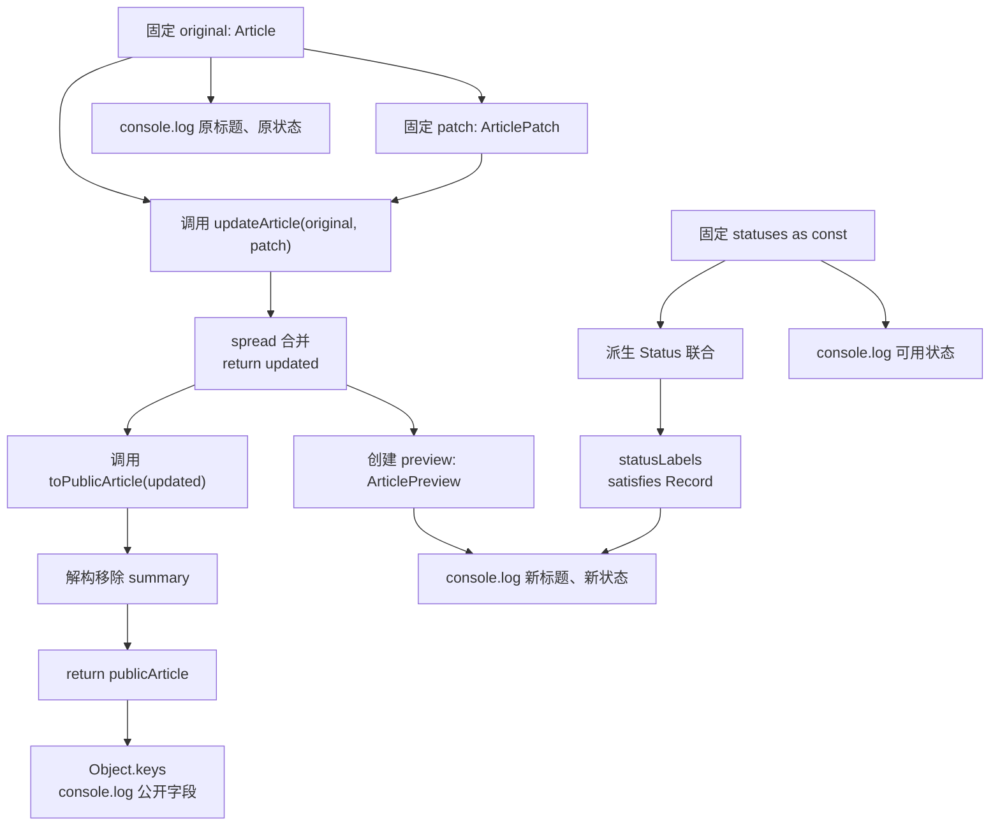

# DAY17 · Practice 01：Utility Types、as const 与 satisfies

[返回当天课程](../README.md)

## 文件位置

- 作答文件：[practice.ts](../../../day17/practice01/practice.ts)
- 完整参考答案：[solution.ts](../../../day17/practice01/solution.ts)
- 方案说明：[SOLUTION.md](./SOLUTION.md)

## 场景背景

你在开发内容管理系统的文章编辑页，编辑表单只会提交发生变化的字段，而公开页面不能泄露内部摘要。程序会收到原文章、部分更新以及固定的状态标签表。你需要生成新文章、编辑预览和真正移除敏感字段的公开数据，并展示更新前后的差异。

这是一道完整、独立的主练习。不要导入其他 practice 文件夹中的代码。

## 数据流

先沿变量名看数据怎样分叉和汇合；`──>` 表示值被交给下一步。

```text
statuses as const ──> Status 联合 ──> statusLabels
Article
   ├── Partial ──> ArticlePatch ──> updateArticle ──> updated
   ├── Pick ──> ArticlePreview ──> preview
   └── Omit ──> PublicArticle ──> publicArticle
派生对象 + 状态文字 ──> 输出
```

## 代码流程图



## 起始代码

固定状态、派生类型、文章、补丁、函数签名、调用和输出已给出。你需要完成对象合并与移除字段时的解构和 `return`。

```ts
const statuses = ["draft", "published", "archived"] as const;
type Status = (typeof statuses)[number];
type Article = {
  readonly id: number;
  title: string;
  summary: string;
  published: boolean;
  status: Status;
};
type ArticlePatch = Partial<Pick<Article, "title" | "summary" | "published" | "status">>;
type ArticlePreview = Pick<Article, "id" | "title" | "status">;
type PublicArticle = Omit<Article, "summary">;
const statusLabels = {
  draft: "草稿",
  published: "已发布",
  archived: "已归档",
} satisfies Record<Status, string>;

function updateArticle(article: Article, patch: ArticlePatch): Article {
  throw new Error("TODO：用 spread 合并并 return 新 Article");
}
function toPublicArticle(article: Article): PublicArticle {
  throw new Error("TODO：解构排除 summary，并 return 其余字段");
}

const original: Article = {
  id: 1,
  title: "旧标题",
  summary: "内部学习记录",
  published: false,
  status: "draft",
};
const patch: ArticlePatch = {
  title: "TypeScript 工具类型",
  published: true,
  status: "published",
};
const updated = updateArticle(original, patch);
const preview: ArticlePreview = { id: updated.id, title: updated.title, status: updated.status };
const publicArticle = toPublicArticle(updated);
console.log(`原标题：${original.title}`);
console.log(`新标题：${preview.title}`);
console.log(`原状态：${original.status}`);
console.log(`新状态：${preview.status}=${statusLabels[preview.status]}`);
console.log(`公开字段：${Object.keys(publicArticle).join(",")}`);
console.log(`可用状态：${statuses.join("、")}`);
```

请从头编写“文章更新与公开摘要”。

先声明：

- `statuses = ["draft", "published", "archived"] as const`
- `Status = (typeof statuses)[number]`
- `Article`：包含只读数字 `id`，以及 `title`、`summary`、`published`、`status`
- `ArticlePatch = Partial<Pick<Article, "title" | "summary" | "published" | "status">>`
- `ArticlePreview = Pick<Article, "id" | "title" | "status">`
- `PublicArticle = Omit<Article, "summary">`
- `statusLabels`，用 `satisfies Record<Status, string>` 精确覆盖三种状态

实现：

- `updateArticle(article, patch): Article`：使用 spread 返回新文章。
- `toPublicArticle(article): PublicArticle`：在运行时真正排除 `summary`，不能只改类型。

固定 `original`：

~~~text
id=1
title=旧标题
summary=内部学习记录
published=false
status=draft
~~~

用补丁把标题改成 `TypeScript 工具类型`、published 改为 `true`、status 改为 `published`，并创建 `updated`、`preview` 和 `publicArticle`。精确输出：

~~~text
原标题：旧标题
新标题：TypeScript 工具类型
原状态：draft
新状态：published=已发布
公开字段：id,title,published,status
可用状态：draft、published、archived
~~~

限制：

- 不得使用 `any`、类型断言、非空断言或直接修改 `original`。
- 四个派生类型不得复制粘贴完整字段定义。
- 状态联合必须来自 `statuses`，标签表必须使用 `satisfies Record<Status, string>`。
- `toPublicArticle` 必须通过对象解构与 rest 真正移除运行时字段。
- 输出新标题时必须读取 `ArticlePreview`，公开字段必须读取 `publicArticle`。

完成标准：右键运行后显示 PASS；能解释类型层的 `Omit` 与运行时移除字段为何是两件事。

## 本题易漏语法

Utility Type 用尖括号传类型，如 Partial<Task>；as const 与 satisfies 放值表达式后，结尾仍是分号。

## 写完后自检

- 如果补丁只提供 `summary`，哪些字段必须保持原值？原文章的对象引用是否可以被直接返回？
- 从 `statusLabels` 删除 `archived` 后，`satisfies` 应该指出什么问题？如果改成普通宽泛对象类型，还能否同样及时发现？
- 为什么 `Omit<Article, "summary">` 不能自动删除运行时的 `summary`？题目中的解构 rest 解决的是哪一层问题？

## 文件

- 在 `practice.ts` 中独立作答。
- 完成并运行通过后，再查看 `solution.ts` 的完整参考答案与 `SOLUTION.md` 的调用说明。
