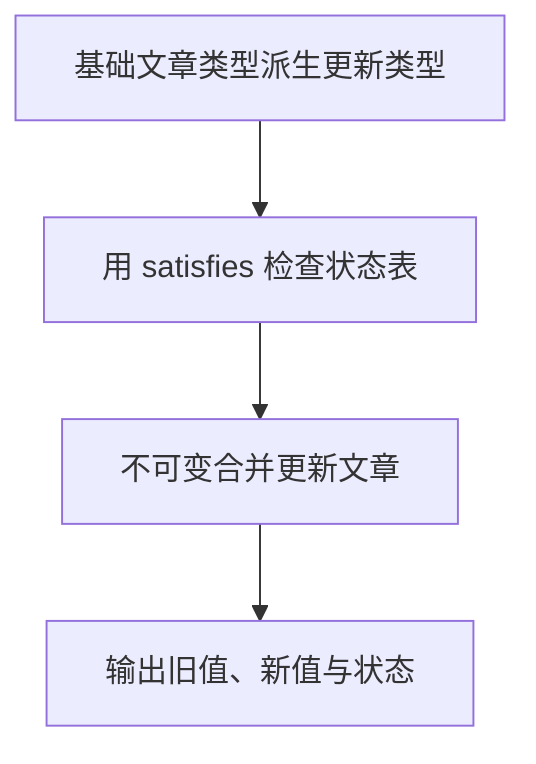

# DAY17 · Practice 02：内容发布配置

[返回当天课程](../README.md)

## 文件位置

- 作答文件：[practice.ts](../../../day17/practice02/practice.ts)
- 结构提示代码：[solution.ts](../../../day17/practice02/solution.ts)
- 方案说明：[SOLUTION.md](./SOLUTION.md)

## 场景背景

你正在实现文章发布面板，编辑器会把少量变更提交给一篇已有文章。系统还维护一张草稿、已发布和已归档状态的中文标签表。你需要在不改动旧文章的前提下得到更新后的内容，并向编辑展示标题变化和当前发布状态。

这是一道与 Practice 01 文件完全分开的闭卷迁移题。先理解并运行当天 `example.ts`，然后关闭它；不要复制代码，仅根据下面的流程与输出从空白重新实现。

## 代码流程图



## 必须练到的能力

使用 Utility Types、as const 或 satisfies 保留约束与推断。

- 不得导入 `practice01` 或直接调用其他练习的实现。
- 输出必须由变量、计算或函数返回值产生，不把整行结果写死。
- 每个参数、局部变量和返回值都应能在流程图中找到位置。

## 精确期望输出

```text
原标题：旧标题
新标题：TypeScript 工具类型
状态：published=已发布
可用状态：draft、published、archived
```

## 文件

在上方链接的 `practice.ts` 作答；独立完成后再查看 `solution.ts` 的 TODO 解题结构。
