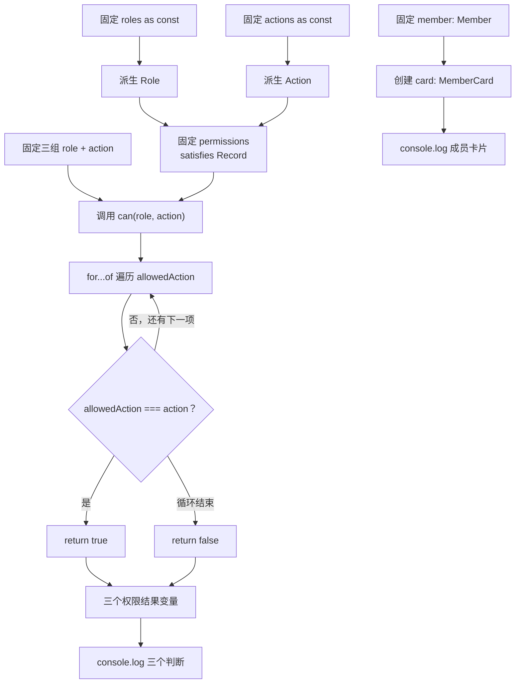

# DAY17 · Practice 02：角色权限矩阵

[返回当天课程](../README.md)

## 文件位置

- 作答文件：[practice.ts](../../../day17/practice02/practice.ts)
- 完整参考答案：[solution.ts](../../../day17/practice02/solution.ts)
- 方案说明：[SOLUTION.md](./SOLUTION.md)

## 场景背景

后台有访客、编辑和管理员三种角色，以及读取、编辑、关闭工单三种动作。权限表必须覆盖每一种角色，但又要保留每个角色自己的精确动作列表。程序会用同一函数检查三组角色与动作，并生成一张不包含邮箱的成员卡片。

## 和 Practice 01 的区别

Practice 01 的输入数据是文章与部分更新，流程会返回新文章和公开字段。本题不做对象补丁：两个 `as const` 数组派生角色与动作，`satisfies Record` 检查权限表完整性，运行时控制流程再根据权限数据做多次授权决策。

## 关联复习

角色和动作仍是 Day11 熟悉的字符串联合，但来源改成运行时数组；`can` 的遍历继续使用早期的 `for...of`。这次 `satisfies` 负责检查“表是否完整”，循环负责回答某次真实授权请求。

## 数据流

先沿变量名看数据怎样分叉和汇合；`──>` 表示值被交给下一步。

```text
roles as const ──> Role ───────┐
actions as const ──> Action ───┼──> permissions satisfies Record<Role, ...>
                               │
role + action ──> can ─────────┘
                    ├── 找到允许动作 ──> true
                    └── 未找到 ──> false

Member ── Pick ──> MemberCard(name, role)
三次权限结果 + MemberCard ──> 输出
```

## 代码流程图



## 起始代码

角色、动作、权限表、成员、函数签名、三次调用和输出都已给出。你需要写 `can` 中的循环、判断和 `return`。

```ts
const roles = ["viewer", "editor", "admin"] as const;
type Role = (typeof roles)[number];
const actions = ["read", "edit", "close"] as const;
type Action = (typeof actions)[number];
type Member = { readonly id: number; name: string; email: string; role: Role };
type MemberCard = Pick<Member, "name" | "role">;
const permissions = {
  viewer: ["read"],
  editor: ["read", "edit"],
  admin: ["read", "edit", "close"],
} satisfies Record<Role, readonly Action[]>;

function can(role: Role, action: Action): boolean {
  throw new Error("TODO：循环比较允许动作，并在对应路径 return boolean");
}

const member: Member = {
  id: 1,
  name: "Ada",
  email: "ada@example.com",
  role: "editor",
};
const card: MemberCard = { name: member.name, role: member.role };
const viewerCanEdit = can("viewer", "edit");
const editorCanClose = can("editor", "close");
const adminCanClose = can("admin", "close");
console.log(`viewer 可编辑：${viewerCanEdit}`);
console.log(`editor 可关闭：${editorCanClose}`);
console.log(`admin 可关闭：${adminCanClose}`);
console.log(`成员：${card.name} / ${card.role}`);
```

## 要完成的功能

- `roles = ["viewer", "editor", "admin"] as const`，并从中派生 `Role`。
- `actions = ["read", "edit", "close"] as const`，并从中派生 `Action`。
- `Member`：`readonly id`、`name`、`email`、`role`。
- `MemberCard = Pick<Member, "name" | "role">`。
- `permissions` 使用 `satisfies Record<Role, readonly Action[]>`：
  - viewer：read
  - editor：read、edit
  - admin：read、edit、close
- `can(role, action): boolean`：遍历该角色的允许动作并返回判断结果。
- 固定成员为 `Ada / editor`，固定判断为 viewer-edit、editor-close、admin-close。

## 约束

- 不得导入 `practice01` 或直接调用其他练习的实现。
- 不得手写另一份 `Role` 或 `Action` 字符串联合。
- 不得使用 `any`、类型断言，也不得在 `can` 中用角色名称硬编码三个分支。
- 权限表缺少角色、拼错动作时必须产生类型错误。
- `MemberCard` 必须从 `Member` 派生，不能复制完整成员字段。
- 输出必须由变量、计算或函数返回值产生，不把整行结果写死。
- 每个参数、局部变量和返回值都应能在流程图中找到位置。

## 精确期望输出

```text
viewer 可编辑：false
editor 可关闭：false
admin 可关闭：true
成员：Ada / editor
```

完成标准：右键运行显示 PASS；权限表覆盖三个角色，三次判断从表中计算，成员卡片只含 `name` 与 `role`。

## 写完后自检

- 从权限表删除 `admin` 后，`satisfies` 应指出什么问题？如果只给对象写一个宽泛索引签名，还能否发现？
- 给 editor 加入 `close` 后，哪一条固定判断会变化？`can` 函数是否需要修改？
- 为什么 `Role` 和 `Action` 从运行时数组派生，而不是维护三份容易不同步的名称清单？

## 文件

在上方链接的 `practice.ts` 作答；独立完成后再查看 `solution.ts` 的完整参考答案。
