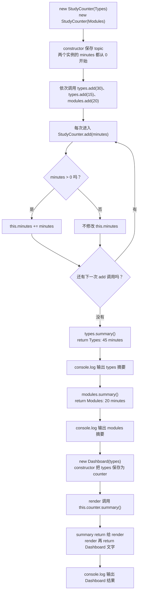

# Day 18：类——把数据与行为放在一起

预计用时：60–90 分钟。

假设要同时记录几名学生各自学习了多少分钟。每一份记录都有相同的数据和操作，但分钟数不能互相影响。类可以把“每个对象要保存什么”和“这些对象能做什么”写在一起，再用 `new` 创建多份互相独立的对象。

## 核心讲解

先看一个会记住次数的类。字段保存数据，方法读取或修改当前对象的数据：

~~~ts
class Counter {
  private count = 0;

  constructor(public readonly name: string) {}

  increment(): void {
    this.count += 1;
  }

  getCount(): number {
    return this.count;
  }
}
~~~

读这段代码时，先把几个词落到具体动作上：

- 每次执行 `new Counter(...)` 都会创建独立对象；例如 `new Counter("练习")` 还会把名称传给 `constructor`。
- `constructor(public readonly name: string)` 接收名称，同时声明并保存 `name` 字段。
- `counter.increment()` 中，点号左边的 `counter` 就是方法里的 `this`。
- `this.count += 1` 只修改当前这个对象的 `count`；另一个 `Counter` 不会跟着改变。
- `getCount()` 读取当前对象保存的次数，再用 `return` 交给调用处。

`private` 会让 TypeScript 阻止外部代码直接访问 `count`，`readonly` 会阻止重新给 `name` 赋值。它们是代码检查规则，不是数据加密，也不会把整个对象冻结。

接口可以规定“这个类必须提供哪些字段或方法”。这里的接口名是 `SummaryProvider`。类写 `implements SummaryProvider` 时，TypeScript 会检查它有没有把要求实现完整，但接口不会自动替类生成任何代码。缺少的方法仍要自己写。

如果 `Dashboard` 只需要调用某个对象的摘要方法，就把这个对象传给它使用，不必让 `Dashboard` 继承计数器。一个对象持有并使用另一个对象，这叫组合。判断时问一句：面板“是一种计数器”，还是“使用计数器提供的数据”？后者通常更适合组合。

调用 `formatter.format("完成")` 时，点号让 `formatter` 成为 `this`。如果先把普通方法取出来放进变量，再直接调用，方法前面没有实例，原来的 `this` 就丢了。

箭头函数字段会记住创建它的那个实例，所以把函数单独传出去后，仍能读取该实例的 `prefix`：

~~~ts
format = (message: string): string => {
  return `${this.prefix} ${message}`;
};
~~~

`class` 会生成运行时真实存在的 JavaScript 代码，所以程序可以执行 `new Counter()`。`type` 和 `interface` 只负责检查，编译后会消失，不能拿它们去 `new` 或在控制台中当值输出。

## 为什么要这样设计

当“学习分钟数”和“怎样增加、怎样生成摘要”散落在不同函数里，任何代码都可能写入非法状态，函数也容易拿错对象。类把一份实例数据和操作它的方法放在一起，每次 `new` 都得到独立状态；接口让面板只依赖“能提供摘要”这项能力，而不是绑死某个具体类。

JavaScript 负责创建实例、保存原型方法并在方法调用时提供 `this`，TypeScript 负责检查公开成员、私有成员和接口契约。你仍要决定哪些状态应隐藏、方法接受什么范围、无效输入如何处理，以及使用组合还是继承。

类不会自动保证状态合法，验证仍要写在方法里。箭头函数字段可以保留 `this`，代价是每个实例都会创建一份函数；`private` 主要是 TypeScript 层面的访问限制，也不等于对不可信数据的运行时安全检查。

## 阅读示例

打开并右键运行 `example.ts`。先分别记下两个 `StudyCounter` 变量，再逐次看方法调用的点号左边是谁。运行后检查分钟数：只有被调用的那个实例应该变化。接着看 `Dashboard` 构造器接收了什么对象，以及它实际调用了对方的哪个方法。

## 函数变量追踪

方法调用有两类输入，分开看就不容易乱：

1. 点号左边的对象决定 `this`。例如 `session.add(20)` 中，`session` 成为 `this`。
2. 圆括号里的值进入普通参数。这里的 `20` 进入分钟参数。
3. 方法用 `this.minutes` 读取或更新当前实例保存的字段。
4. 方法里的普通局部变量只属于这一次调用，调用结束后不会自动变成实例字段。
5. 方法有返回值时，`return` 再把结果交回调用处。

如果看到 `this` 是 `undefined` 或字段读不到，先检查这个方法是不是离开了点号左边的实例，被单独传递或调用了。

## Example 实际输出

运行 `example.ts` 后，终端会按下面的顺序显示。先用代码推测结果，再逐行对照：

```text
Types: 45 minutes
Modules: 20 minutes
Dashboard | Types: 45 minutes
```

## Example 代码流程图

运行 `example.ts` 前先沿图预测执行顺序；运行后再把每个节点对应到代码行。



## 官方手册扩展阅读（可选）

完成当天教程后，可从 [Day 18 对应阅读](../OFFICIAL-READING.md#day-18) 中只选 1 篇继续看。它不是练习前置，不需要在写 Practice 前读完。

## 独立练习导航

本日共有 2 道独立练习。每道题都有单独目录、说明、作答文件和完整参考答案；题目之间不共享代码。

| 目录 | 场景 | 类型 |
| --- | --- | --- |
| [practice01](./practice01/README.md) | 类：把数据与行为放在一起 | 主任务 |
| [practice02](./practice02/README.md) | 存储配额与状态边界 | 闭卷迁移 |

右击任意练习目录中的 `practice.ts` 即可单独检查；命令行也可运行 `npm run beginner -- day18 practice02`。

## 容易出错的地方

- 方法里写 `minutes` 而不是 `this.minutes`。
- 误以为 `private` 会加密或冻结数据。
- 把普通方法单独传递，调用时丢失 `this`。
- 误以为 `implements` 会自动提供方法实现。
- 为“拥有/使用”关系建立很深的继承层级。

### 错误代码示例

日志模块本来直接调用 `formatter.format(...)`，后来任务调度器要求传入一个独立回调。开发者把普通方法取出来交给调度器，调用方式从“实例点方法”变成了“直接调用函数”：

```ts
class AuditFormatter {
  constructor(private readonly prefix: string) {}

  format(entry: string): string {
    return `${this.prefix} ${entry}`;
  }
}

const formatter = new AuditFormatter("[订单]");
const scheduledTask = formatter.format; // ❌ 普通方法脱离实例。

console.log(scheduledTask("已支付"));
```

运行时会报错：

```text
TypeError: Cannot read properties of undefined (reading 'prefix')
```

`formatter.format("已支付")` 中，点号左边的 `formatter` 会成为 `this`。保存成 `scheduledTask` 后再直接调用，前面没有实例，普通方法里的 `this` 就是 `undefined`。这类问题常出现在事件处理器、定时任务、数组回调和第三方库的回调参数中。

### 正确写法

如果这个方法本来就需要经常作为回调传递，可以写成箭头函数字段：

```ts
class AuditFormatter {
  constructor(private readonly prefix: string) {}

  format = (entry: string): string => { // ✅ 箭头字段保留创建它的 this。
    return `${this.prefix} ${entry}`;
  };
}

const formatter = new AuditFormatter("[订单]");
const scheduledTask = formatter.format;
console.log(scheduledTask("已支付"));
```

实际输出：

```text
[订单] 已支付
```

也可以保留普通方法，在传递时明确绑定一次：

```ts
const scheduledTask = formatter.format.bind(formatter);
```

箭头函数字段会为每个实例创建一份函数；普通原型方法配合 `bind` 则由调用处决定何时绑定。选哪一种要看方法是否经常脱离实例传递。

## 面试时怎么回答

**问：`class implements` 后面只能写 `interface` 吗？**

**答：**不是。`implements` 后面需要的是能描述实例形状的类型，`interface` 和对象类型别名都可以。它只检查类实例是否满足契约，不会给类添加成员，也不会影响方法参数的类型推断：

```ts
type Printable = { print(): string };
class Report implements Printable {
  print(): string {
    return "report";
  }
}
```

类仍要亲自实现 `print`。无法静态表示为单一实例形状的联合类型，也不能直接用来让类“选择实现其中一个分支”。

**问：接口、抽象类和访问修饰符怎样区分？**

**答：**接口只描述实例需要具备的结构，编译后不保留。抽象类既能声明必须由子类实现的成员，也能保存共享状态和已经实现的方法；它会生成 JavaScript，并参与运行时继承。`public`、`protected` 和 TypeScript 的 `private` 主要是类型检查阶段的可见性规则；需要 JavaScript 运行时私有字段时使用 `#field`。

这些语法都不会替业务方法验证输入。例如 `consume(-5)` 是否允许，仍要在方法中写出规则。

官方参考：

- [TypeScript Handbook：Classes、`implements`、可见性与抽象类](https://www.typescriptlang.org/docs/handbook/2/classes.html)
- [MDN：Private elements](https://developer.mozilla.org/en-US/docs/Web/JavaScript/Reference/Classes/Private_elements)

## 拓展思考（不要求写代码）

一个只保存姓名和邮箱、没有长期内部行为的 `Profile` 是否值得写成类？请从实例状态、行为、测试难度和代码复杂度四方面比较“类型加普通函数”与“类”。
