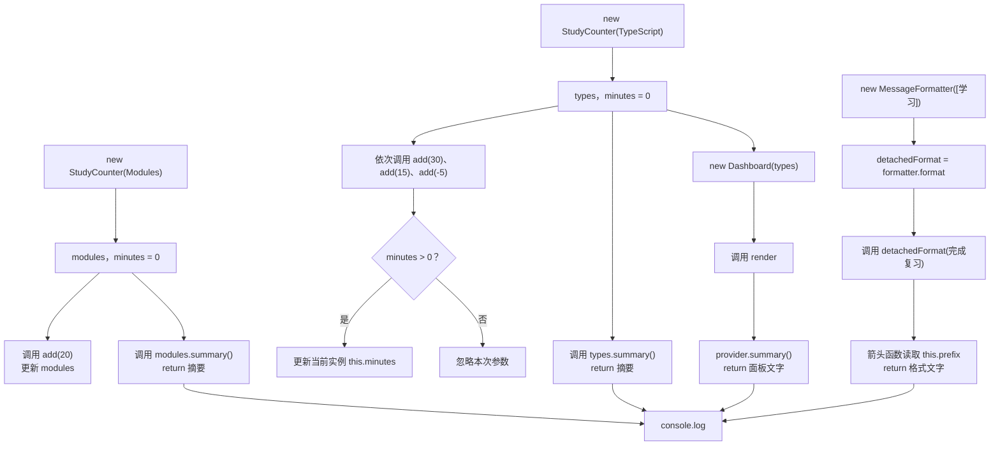

# DAY18 · Practice 01：类：把数据与行为放在一起

[返回当天课程](../README.md)

## 文件位置

- 作答文件：[practice.ts](../../../day18/practice01/practice.ts)
- 完整参考答案：[solution.ts](../../../day18/practice01/solution.ts)
- 方案说明：[SOLUTION.md](./SOLUTION.md)

## 场景背景

你在制作一个学习计时面板，每个学习主题都要独立累计时长，并能向面板提供统一格式的摘要。系统还会把消息格式化功能作为回调交给其他模块调用。你需要交付两个主题的计时结果、面板内容和一条脱离原实例后仍能正确生成的通知。

这是一道完整、独立的主练习。不要导入其他 practice 文件夹中的代码。

## 数据流

先沿变量名看数据怎样分叉和汇合；`──>` 表示值被交给下一步。

```text
new StudyCounter(...) ──> types / modules 两个独立实例
   └── addMinutes ──> 各自的 this.minutes
两个实例 ──> Dashboard ──> 汇总摘要
message ──> MessageFormatter.format ──> 格式文字
                         └── detachedFormat 仍绑定实例
实例结果 + 汇总 + 格式文字 ──> 输出
```

## 代码流程图



## 起始代码

接口、类结构、固定实例、方法调用和四行输出都已给出。你需要完成 `add` 的判断、各方法的 `return`，以及 `format` 箭头函数的主体。

```ts
interface SummaryProvider { summary(): string; }

class StudyCounter implements SummaryProvider {
  private minutes = 0;
  constructor(public readonly topic: string) {}
  add(minutes: number): void {
    // TODO：判断 minutes，只更新当前实例。
  }
  summary(): string {
    throw new Error("TODO：读取 this.topic、this.minutes 并 return 摘要");
  }
}

class Dashboard {
  constructor(private readonly provider: SummaryProvider) {}
  render(): string {
    throw new Error("TODO：使用 provider.summary() 并 return 面板文字");
  }
}

class MessageFormatter {
  constructor(private readonly prefix: string) {}
  format = (message: string): string => {
    throw new Error("TODO：使用 this.prefix 和 message 并 return 文字");
  };
}

const types = new StudyCounter("TypeScript");
const modules = new StudyCounter("Modules");
types.add(30);
types.add(15);
types.add(-5);
modules.add(20);
const dashboard = new Dashboard(types);
const formatter = new MessageFormatter("[学习]");
const detachedFormat = formatter.format;
console.log(types.summary());
console.log(modules.summary());
console.log(dashboard.render());
console.log(detachedFormat("完成复习"));
```

请从头编写“学习计数与面板”：

- 接口 `SummaryProvider`，包含 `summary(): string`。
- 类 `StudyCounter implements SummaryProvider`：
  - 私有字段 `minutes` 初始为 0。
  - 构造器参数属性 `public readonly topic: string`。
  - `add(minutes): void` 只累加大于 0 的分钟数。
  - `summary(): string` 返回 `主题: 分钟 minutes`。
- 类 `Dashboard`：
  - 构造器接收并保存 `private readonly provider: SummaryProvider`。
  - `render()` 返回 `Dashboard | 摘要`。
- 类 `MessageFormatter`：
  - 构造器保存 `private readonly prefix: string`。
  - `format` 必须是箭头函数字段，返回 `前缀 消息`，保证它脱离实例调用时仍有正确的 `this`。

固定操作：

- 创建 `TypeScript` 和 `Modules` 两个计数器。
- 前者依次增加 30、15 和 -5，后者增加 20。
- 用前者创建面板。
- 用前缀 `[学习]` 创建格式器，把 `format` 赋给 `detachedFormat` 后再调用。

精确输出：

~~~text
TypeScript: 45 minutes
Modules: 20 minutes
Dashboard | TypeScript: 45 minutes
[学习] 完成复习
~~~

限制：

- 不得使用 `any`、类型断言或直接从类外访问 `minutes`。
- 两个计数器必须是独立实例，不能共享全局分钟数。
- `Dashboard` 必须依赖接口并使用组合，不能继承 `StudyCounter`。
- `MessageFormatter.format` 必须能作为独立回调使用，不能在调用处手工绑定。
- 所有计算方法用 `return` 交付文字，最后才统一输出。

完成标准：右键运行后显示 PASS；能解释 `implements`、组合和箭头函数字段分别解决什么问题。

## 本题易漏语法

类字段与方法在 class 花括号内；字段语句用分号，方法关闭花括号后通常不加分号。

## 写完后自检

- 把 `types.add(-5)` 改成 `types.add(0)`，摘要是否应该变化？哪个方法负责守住这个边界？
- 如果把 `Dashboard` 的构造器参数写成具体的 `StudyCounter`，以后传入另一个能提供 `summary()` 的对象会受到什么限制？
- 把 `format` 改成普通方法再赋给 `detachedFormat`，运行时可能发生什么？为什么箭头函数字段能改变这个结果？

## 文件

- 在 `practice.ts` 中独立作答。
- 完成并运行通过后，再查看 `solution.ts` 的完整参考答案与 `SOLUTION.md` 的调用说明。
