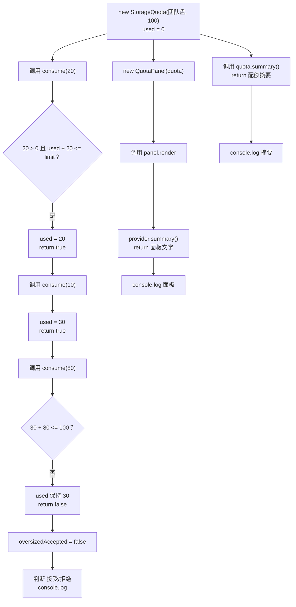

# DAY18 · Practice 02：存储配额与状态边界

[返回当天课程](../README.md)

## 文件位置

- 作答文件：[practice.ts](../../../day18/practice02/practice.ts)
- 完整参考答案：[solution.ts](../../../day18/practice02/solution.ts)
- 方案说明：[SOLUTION.md](./SOLUTION.md)

## 场景背景

团队网盘给每个空间设置独立容量。写入请求可能是负数、零或超过剩余容量，不能先修改状态再由外部代码补救。`StorageQuota` 要在方法内部决定是否接受写入；`QuotaPanel` 只读取摘要并加上展示前缀。

固定空间上限是 `100 GB`。先成功写入 `20 GB` 和 `10 GB`，再尝试写入 `80 GB`；最后一次会超过剩余容量，必须返回拒绝且不能改变已用容量。

## 和 Practice 01 的区别

Practice 01 主要观察两个计时器实例和脱离实例的 `this`。本题改为单个有容量上限的业务对象：`consume` 既要验证输入，又要用返回值告诉调用方写入是否被接受；展示对象只能读取接口，不能替配额对象修正状态。

## 关联复习

容量边界会复用 Day04 的条件分支，boolean 返回值则需要像 Day11 的状态标签一样明确解释含义。本日新增的类把检查和状态更新放进同一个实例方法。

## 数据流

先沿变量名看数据怎样分叉和汇合；`──>` 表示值被交给下一步。

```text
new StorageQuota("团队盘", 100) ──> quota（used = 0）
   ├── consume(20) ──> 校验通过 ──> used = 20 ──> true
   ├── consume(10) ──> 校验通过 ──> used = 30 ──> true
   └── consume(80) ──> 30 + 80 > 100 ──> used 仍为 30 ──> false

quota ──> summary() ───────────────────────> 配额摘要
quota ──> QuotaPanel(SummaryProvider) ──> render() ──> 带前缀摘要
第三次 consume 的 boolean ──> 接受/拒绝文字
```

## 代码流程图



## 起始代码

接口、类结构、固定容量、三次写入、面板调用和输出已经提供。你要完成容量判断、状态更新及所有 `return`。

```ts
interface SummaryProvider { summary(): string; }

class StorageQuota implements SummaryProvider {
  private used = 0;
  constructor(public readonly name: string, private readonly limit: number) {}
  consume(gigabytes: number): boolean {
    throw new Error("TODO：判断正数和容量上限，更新 used，并 return boolean");
  }
  summary(): string {
    throw new Error("TODO：读取 name、used、limit 并 return 摘要");
  }
}

class QuotaPanel {
  constructor(private readonly provider: SummaryProvider) {}
  render(): string {
    throw new Error("TODO：使用 provider.summary() 并 return 面板文字");
  }
}

const quota = new StorageQuota("团队盘", 100);
quota.consume(20);
quota.consume(10);
const oversizedAccepted = quota.consume(80);
const panel = new QuotaPanel(quota);
console.log(quota.summary());
console.log(`超额写入：${oversizedAccepted ? "接受" : "拒绝"}`);
console.log(panel.render());
```

## 要完成的功能

- 接口 `SummaryProvider`：包含 `summary(): string`。
- 类 `StorageQuota implements SummaryProvider`：
  - 私有字段 `used` 从 `0` 开始。
  - 构造器保存只读 `name` 和私有只读 `limit`。
  - `consume(gigabytes): boolean` 只接受正数且不能让 `used` 超过 `limit`；接受时更新状态并返回 `true`，拒绝时保持原状态并返回 `false`。
  - `summary()` 返回当前名称、已用容量和上限。
- 类 `QuotaPanel`：构造器只接收 `SummaryProvider`，`render()` 给摘要加上 `配额 | ` 前缀。

## 约束

- 不得导入 `practice01` 或直接调用其他练习的实现。
- 不得使用全局 `used`、`any`、类型断言，也不得从类外直接访问私有字段。
- 容量校验和状态更新必须在同一个 `consume` 方法内完成，拒绝请求不能留下部分修改。
- `QuotaPanel` 不能继承 `StorageQuota`，也不能读取它的私有容量字段。
- 输出必须由变量、计算或函数返回值产生，不把整行结果写死。
- 每个参数、局部变量和返回值都应能在流程图中找到位置。

## 精确期望输出

```text
团队盘：已用 30/100 GB
超额写入：拒绝
配额 | 团队盘：已用 30/100 GB
```

完成标准：右键运行显示 PASS；第三次超额写入返回拒绝且 `used` 保持 `30`，面板只通过接口取得摘要。

## 写完后自检

- 把第三次写入改成 `70`，它是否正好能被接受？摘要中的 `used` 应怎样变化？
- 依次调用 `consume(0)` 和 `consume(-5)`，为什么两次都不能修改状态？
- 为什么容量规则放在 `StorageQuota.consume` 内，而不是让 `QuotaPanel` 或调用方直接修改 `used` 后再检查？

## 文件

在上方链接的 `practice.ts` 作答；独立完成后再查看 `solution.ts` 的完整参考答案。
