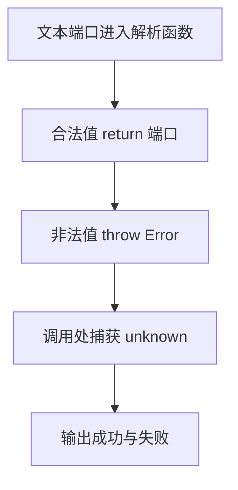

# Day 19：错误不是字符串——throw、unknown 与 Result

预计用时：60–90 分钟。

今天从一段端口文字得到可用端口。输入可能不是数字，也可能超出范围；端口即使合法，保存时仍可能遇到普通业务失败。我们会把这两类失败分开，让调用者知道是程序无法继续，还是这次业务操作没有成功。

## 核心讲解

函数发现问题后有两种常见做法：

| 情况 | 函数怎样交回结果 | 调用者怎样处理 |
| --- | --- | --- |
| 当前路径无法给出可信正常值 | `throw` 一个标准 `Error` | 在合适边界用 `try/catch` |
| 失败是调用者经常需要判断的业务结果 | `return` 成功或失败对象 | 检查对象里的状态字段 |

先看第一种。数值不符合函数的基本要求时，函数不能正常返回，就抛出标准错误对象：

~~~ts
function requirePositive(value: number): number {
  if (value <= 0) {
    throw new RangeError("数值必须大于 0");
  }
  return value;
}
~~~

执行到 `throw` 后，这次函数调用会立即停下，后面的正常 `return` 不再执行。错误会沿着调用关系向外走，直到遇到 `try/catch`。

`catch` 接到的值不能直接假设是 `Error`，因为 JavaScript 允许任何值被抛出。先把它当作 `unknown`，检查确认后再读取：

~~~ts
function errorMessage(error: unknown): string {
  return error instanceof Error ? error.message : "未知错误";
}
~~~

`error instanceof Error` 为真时，TypeScript 才允许读取 `error.message`。如果捕获到的不是标准错误对象，就返回备用说明。

不要抛字符串：它没有标准 `Error` 的名称和堆栈信息。也不要把捕获值写成 `any` 后直接读任意属性；TypeScript 会停止保护你。空的 `catch {}` 则会让失败完全消失，外部只能看到程序没有按预期工作，却不知道原因。

再看第二种。保存操作的失败如果是调用者本来就要展示和处理的结果，可以像返回正常值一样，返回一个带状态标签的对象：

~~~ts
type Result<T> =
  | { ok: true; value: T }
  | { ok: false; error: string };
~~~

调用者先检查 `result.ok`：

- `true` 表示保存成功，成功对象中的数据字段叫 `value`，此时读取 `result.value`。
- `false` 表示业务失败，此时读取 `result.error`。

这和 Day11 的状态对象一样，是用标签区分对象形状（判别联合）。选择 `throw` 还是 `Result`，要看调用者接下来怎样处理：无法继续的异常交给错误边界，经常出现的业务失败则作为明确结果返回。两种方式都要保留原因，不能用看似正常的假数据盖住失败。

## 为什么要这样设计

用 `"失败"` 或 `-1` 冒充错误时，调用者很难区分“正常结果刚好是这个值”和“操作失败”。标准 `Error` 保存消息和调用位置，`unknown` 迫使捕获者先确认拿到的是什么，`Result` 则把预期内的成功与失败都放进返回类型。

语言和类型系统负责传递异常、收窄捕获值，并检查 `Result` 的两个分支。你仍要决定哪类问题应该 `throw`、哪类属于可预期业务失败，以及错误消息、记录和重试由哪一层负责，不能把所有失败都塞进同一种处理方式。

异常会跳过当前调用路径，追踪不当时不容易看出控制流；`Result` 更显式，但每次调用都要检查分支。两种方案都有代价，关键是保持约定一致，并且不要用看似正常的假数据掩盖失败。

## 阅读示例

打开并右键运行 `example.ts`。分别追踪两条失败路径：`parsePort` 在哪一行停止并抛出错误，外层哪个 `catch` 接到它；`savePort` 又在哪一行正常 `return` 失败对象，调用者怎样检查 `ok`。

## 函数变量追踪

把两条路径分开追踪：

**正常返回**

1. 实参进入函数参数。
2. 检查通过，函数执行 `return`。
3. 返回值回到调用函数的位置。

**抛出错误**

1. 实参进入函数参数。
2. 检查失败，函数执行 `throw`，本次调用立即中断。
3. 错误向外传递，进入最近的 `catch`。
4. `catch` 中的 `error` 是一个新的局部变量，先保持 `unknown`。
5. `instanceof Error` 检查通过后，才能安全读取 `message`。

## Example 实际输出

运行 `example.ts` 后，终端会按下面的顺序显示。先用代码推测结果，再逐行对照：

```text
端口: 3000
错误: 端口必须是 1 到 65535 的整数
保存结果: 成功
```

## Example 代码流程图

运行 `example.ts` 前先沿图预测执行顺序；运行后再把每个节点对应到代码行。



## 独立练习导航

本日共有 2 道独立练习。每道题都有单独目录、说明、作答文件和解题结构；题目之间不共享代码。

| 目录 | 场景 | 类型 |
| --- | --- | --- |
| [practice01](./practice01/README.md) | 错误不是字符串：throw、unknown 与 Result | 主任务 |
| [practice02](./practice02/README.md) | 端口配置校验 | 闭卷迁移 |

右击任意练习目录中的 `practice.ts` 即可单独检查；命令行也可运行 `npm run beginner -- day19 practice02`。

## 容易出错的地方

- `throw "bad"`，丢失标准错误信息和堆栈。
- 把捕获值写成 `any`，直接读取任意属性。
- 捕获后返回看似正常的假数据，调用者无法分辨失败。
- 未检查 `Number` 得到的 `NaN`、小数或越界值。
- 底层与上层重复输出同一错误。

### 错误代码示例

```ts
try {
  throw "端口错误"; // ❌ 抛字符串没有标准 Error 的名称和堆栈信息。
} catch (error: any) {
  console.log(error.message); // ❌ any 允许读取并不存在的属性，结果可能是 undefined。
}
```

### 正确写法

```ts
try {
  throw new RangeError("端口错误"); // ✅ 抛出标准错误对象并保留堆栈。
} catch (error: unknown) {
  // ✅ 捕获值先保持 unknown，经过真实检查后再读取 message。
  const message = error instanceof Error ? error.message : "未知错误";
  console.log(message);
}
```

## 面试时怎么回答

**问：`any` 和 `unknown` 都能保存未知值，为什么更推荐 `unknown`？**

**答：**`any` 会让后续属性读取、调用和赋值几乎都跳过检查，错误被推迟到运行时；`unknown` 允许先接住值，但使用前必须用真实条件收窄：

```ts
function getMessage(error: unknown): string {
  return error instanceof Error ? error.message : "未知错误";
}
```

TypeScript 负责在 `instanceof` 成功分支开放 `message`，开发者仍要决定还接受哪些错误形状。`unknown` 在运行时没有包装或转换，拿到的仍是原值；而且 JavaScript 可以抛出任意值，所以 `catch` 中不能假设一定是 `Error`。

**问：什么时候用 `Result`，什么时候用 `throw`？**

**答：**可预期、调用者经常需要分支处理的业务失败适合 `Result`，例如端口被占用；无法在当前层正常继续的解析失败或程序异常可以抛出。

**容易答错或追问：**不要只按“严重程度”机械划分。真正要看调用约定：`Result` 显式但每次都要检查，异常传递方便却会跳出当前路径，两种方案都不能用假成功值掩盖失败。

## 拓展思考（不要求写代码）

如果保存端口要访问网络，临时断网、端口已占用和程序内部 bug 分别更适合“重试结果”“业务 Result”还是“异常”？请给出你的分类理由。

## 官方资料

- [Narrowing：instanceof](https://www.typescriptlang.org/docs/handbook/2/narrowing.html#instanceof-narrowing)
- [TSConfig：useUnknownInCatchVariables](https://www.typescriptlang.org/tsconfig/useUnknownInCatchVariables.html)
