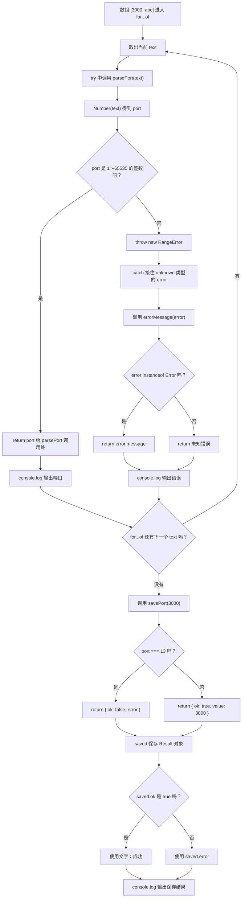

# Day 19：错误不是字符串——throw、unknown 与 Result

预计用时：60–90 分钟。

今天从一段端口文字得到可用端口。输入可能不是数字，也可能超出范围；端口即使合法，保存时仍可能遇到普通业务失败。我们会把这两类失败分开，让调用者知道是程序无法继续，还是这次业务操作没有成功。

## 写 Example 前先认识这些写法

### `text.trim()`：去掉字符串两端空白

`trim` 由字符串提供，点号左边是要处理的字符串，括号里不传参数。它返回一个新字符串，不会修改原字符串，也不会删除文字中间的空格。

输入验证时要先处理空白，因为 `Number("   ")` 会得到 `0`。如果空文本不允许，先检查 `text.trim() === ""`，再做数字转换。

```ts
const raw = "  19.9  ";
console.log(JSON.stringify(raw.trim()));
console.log(JSON.stringify(raw));
```

实际输出：

```text
"19.9"
"  19.9  "
```

这里用 `JSON.stringify` 给字符串补上引号，只是为了让两端空格看得见；`trim` 自己返回的仍然是普通字符串。

### 数字判断：没有内置的 `isNumber`

JavaScript 没有全局 `isNumber(value)`。面对 `unknown`，先用 `typeof value === "number"` 确认它是 number，再按业务需要选择 `Number` 提供的判断函数：

| 写法 | 括号传入什么 | 返回什么 | 解决什么问题 |
| --- | --- | --- | --- |
| `Number.isNaN(value)` | 一个值 | boolean | 只判断是否为真正的 `NaN` |
| `Number.isFinite(value)` | 一个值 | boolean | 排除 `NaN`、`Infinity`、`-Infinity` |
| `Number.isInteger(value)` | 一个值 | boolean | 判断是否为有限整数，不负责检查业务范围 |

这些函数不会把字符串自动转成数字。`Number.isFinite("12")` 是 `false`；要转换文本，应先明确调用 `Number(text)`。

```ts
function isFiniteNumber(value: unknown): value is number {
  return typeof value === "number" && Number.isFinite(value);
}

console.log(isFiniteNumber(12));
console.log(isFiniteNumber("12"));
console.log(Number.isInteger(12.5));
console.log(Number.isNaN(NaN));
```

实际输出：

```text
true
false
false
true
```

### `RangeError` 与 `instanceof Error`

`RangeError` 是 JavaScript 提供的标准错误类型，用来表示“值的范围不符合要求”。它属于 `Error` 家族。`instanceof` 是判断运算符，不是函数：左边放待检查的值，右边放构造函数，结果是 boolean。

```ts
const problem = new RangeError("端口超出范围");
console.log(problem instanceof Error);
console.log(problem.message);
```

实际输出：

```text
true
端口超出范围
```

## 核心讲解

函数发现问题后有两种常见做法：

| 情况 | 函数怎样交回结果 | 调用者怎样处理 |
| --- | --- | --- |
| 当前路径无法给出可信正常值 | `throw` 一个标准 `Error` | 在合适边界用 `try/catch` |
| 失败是调用者经常需要判断的业务结果 | `return` 成功或失败对象 | 检查对象里的状态字段 |

先看第一种。数值不符合函数的基本要求时，函数不能正常返回，就抛出标准错误对象：

~~~ts
function requirePositive(value: number): number {
  if (value <= 0) {
    throw new RangeError("数值必须大于 0");
  }
  return value;
}
~~~

执行到 `throw` 后，这次函数调用会立即停下，后面的正常 `return` 不再执行。错误会沿着调用关系向外走，直到遇到 `try/catch`。

`catch` 接到的值不能直接假设是 `Error`，因为 JavaScript 允许任何值被抛出。先把它当作 `unknown`，检查确认后再读取：

~~~ts
function errorMessage(error: unknown): string {
  return error instanceof Error ? error.message : "未知错误";
}
~~~

`error instanceof Error` 为真时，TypeScript 才允许读取 `error.message`。如果捕获到的不是标准错误对象，就返回备用说明。

不要抛字符串：它没有标准 `Error` 的名称和堆栈信息。也不要把捕获值写成 `any` 后直接读任意属性；TypeScript 会停止保护你。空的 `catch {}` 则会让失败完全消失，外部只能看到程序没有按预期工作，却不知道原因。

再看第二种。保存操作的失败如果是调用者本来就要展示和处理的结果，可以像返回正常值一样，返回一个带状态标签的对象：

~~~ts
type Result<T> =
  | { ok: true; value: T }
  | { ok: false; error: string };
~~~

调用者先检查 `result.ok`：

- `true` 表示保存成功，成功对象中的数据字段叫 `value`，此时读取 `result.value`。
- `false` 表示业务失败，此时读取 `result.error`。

这和 Day11 的状态对象一样，是用标签区分对象形状（判别联合）。选择 `throw` 还是 `Result`，要看调用者接下来怎样处理：无法继续的异常交给错误边界，经常出现的业务失败则作为明确结果返回。两种方式都要保留原因，不能用看似正常的假数据盖住失败。

## 为什么要这样设计

用 `"失败"` 或 `-1` 冒充错误时，调用者很难区分“正常结果刚好是这个值”和“操作失败”。标准 `Error` 保存消息和调用位置，`unknown` 迫使捕获者先确认拿到的是什么，`Result` 则把预期内的成功与失败都放进返回类型。

语言和类型系统负责传递异常、收窄捕获值，并检查 `Result` 的两个分支。你仍要决定哪类问题应该 `throw`、哪类属于可预期业务失败，以及错误消息、记录和重试由哪一层负责，不能把所有失败都塞进同一种处理方式。

异常会跳过当前调用路径，追踪不当时不容易看出控制流；`Result` 更显式，但每次调用都要检查分支。两种方案都有代价，关键是保持约定一致，并且不要用看似正常的假数据掩盖失败。

## 阅读示例

打开并右键运行 `example.ts`。分别追踪两条失败路径：`parsePort` 在哪一行停止并抛出错误，外层哪个 `catch` 接到它；`savePort` 又在哪一行正常 `return` 失败对象，调用者怎样检查 `ok`。

## 函数变量追踪

把两条路径分开追踪：

**正常返回**

1. 实参进入函数参数。
2. 检查通过，函数执行 `return`。
3. 返回值回到调用函数的位置。

**抛出错误**

1. 实参进入函数参数。
2. 检查失败，函数执行 `throw`，本次调用立即中断。
3. 错误向外传递，进入最近的 `catch`。
4. `catch` 中的 `error` 是一个新的局部变量，先保持 `unknown`。
5. `instanceof Error` 检查通过后，才能安全读取 `message`。

## Example 实际输出

运行 `example.ts` 后，终端会按下面的顺序显示。先用代码推测结果，再逐行对照：

```text
端口: 3000
错误: 端口必须是 1 到 65535 的整数
保存结果: 成功
```

## Example 代码流程图

运行 `example.ts` 前先沿图预测执行顺序；运行后再把每个节点对应到代码行。



## 官方手册扩展阅读（可选）

完成当天教程后，可从 [Day 19 对应阅读](../OFFICIAL-READING.md#day-19) 中只选 1 篇继续看。它不是练习前置，不需要在写 Practice 前读完。

## 独立练习导航

本日共有 2 道独立练习。每道题都有单独目录、说明、作答文件和完整参考答案；题目之间不共享代码。

| 目录 | 场景 | 类型 |
| --- | --- | --- |
| [practice01](./practice01/README.md) | 错误不是字符串：throw、unknown 与 Result | 主任务 |
| [practice02](./practice02/README.md) | 批量价格导入：把异常转成 Result | 闭卷迁移 |

右击任意练习目录中的 `practice.ts` 即可单独检查；命令行也可运行 `npm run beginner -- day19 practice02`。

## 容易出错的地方

- `throw "bad"`，丢失标准错误信息和堆栈。
- 把捕获值写成 `any`，直接读取任意属性。
- 捕获后返回看似正常的假数据，调用者无法分辨失败。
- 未检查 `Number` 得到的 `NaN`、小数或越界值。
- 底层与上层重复输出同一错误。

### 错误代码示例

旧版 CSV 解析器可能抛出字符串，而新版解析器抛出 `Error`。导入任务为了“保证任务不失败”，把捕获值写成 `any`，读取不存在的 `message` 后又返回空数组：

```ts
function legacyCsvParser(): string[] {
  throw "CSV 表头缺失";
}

function importRows(): string[] {
  try {
    return legacyCsvParser();
  } catch (error: any) { // ❌ any 放过了不安全的 message 读取。
    console.log("导入失败：" + error.message);
    return [];
  }
}

const rows = importRows();
console.log("成功导入：" + rows.length);
```

实际输出：

```text
导入失败：undefined
成功导入：0
```

日志丢掉了真实原因，任务状态还把失败报告成“成功导入 0 条”。`any` 没有把字符串变成 `Error`，空数组也不是一次成功导入的可信结果。生产环境里这会让告警、重试和人工处理全部失去依据。

### 正确写法

```ts
type ImportResult =
  | { ok: true; rows: string[] }
  | { ok: false; error: string };

function errorMessage(error: unknown): string {
  if (error instanceof Error) {
    return error.message;
  }
  if (typeof error === "string") {
    return error;
  }
  return "未知错误";
}

function importRows(): ImportResult {
  try {
    return {
      ok: true,
      rows: legacyCsvParser(),
    };
  } catch (error: unknown) { // ✅ 先保留 unknown，再统一转换失败原因。
    return {
      ok: false,
      error: errorMessage(error),
    };
  }
}

const result = importRows();
if (result.ok) {
  console.log("成功导入：" + result.rows.length);
} else {
  console.log("导入失败：" + result.error);
}
```

实际输出：

```text
导入失败：CSV 表头缺失
```

自己控制的代码应优先抛出标准 `Error` 对象；系统边界仍把捕获值当作 `unknown`，因为依赖库和旧代码可能抛出任意值。适配层再把异常转换成明确的失败结果，外层就不会把失败误当成功。

## 面试时怎么回答

**问：`any` 和 `unknown` 都能保存未知值，为什么更推荐 `unknown`？**

**答：**`any` 会让属性读取、函数调用和赋值跳过大部分类型检查；`unknown` 可以接收任何值，但使用前必须通过 `typeof`、`instanceof` 或类型守卫收窄：

```ts
function getMessage(error: unknown): string {
  return error instanceof Error ? error.message : "未知错误";
}
```

`unknown` 不会包装或转换运行值。JavaScript 允许抛出任意值，所以 `catch` 变量在严格模式下采用 `unknown`，能迫使错误处理代码先确认真实形状。

**问：什么时候用 `Result`，什么时候用 `throw`？**

**答：**要看调用约定。调用者日常需要处理、并且通常会继续当前流程的失败，适合放进 `Result`，例如优惠码被拒绝；当前函数无法给出可信返回值、需要把控制权交给错误边界时，可以 `throw`。在批处理边界，也可以捕获单项异常并转换成 `Result`，让下一项继续。

`Result` 要求每个调用者显式检查分支；异常会跳出当前调用路径。团队应保持约定一致，两种方式都不能用空数组、`0` 或默认对象伪装成功。

官方参考：

- [TypeScript 4.4：catch 变量默认使用 `unknown`](https://www.typescriptlang.org/docs/handbook/release-notes/typescript-4-4.html#defaulting-to-the-unknown-type-in-catch-variables)
- [MDN：`try...catch`](https://developer.mozilla.org/en-US/docs/Web/JavaScript/Reference/Statements/try...catch)

## 拓展思考（不要求写代码）

如果保存端口要访问网络，临时断网、端口已占用和程序内部 bug 分别更适合“重试结果”“业务 Result”还是“异常”？请给出你的分类理由。
