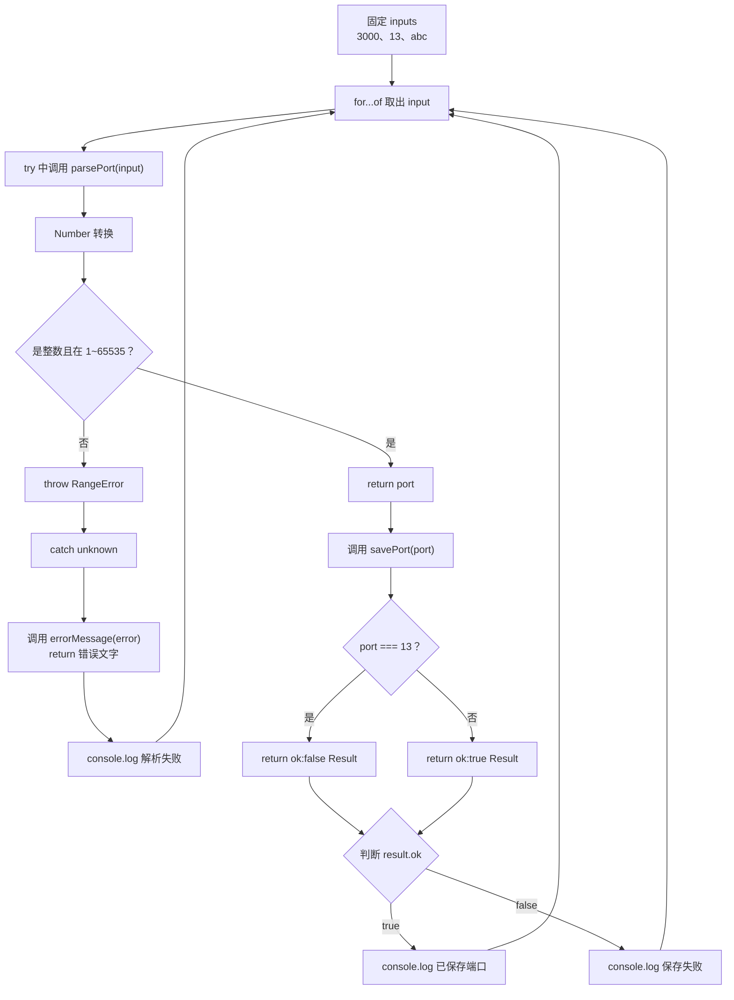

# DAY19 · Practice 01：错误不是字符串：throw、unknown 与 Result

[返回当天课程](../README.md)

## 文件位置

- 作答文件：[practice.ts](../../../day19/practice01/practice.ts)
- 完整参考答案：[solution.ts](../../../day19/practice01/solution.ts)
- 方案说明：[SOLUTION.md](./SOLUTION.md)

## 场景背景

你在开发本地服务的端口配置工具，用户输入的是文本，既可能格式或范围非法，也可能是合法但当前不可保存的端口。程序需要区分无法解析的异常与可以预期的保存失败。最终要为每个输入给出明确结果，让用户知道是配置已保存、端口不可用，还是输入本身有误。

这是一道完整、独立的主练习。不要导入其他 practice 文件夹中的代码。

## 数据流

先沿变量名看数据怎样分叉和汇合；`──>` 表示值被交给下一步。

```text
inputs
   └── parsePort
          ├── 合法 ──> port ──> savePort ──> Result
          │                              ├── ok:true ──> value
          │                              └── ok:false ──> error
          └── 非法 ──> throw ──> catch unknown ──> errorMessage
两种失败通道 ──> 输出
```

## 代码流程图



## 起始代码

类型、三个函数签名、固定输入、调用链和三种输出位置已经提供。你要完成端口判断、Result 分支和各函数的 `return`。

```ts
type Result<T> =
  | { ok: true; value: T }
  | { ok: false; error: string };

function parsePort(text: string): number {
  throw new Error("TODO：转换 text，判断整数与范围，失败时抛 RangeError，成功时 return port");
}
function savePort(port: number): Result<number> {
  throw new Error("TODO：判断 13，并 return 成功或失败 Result");
}
function errorMessage(error: unknown): string {
  throw new Error("TODO：收窄 error，并 return message 或未知错误");
}

const inputs = ["3000", "13", "abc"];
for (const input of inputs) {
  try {
    const port = parsePort(input);
    const result = savePort(port);
    if (result.ok) {
      console.log(`已保存端口：${result.value}`);
    } else {
      console.log(`保存失败：${result.error}`);
    }
  } catch (error: unknown) {
    console.log(`解析失败：${errorMessage(error)}`);
  }
}
```

请从头编写“端口解析与保存器”。

必须创建：

- 泛型判别联合 `Result<T>`，成功成员为 `{ ok: true; value: T }`，失败成员为 `{ ok: false; error: string }`。
- `parsePort(text: string): number`：使用 `Number` 转换；若结果不是 1 到 65535 的整数，抛出 `RangeError("端口必须是 1 到 65535 的整数")`。
- `savePort(port: number): Result<number>`：端口为 13 时返回失败 `端口 13 不可用`，其他端口返回成功值。
- `errorMessage(error: unknown): string`：`Error` 实例返回 `message`，否则返回“未知错误”。
- 固定输入 `inputs = ["3000", "13", "abc"]`。

逐项处理：先解析，再保存；保存失败是普通结果，不要抛异常。解析失败在外层捕获。精确输出：

~~~text
已保存端口：3000
保存失败：端口 13 不可用
解析失败：端口必须是 1 到 65535 的整数
~~~

限制：

- 不得使用 `any`、类型断言、抛字符串或空 `catch`。
- `parsePort` 必须验证整数与范围，非法时不得返回伪造默认值。
- `savePort` 不得为预期的端口占用抛异常。
- `catch` 参数保持 `unknown`，只通过 `errorMessage` 安全取得文字。
- 成功与失败分支必须通过 `ok` 收窄，不能用非空断言读取字段。

完成标准：右键运行后显示 PASS；能说明为什么“格式非法”和“端口不可用”选择了不同失败通道。

## 本题易漏语法

throw new Error(message); 抛出，catch (error) 接住；unknown 必须先收窄。

## 写完后自检

- 分别把输入换成 `"0"`、`"65535"` 和 `"12.5"`，预测它们会进入解析成功、保存失败还是异常分支。
- 如果 `savePort` 也改成抛异常，调用方还能否轻易区分“输入无效”和“合法端口暂时不可用”？
- 为什么 `catch` 中不能直接读取 `error.message`？把捕获值保留为 `unknown` 防住了哪类情况？

## 文件

- 在 `practice.ts` 中独立作答。
- 完成并运行通过后，再查看 `solution.ts` 的完整参考答案与 `SOLUTION.md` 的调用说明。
