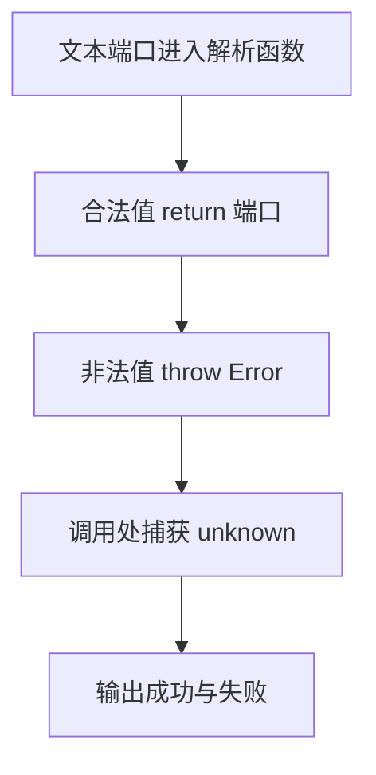

# DAY19 · Practice 02：端口配置校验

[返回当天课程](../README.md)

## 文件位置

- 作答文件：[practice.ts](../../../day19/practice02/practice.ts)
- 结构提示代码：[solution.ts](../../../day19/practice02/solution.ts)
- 方案说明：[SOLUTION.md](./SOLUTION.md)

## 场景背景

你正在为命令行配置程序增加端口校验。程序会接收一个合法端口文本和一个非法文本，并在解析后尝试保存配置。你需要分别交付成功读取的端口、可理解的错误消息和最终保存状态，避免程序因坏输入直接崩溃。

这是一道与 Practice 01 文件完全分开的闭卷迁移题。先理解并运行当天 `example.ts`，然后关闭它；不要复制代码，仅根据下面的流程与输出从空白重新实现。

## 代码流程图



## 必须练到的能力

失败用 throw 或 Result 表达；catch 值保持 unknown 直到收窄。

- 不得导入 `practice01` 或直接调用其他练习的实现。
- 输出必须由变量、计算或函数返回值产生，不把整行结果写死。
- 每个参数、局部变量和返回值都应能在流程图中找到位置。

## 精确期望输出

```text
端口: 3000
错误: 端口必须是 1 到 65535 的整数
保存结果: 成功
```

## 文件

在上方链接的 `practice.ts` 作答；独立完成后再查看 `solution.ts` 的 TODO 解题结构。
