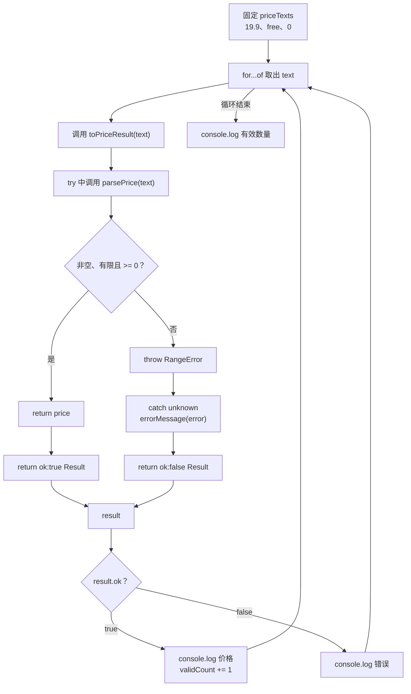

# DAY19 · Practice 02：批量价格导入：把异常转成 Result

[返回当天课程](../README.md)

## 文件位置

- 作答文件：[practice.ts](../../../day19/practice02/practice.ts)
- 完整参考答案：[solution.ts](../../../day19/practice02/solution.ts)
- 方案说明：[SOLUTION.md](./SOLUTION.md)

## 场景背景

商品后台会批量导入价格文本。底层 `parsePrice` 遇到空文本、非数字、无限值或负数时会抛错；批处理不能因为一条坏数据停止，所以适配函数要逐项捕获异常并转成 `Result<number>`。价格 `0` 是合法值，不能被真假值判断误当成失败。

固定输入为 `"19.9"`、`"free"`、`"0"`。批次需要继续处理三项，并在最后统计有效价格数量。

## 和 Practice 01 的区别

Practice 01 让调用处同时面对“解析异常”和“保存 Result”两条协议。本题在 `toPriceResult` 边界把解析异常统一转换为 Result，外层批处理不写 `try/catch`，而是只按 `ok` 分支处理三条独立输入。

## 关联复习

文本转数字会复用 Day02 的 `Number(...)`，真假值边界会复用 Day08 对 `0` 的判断。转换后的 Result 仍沿用 Day11 的判别字段收窄，成功和失败字段不能交叉读取。

## 数据流

先沿变量名看数据怎样分叉和汇合；`──>` 表示值被交给下一步。

```text
priceTexts
   └── 当前 text ──> toPriceResult
                           └── parsePrice
                                  ├── 合法 ──> number ──> { ok:true, value }
                                  └── 非法 ──> throw
                                                   └── catch unknown
                                                          └── { ok:false, error }
每项 Result ──> 输出价格/错误
ok:true 的数量 ──> validCount ──> 汇总输出
```

## 代码流程图



## 起始代码

类型、函数签名、固定文本、调用、分支输出和最终计数输出都已提供。你需要完成价格判断、异常转换和每个 `return`。

```ts
type Result<T> =
  | { ok: true; value: T }
  | { ok: false; error: string };

function parsePrice(text: string): number {
  throw new Error("TODO：判断空文本、有限数字和非负条件，再 return price");
}
function errorMessage(error: unknown): string {
  throw new Error("TODO：收窄 error 并 return 文字");
}
function toPriceResult(text: string): Result<number> {
  throw new Error("TODO：使用 parsePrice，经 try/catch return 对应 Result");
}

const priceTexts = ["19.9", "free", "0"];
let validCount = 0;
for (const text of priceTexts) {
  const result = toPriceResult(text);
  if (result.ok) {
    console.log(`价格：${result.value}`);
    validCount += 1;
  } else {
    console.log(`错误：${result.error}`);
  }
}
console.log(`有效数量：${validCount}`);
```

## 要完成的功能

- 泛型 `Result<T>`：成功含 `value`，失败含 `error`，用 `ok` 判别。
- `parsePrice(text): number`：
  - 先拒绝去掉两端空白后为空的文本。
  - 使用 `Number(text)` 转换。
  - 结果必须是有限数字且大于等于 `0`。
  - 失败时抛出 `RangeError("价格必须是非负数字")`。
- `errorMessage(error: unknown): string`：`Error` 返回 message，否则返回“未知错误”。
- `toPriceResult(text): Result<number>`：调用 `parsePrice`，并把捕获的异常转换成失败 Result。
- 遍历固定三项，输出每项结果并累计成功数量。

## 约束

- 不得导入 `practice01` 或直接调用其他练习的实现。
- 不得使用 `any`、类型断言、抛字符串或空 `catch`。
- 外层循环不得再调用 `parsePrice` 或写 `try/catch`，它只处理 `toPriceResult` 的 Result。
- `0` 必须走成功分支；不能用 `if (!value)` 判断是否解析成功。
- 输出必须由变量、计算或函数返回值产生，不把整行结果写死。
- 每个参数、局部变量和返回值都应能在流程图中找到位置。

## 精确期望输出

```text
价格：19.9
错误：价格必须是非负数字
价格：0
有效数量：2
```

完成标准：右键运行显示 PASS；坏价格只影响当前项，后面的 `0` 仍被保留为成功，最终有效数量为 `2`。

## 写完后自检

- 分别加入 `""`、`"Infinity"` 和 `"-1"`，它们应在哪个检查上失败？
- 如果用 `if (!result.value)` 判断成功，合法价格 `0` 会发生什么？为什么应先看 `result.ok`？
- 为什么批处理边界把异常转成 Result，而不是让外层循环在第一条坏数据处直接退出？

## 文件

在上方链接的 `practice.ts` 作答；独立完成后再查看 `solution.ts` 的完整参考答案。
