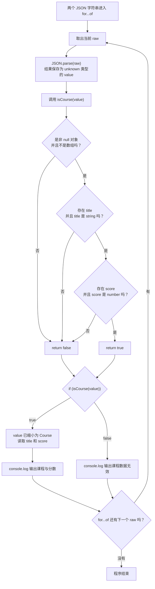

# Day 20：JSON 进入程序后，先把它当作 unknown

预计用时：75–90 分钟。

接口、文件或浏览器存储给程序的是一段外部数据。即使里面写着 `name`、`contact` 等熟悉字段，TypeScript 也没有检查过它们是否存在、类型是否正确。先把解析结果放进 `unknown`，意思是“现在还不知道它能不能安全使用”；验证通过后，再交给业务代码。

## 写 Example 前先认识这些写法

### `JSON.parse(text)` 与 `JSON.stringify(value)`

`JSON` 是 JavaScript 运行环境提供的对象。

- `JSON.parse(text)` 的括号里放 JSON 字符串，返回解析后的 JavaScript 值。语法损坏时会抛错；解析成功也不代表字段符合业务类型。
- `JSON.stringify(value)` 的括号里放 JavaScript 值，返回 JSON 字符串。它用于保存或传输，不负责验证业务字段。

TypeScript 标准库没有替你验证 `JSON.parse` 的结果，本教程先把结果保存为 `unknown`。

```ts
const value: unknown = JSON.parse('{"title":"TypeScript","score":90}');
console.log(typeof value);
console.log(JSON.stringify(value));
```

实际输出：

```text
object
{"title":"TypeScript","score":90}
```

### 判断 unknown：也没有内置的 `isString`、`isNumber`

JavaScript 没有通用的 `isString(value)` 或 `isNumber(value)`。常用检查来自同一个“判断运行时值”家族：

| 写法 | 返回什么 | 能确认什么 | 不能确认什么 |
| --- | --- | --- | --- |
| `typeof value === "string"` | boolean | 原始字符串 | 对象里的其他字段 |
| `typeof value === "number"` | boolean | number 类型，包括 `NaN` | 是否有限、是否整数 |
| `Array.isArray(value)` | boolean | 值是不是数组 | 数组元素是否合格 |
| `value !== null` | boolean | 排除 `null` | 值一定是普通记录对象 |
| `!Array.isArray(value)` | boolean | 排除数组 | 其他对象字段是否合格 |
| `"title" in value` | boolean | 对象或原型链上存在该属性 | 属性值是不是字符串 |
| `value instanceof Error` | boolean | 值来自 Error 家族 | 普通错误形状 |

`typeof null` 的结果也是 `"object"`，而数组的 `typeof` 结果同样是 `"object"`。本教程把 `isRecord` 定义为“普通记录对象”，所以必须同时排除 `null` 和数组；如果想让数组也通过，更合适的名字是 `isObject`。类型和值的完整规则通常写成自己的类型守卫：

```ts
function isString(value: unknown): value is string {
  return typeof value === "string";
}

function isRecord(value: unknown): value is Record<string, unknown> {
  return (
    typeof value === "object" &&
    value !== null &&
    !Array.isArray(value)
  );
}

console.log(isString("TS"));
console.log(isString(90));
console.log(isRecord(null));
console.log(isRecord([]));
console.log(Array.isArray([]));
```

实际输出：

```text
true
false
false
false
true
```

### `array.every(check)`：每一项都必须通过

`every` 由数组提供。括号里传检查回调，每项都让回调返回真时，`every` 才返回 `true`；遇到第一项失败会停止继续检查。空数组没有失败项，所以 `[].every(check)` 会返回 `true`，业务若要求至少一项，还要额外检查数组长度。

```ts
console.log(["变量", "函数"].every(isString));
console.log(["变量", 90].every(isString));
console.log([].every(isString));
```

实际输出：

```text
true
false
true
```

## 核心讲解

从 JSON 文本进入业务代码，按这个顺序走：

1. `JSON.parse` 把文本解析成 JavaScript 值，并把这个值保存在 `unknown` 变量中。
2. 用真正会执行的条件判断，逐层检查对象、字段、数组和数组成员。
3. 所有必要检查都通过后，TypeScript 才允许把这个值当作业务类型使用。

写 `JSON.parse(raw) as User` 只是告诉 TypeScript“请相信我”，没有执行任何字段检查。真实数据里的数字不会因此变成字符串，缺失的字段也不会自动出现。程序可能顺利通过编译，却在读取深层字段时崩溃。

验证函数在运行时返回 `true` 或 `false`。返回类型中的 `value is Course` 进一步告诉 TypeScript：“只有返回 `true` 时，`value` 才可以当作 `Course`。”这种写法叫类型谓词：

~~~ts
function isCourse(value: unknown): value is Course {
  return (
    typeof value === "object" &&
    value !== null &&
    !Array.isArray(value) &&
    "title" in value &&
    typeof value.title === "string"
  );
}
~~~

逐行看这个检查：

1. `typeof value === "object"` 先排除字符串、数字等值。
2. `value !== null` 单独排除 `null`，因为 JavaScript 中 `typeof null === "object"` 的结果是 `true`。
3. `!Array.isArray(value)` 排除数组；数组虽然也是对象，却不是这里要读取命名字段的普通记录对象。
4. `"title" in value` 确认属性存在。
5. `typeof value.title === "string"` 再确认属性值确实是字符串。

嵌套对象要在进入下一层前重复对象检查。数组先用 `Array.isArray` 确认容器，再用 `every` 让每个元素都通过元素验证函数。只要漏查一个必填字段，`value is Course` 的承诺就比真实检查更乐观，后面的业务代码仍可能出错。

还要区分两种错误：

| 失败发生在哪里 | 例子 | 调用者可以看到什么 |
| --- | --- | --- |
| 解析阶段 | 少了引号、括号不配对 | JSON 文本语法错误 |
| 验证阶段 | 能解析，但 `title` 缺失或类型不对 | 数据结构不符合业务要求 |

`JSON.parse` 遇到语法错误会抛出异常；解析成功不代表结构正确，还要继续验证。用结果联合分别保存这两种原因，界面才能给出对应提示，而不是只显示一个模糊的“读取失败”。

## 为什么要这样设计

JSON 能被解析只说明文字格式正确，不说明里面一定有程序需要的字段。若直接断言成业务类型，错误会被推迟到读取深层属性时才爆发。先保留为 `unknown` 会阻止不安全读取，类型守卫则把运行时检查和后续类型收窄连接起来。

JavaScript 负责真正执行每一项条件，TypeScript 只在守卫返回 `true` 的分支相信该值符合目标类型。`true` 表示当前输入通过了所有必要检查，可以进入业务代码；`false` 表示当前输入未通过，调用处不能把它当成目标类型。你仍要决定哪些字段必填、每层怎样验证，以及失败时给出什么原因。

守卫中的类型谓词是一项承诺，不会自动生成检查。漏查字段却返回 `true` 会制造虚假安全；检查规则也要随着业务类型一起维护，复杂数据通常需要拆成多个小守卫或采用专门的验证工具。

## 阅读示例

打开并右键运行 `example.ts`。给 `isCourse` 的每个条件标出问题：它在排除哪种错误数据？然后看条件全部为 `true` 后，调用处为什么可以读取课程字段。

## 验证函数的数据流

把一次验证调用按顺序看：

1. 外部值进入验证函数的 `value` 参数，此时类型仍是 `unknown`。
2. 条件从外到内检查；前一个条件通过后，后一个条件才安全地读取更深一层。
3. 任一条件失败，函数返回 `false`，调用处进入失败分支，不能读取业务字段。
4. 所有条件通过，函数返回 `true`。类型谓词让调用处的值收窄为 `Course`。
5. 业务代码只在成功分支中读取课程字段。

类型谓词本身不会替你检查数据；真正提供保证的是函数体里这些会在运行时执行的条件。

## Example 实际输出

运行 `example.ts` 后，终端会按下面的顺序显示。先用代码推测结果，再逐行对照：

```text
课程: TypeScript / 90 分
课程数据无效
```

## Example 代码流程图

运行 `example.ts` 前先沿图预测执行顺序；运行后再把每个节点对应到代码行。



## 官方手册扩展阅读（可选）

完成当天教程后，可从 [Day 20 对应阅读](../OFFICIAL-READING.md#day-20) 中只选 1 篇继续看。它不是练习前置，不需要在写 Practice 前读完。

## 独立练习导航

本日共有 2 道独立练习。每道题都有单独目录、说明、作答文件和解题结构；题目之间不共享代码。

| 目录 | 场景 | 类型 |
| --- | --- | --- |
| [practice01](./practice01/README.md) | JSON、unknown 与运行时验证 | 主任务 |
| [practice02](./practice02/README.md) | 通知批次的部分接收 | 闭卷迁移 |

右击任意练习目录中的 `practice.ts` 即可单独检查；命令行也可运行 `npm run beginner -- day20 practice02`。

## 容易出错的地方

- 只检查最外层对象就相信内部字段。
- 忘记排除 `null`。
- 把数组也当成普通记录对象通过 `isRecord`。
- 数组只检查 `Array.isArray`，没有检查元素。
- 谓词声明 `value is Profile`，实际却漏查字段。
- 用 `as` 让编译器安静，却没有改变真实数据。
- 用一个大 `catch` 混淆语法错误与结构错误。

### 错误代码示例

```ts
const profile = JSON.parse(raw) as Profile;
console.log(profile.contact.email.toLowerCase());
// ❌ as Profile 没有验证 contact 或 email，真实数据缺字段时仍会崩溃。

function isProfile(value: unknown): value is Profile {
  return typeof value === "object"; // ❌ null 也满足，而且完全没检查嵌套字段。
}
```

### 正确写法

```ts
function isProfile(value: unknown): value is Profile {
  return (
    isRecord(value) &&
    typeof value.name === "string" &&
    isRecord(value.contact) &&
    typeof value.contact.email === "string" &&
    Array.isArray(value.lessons) &&
    value.lessons.every(isLesson) // ✅ 数组中的每个元素也必须通过验证。
  );
}

const value: unknown = JSON.parse(raw);
if (isProfile(value)) {
  console.log(value.contact.email.toLowerCase()); // ✅ 收窄后再进入业务逻辑。
}
```

## 面试时怎么回答

**问：类型谓词为什么不只是把返回类型写成 `value is Course`？**

**答：**它解决的是把运行时验证结果告诉类型系统。函数体中的条件必须真的检查 `Course` 要求的字段；返回 `true` 表示当前输入已通过这些检查，调用处才会收窄，返回 `false` 表示当前输入被拒绝：

```ts
function isCourse(value: unknown): value is Course {
  return isRecord(value) &&
    typeof value.title === "string" &&
    typeof value.score === "number";
}
```

类型谓词只是对检查结果的承诺，TypeScript 不会审计它是否漏字段。类型变化后，验证器也要同步维护。

**问：`JSON.parse(raw) as Course` 会验证或转换数据吗？**

**答：**不会。类型断言只让编译器暂时按 `Course` 看待这个值，不会补字段、把 `"90"` 变成 `90`，也不会抛出结构错误。需要“失败就中止并在成功后收窄”时，可以写真正执行检查并抛错的断言函数；它和单纯的 `as` 不是一回事。

**容易答错或追问：**不要把编译通过当成数据安全，也不要认为类型断言能完成运行时转换。类型谓词和断言函数是否可靠，都取决于函数体有没有做完整检查。

## 拓展思考（不要求写代码）

如果 `Profile` 新增可选 `nickname?: string`，验证器应怎样区分“字段完全缺席”“字段存在且为字符串”和“字段存在但类型错误”？
