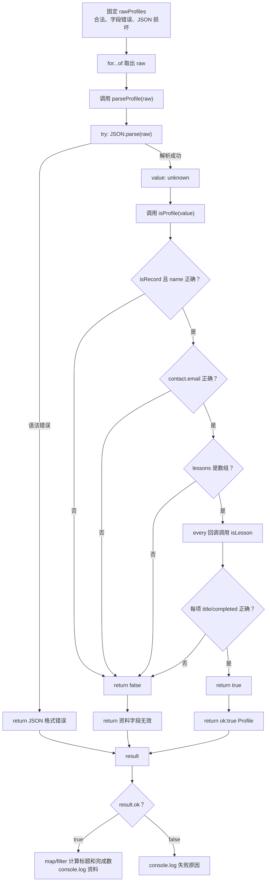

# DAY20 · Practice 01：JSON、unknown 与运行时验证

[返回当天课程](../README.md)

## 文件位置

- 作答文件：[practice.ts](../../../day20/practice01/practice.ts)
- 完整参考答案：[solution.ts](../../../day20/practice01/solution.ts)
- 方案说明：[SOLUTION.md](./SOLUTION.md)

## 场景背景

学习平台允许用户导入外部导出的个人资料 JSON，但这些文本可能语法损坏，也可能缺少正确的嵌套字段。输入包含一份有效资料、字段类型错误的资料和无法解析的文本。你需要只让验证通过的数据进入业务逻辑，并为每份输入交付资料摘要或准确的失败原因。

这是一道完整、独立的主练习。不要导入其他 practice 文件夹中的代码。

## 数据流

先沿变量名看数据怎样分叉和汇合；`──>` 表示值被交给下一步。

```text
rawProfiles
   └── JSON.parse ──> unknown
                         └── isProfile
                                ├── isRecord
                                └── lessons.every(isLesson)
验证结果 ──> parseProfile
              ├── ok:true ──> Profile ──> 业务输出
              └── ok:false ──> message ──> 错误输出
```

## 代码流程图



## 起始代码

业务类型、守卫签名、固定 JSON、解析调用以及成功和失败输出位置已给出。你需要完成逐层判断、`every`/`map`/`filter` 回调和各函数的 `return`。

```ts
interface Lesson { title: string; completed: boolean; }
interface Profile { name: string; contact: { email: string }; lessons: Lesson[]; }
type ParseResult<T> =
  | { ok: true; value: T }
  | { ok: false; error: string };

function isRecord(value: unknown): value is Record<string, unknown> {
  throw new Error("TODO：判断普通记录对象并 return boolean");
}
function isLesson(value: unknown): value is Lesson {
  throw new Error("TODO：逐字段判断并 return boolean");
}
function isProfile(value: unknown): value is Profile {
  throw new Error("TODO：判断 name、contact 和 lessons.every(isLesson)，再 return boolean");
}
function parseProfile(raw: string): ParseResult<Profile> {
  throw new Error("TODO：JSON.parse 到 unknown，区分语法错误和字段错误并 return Result");
}

const rawProfiles = [
  '{"name":"Ada","contact":{"email":"ada@example.com"},"lessons":[{"title":"变量","completed":true},{"title":"联合","completed":false}]}',
  '{"name":"Lin","contact":{"email":123},"lessons":[]}',
  '{"name":',
];
for (const raw of rawProfiles) {
  const result = parseProfile(raw);
  if (result.ok) {
    const profile = result.value;
    const lessonTitles = profile.lessons.map((lesson) => lesson.title);
    const completedCount = profile.lessons.filter((lesson) => lesson.completed).length;
    console.log(`资料：${profile.name} / ${profile.contact.email} / 课程：${lessonTitles.join("、")} / 已完成：${completedCount}`);
  } else {
    console.log(`失败：${result.error}`);
  }
}
```

请从头编写“课程资料 JSON 验证器”。

业务类型：

- `Lesson`：`title: string`、`completed: boolean`
- `Profile`：`name: string`、`contact: { email: string }`、`lessons: Lesson[]`
- `ParseResult<T>`：成功 `{ ok: true; value: T }`，失败 `{ ok: false; error: string }`

必须实现：

- `isRecord(value: unknown): value is Record<string, unknown>`：确认值是非 `null`、非数组的普通记录对象。
- `isLesson(value: unknown): value is Lesson`。
- `isProfile(value: unknown): value is Profile`：逐层验证 name、contact.email、lessons 数组及每个元素。
- `parseProfile(raw: string): ParseResult<Profile>`：
  - JSON 语法错误返回 `JSON 格式错误`
  - 结构不合格返回 `资料字段无效`
  - 验证成功返回安全的 `Profile`

固定输入 `rawProfiles` 必须依次包含：

~~~text
{"name":"Ada","contact":{"email":"ada@example.com"},"lessons":[{"title":"变量","completed":true},{"title":"联合","completed":false}]}
{"name":"Lin","contact":{"email":123},"lessons":[]}
{"name":
~~~

遍历结果并精确输出：

~~~text
资料：Ada / ada@example.com / 课程：变量、联合 / 已完成：1
失败：资料字段无效
失败：JSON 格式错误
~~~

限制：

- 不得使用 `any`、类型断言、非空断言或 `as Profile`。
- 每个类型谓词的检查必须与承诺完全一致。
- JSON 解析结果必须先存为 `unknown`。
- `contact` 必须单独确认是非 `null`、非数组的普通记录对象；`lessons` 必须检查数组中的每一项。
- 只捕获 `JSON.parse` 的语法失败，不能把字段错误混成同一原因。

完成标准：右键运行后显示 PASS；能解释“编译通过”为什么不代表外部数据可信。

## 本题易漏语法

JSON.parse 接收字符串，结果先当 unknown；验证对象要先排除 null，因为 typeof null 也是 object。

## 写完后自检

- 把 `lessons` 改成 `[null]` 或把 `contact` 改成 `null`，预测是哪一层守卫返回 `false`，最终错误应属于哪一种？
- 如果 JSON 文本语法正确但缺少 `email`，为什么不能和 `JSON.parse` 的语法错误共用同一个失败原因？
- 为什么这里写类型谓词和逐层验证，而不是直接把解析结果断言成 `Profile`？

## 文件

- 在 `practice.ts` 中独立作答。
- 完成并运行通过后，再查看 `solution.ts` 的完整参考答案与 `SOLUTION.md` 的调用说明。
