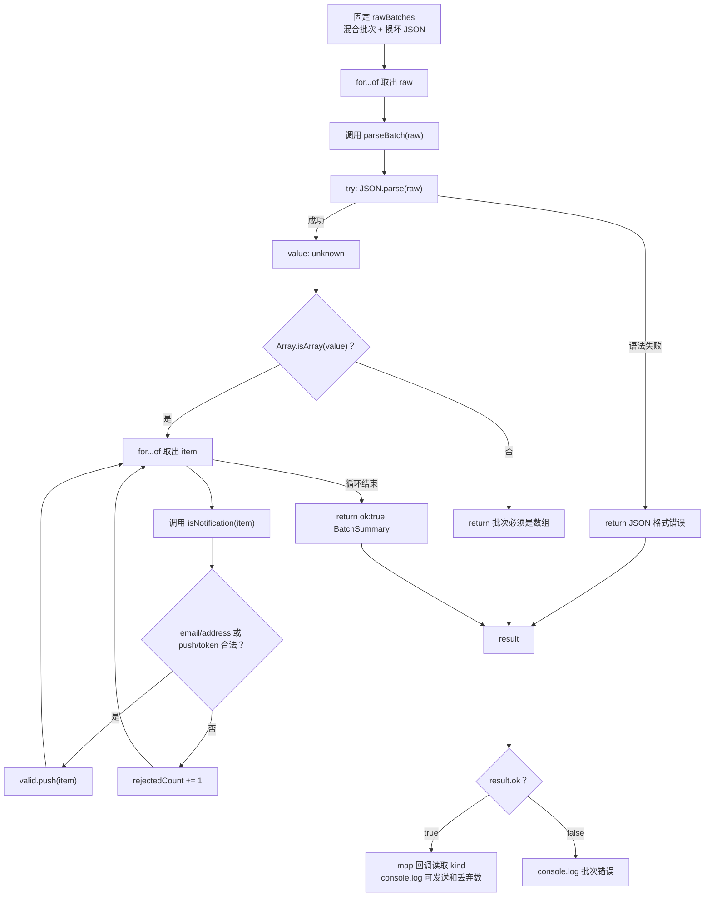

# DAY20 · Practice 02：通知批次的部分接收

[返回当天课程](../README.md)

## 文件位置

- 作答文件：[practice.ts](../../../day20/practice02/practice.ts)
- 完整参考答案：[solution.ts](../../../day20/practice02/solution.ts)
- 方案说明：[SOLUTION.md](./SOLUTION.md)

## 场景背景

通知网关会收到一整个 JSON 数组。数组中某些项可能合法，某些项可能属于不支持的渠道或字段类型错误；业务允许保留合法项并丢弃坏项。但如果 JSON 本身无法解析，或最外层不是数组，这一批就不能继续处理。

## 和 Practice 01 的区别

Practice 01 的 `Profile` 是一个整体，任一嵌套字段错误都会拒绝整份资料。本题先验证批次容器，再逐项分流：合法通知进入 `valid`，坏项只增加 `rejectedCount`；只有语法错误或错误容器才返回失败 Result。

## 关联复习

通知的 `kind` 会复用 Day11 的判别联合，数组分流会复用 Day06 的追加与早期循环。批次层的成功/失败继续使用 Day19 的 Result，但单项错误不会升级成整批失败。

## 数据流

先沿变量名看数据怎样分叉和汇合；`──>` 表示值被交给下一步。

```text
rawBatches
   └── JSON.parse ──> unknown
          ├── 语法失败 ──> Result error
          └── Array.isArray
                 ├── false ──> Result error
                 └── true ──> 逐项 isNotification
                                ├── true ──> valid[]
                                └── false ──> rejectedCount + 1
成功批次 ──> 渠道列表 + 丢弃数量
失败批次 ──> 批次错误
```

## 代码流程图



## 起始代码

三份类型、守卫签名、固定批次、调用和全部输出位置都已给出。你需要完成对象判断、通知分支、分类循环和各个 `return`。

```ts
type Notification =
  | { kind: "email"; address: string }
  | { kind: "push"; token: string };
type BatchSummary = { valid: Notification[]; rejectedCount: number };
type ParseResult<T> =
  | { ok: true; value: T }
  | { ok: false; error: string };

function isRecord(value: unknown): value is Record<string, unknown> {
  throw new Error("TODO：判断普通记录对象并 return boolean");
}
function isNotification(value: unknown): value is Notification {
  throw new Error("TODO：根据 kind 判断成员字段并 return boolean");
}
function parseBatch(raw: string): ParseResult<BatchSummary> {
  throw new Error("TODO：解析、检查数组、循环分类并 return Result");
}

const rawBatches = [
  '[{"kind":"email","address":"ada@example.com"},{"kind":"sms","phone":"10086"},{"kind":"push","token":"device-1"},{"kind":"email","address":42}]',
  '[{"kind":',
];
for (const raw of rawBatches) {
  const result = parseBatch(raw);
  if (result.ok) {
    const kinds = result.value.valid.map((item) => item.kind);
    console.log(`可发送：${kinds.join(",")}`);
    console.log(`丢弃数量：${result.value.rejectedCount}`);
  } else {
    console.log(`批次错误：${result.error}`);
  }
}
```

## 要完成的功能

先在文件顶层**分别声明**三个有名字的类型：

```ts
type Notification =
  | { kind: "email"; address: string }
  | { kind: "push"; token: string };

type BatchSummary = {
  valid: Notification[];
  rejectedCount: number;
};

type ParseResult<T> =
  | { ok: true; value: T }
  | { ok: false; error: string };
```

- `Notification` 是类型：它只允许 email 和 push 两种通知。
- `BatchSummary` 是类型：返回对象中的 `valid` 字段保存合法通知，`rejectedCount` 字段保存被丢弃的数量。
- `ParseResult<T>` 是泛型类型：成功对象必须有 `ok: true` 和 `value`；失败对象必须有 `ok: false` 和 `error`。

把这些对象结构直接内联到 `parseBatch` 的返回类型里，在 TypeScript 中可以合法书写，但不符合本题“声明并复用 `Notification`、`BatchSummary`、`ParseResult<T>`”的结构练习。

接着实现三个函数：

- 类型守卫函数 `isRecord(value: unknown): value is Record<string, unknown>`：确认值是非 `null`、非数组的普通记录对象。
- 类型守卫函数 `isNotification(value: unknown): value is Notification`：根据 `kind` 检查该成员真正需要的字段。email 必须有字符串 `address`，push 必须有字符串 `token`。
- 函数 `parseBatch(raw: string): ParseResult<BatchSummary>`：
  - JSON 语法错误返回 `JSON 格式错误`。
  - 解析结果不是数组返回 `批次必须是数组`。
  - 数组逐项验证，保留合法项并统计坏项。

函数骨架中的返回关系应是：

```ts
function parseBatch(
  raw: string,
): ParseResult<BatchSummary> {
  // TODO：解析 raw、验证数组、逐项分类。
  // 成功时 value 字段必须是 BatchSummary。
  // 失败时 error 字段必须是字符串。
}
```

最后声明变量 `rawBatches`，让第一批包含合法 email、不支持的 sms、合法 push、`address` 为数字的坏 email；第二批使用语法损坏文本。循环中的变量 `result` 保存每次 `parseBatch(raw)` 的返回对象，再根据 `result.ok` 读取 `value` 或 `error`。

## 约束

- 不得导入 `practice01` 或直接调用其他练习的实现。
- 不得使用 `any`、类型断言、非空断言或直接相信 `JSON.parse`。
- 类型谓词承诺的字段必须全部经过运行时检查。
- 单项错误不能让第一批整体失败；JSON 语法错误也不能伪装成“丢弃一项”。
- 输出必须由变量、计算或函数返回值产生，不把整行结果写死。
- 每个参数、局部变量和返回值都应能在流程图中找到位置。

## 精确期望输出

```text
可发送：email,push
丢弃数量：2
批次错误：JSON 格式错误
```

完成标准：右键运行显示 PASS；第一批保留 email、push 并丢弃两项，第二批只输出语法错误，未经守卫的字段不会进入业务输出。

## 写完后自检

- 把最外层数组换成 `{}`，它应进入哪一种失败分支？为什么不能直接 `for...of`？
- 加入 `{ "kind": "email", "address": "" }` 后，当前守卫会接受还是拒绝？“是字符串”和“是可用邮箱”属于同一层验证吗？
- 为什么本题逐项保留合法通知，而 Practice 01 使用 `every` 拒绝整份资料？两种策略分别保护什么业务目标？

## 文件

在上方链接的 `practice.ts` 作答；独立完成后再查看 `solution.ts` 的完整参考答案。
