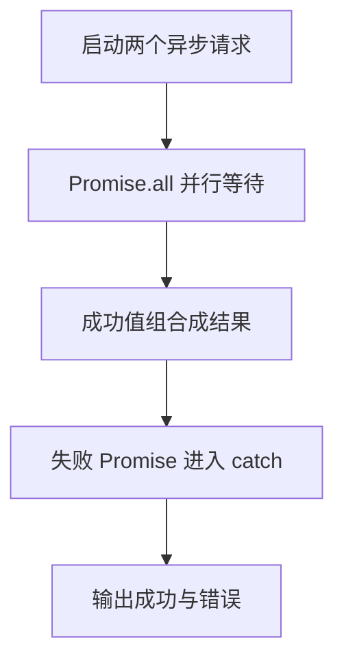

# Day 21：Promise、async/await 与异步错误

预计用时：60–90 分钟。

网络请求、定时器和文件读取都要等一段时间。调用这类函数时，程序先拿到一个 `Promise`：它不是最终数据，而是一份“稍后会成功给值，或者失败给错误”的结果。`async/await` 是配套写法，其中 `await` 用来等待这份结果，再决定继续正常步骤还是进入错误处理。

## 核心讲解

先分清三个时刻：

1. 调用 `getName()` 后立刻得到 `Promise<string>`，此时还没有可直接使用的姓名字符串。
2. `await getName()` 会暂停当前 `async` 函数，等待 Promise 得到结果；它不会把整个 JavaScript 程序都停住。
3. Promise 成功时，`await` 表达式得到 `string`；Promise 失败时，当前路径像遇到 `throw` 一样进入附近的 `catch`。

只要函数写了 `async`，它对外返回的就是 Promise。函数内部 `return` 一个 `T`，调用者拿到的是 `Promise<T>`；调用者再 `await` 后才得到 `T`。

两个请求如果互相不需要对方的结果，就可以同时启动，再一起等待：

~~~ts
const [lesson, progress] = await Promise.all([
  loadLesson(),
  loadProgress(),
]);
~~~

执行数组中的两个函数调用时，请求就开始了。`Promise.all` 等到两项都成功后，把两个成功值按原顺序放进结果数组，再解构到 `lesson` 和 `progress`。只要其中一项失败，`Promise.all` 返回的 Promise 就会失败；它不会自动取消其他已经开始的请求。

顺序可以这样比较：

| 写法 | 第二个请求何时开始 | 适用情况 |
| --- | --- | --- |
| 先 `await` 第一个，再调用第二个 | 第一个完成以后 | 第二个需要第一个的结果 |
| 先创建两个 Promise，再 `Promise.all` | 不等待第一个完成 | 两个请求互不依赖 |

不要写无人等待的 `forEach(async () => ...)`。`forEach` 只负责逐项调用回调，不会把回调返回的 Promise 收集起来，也不会等它们完成。用 `map` 把每次调用得到的 Promise 放进新数组，再把这个数组交给 `Promise.all`。

每次调用异步函数后，都要决定谁来等待它：当前函数立刻 `await`，把 Promise `return` 给上一层，或者先保存起来稍后统一等待。如果三种都没做，外层代码可能已经继续执行，而异步任务还没完成，失败也可能没人处理。

异步错误进入 `catch` 后，捕获值仍先看作 `unknown`，通过 `instanceof Error` 检查后再读取 `message`。不要在 `catch` 中随手返回看似成功的数据；这样调用者会把失败当成正常结果。只有产品明确允许备用数据，并且返回结果能标明“这是备用值”时，才适合这样做。

## 阅读示例

打开并右键运行 `example.ts`。先找出每个异步函数调用返回的 Promise，再找对应的 `await`。对每个变量分别写下“等待前的类型”和“等待后的类型”。最后沿失败请求找到它进入的 `catch`。

## 函数变量追踪

追踪一个 `async` 函数时，按调用者和函数内部两层看：

1. 调用者执行异步函数，立刻得到 `Promise<T>`。
2. 异步函数内部继续执行自己的步骤；遇到 `await` 时，当前函数等待该 Promise。
3. 内部最终 `return` 的 `T` 会成为外层 Promise 的成功值。
4. 调用者对这个 Promise 使用 `await` 后，才得到真正的 `T`。
5. 内部抛错或等待到失败 Promise 时，外层 Promise 会拒绝；调用者的 `await` 再把错误送进 `catch`。

看到变量类型时，先问它处在 `await` 前还是后：前面通常是 `Promise<T>`，后面才是 `T`。

## Example 实际输出

运行 `example.ts` 后，终端会按下面的顺序显示。先用代码推测结果，再逐行对照：

```text
并行结果: 课程、进度
错误: 网络不可用
```

## Example 代码流程图

运行 `example.ts` 前先沿图预测执行顺序；运行后再把每个节点对应到代码行。



## 独立练习导航

本日共有 2 道独立练习。每道题都有单独目录、说明、作答文件和解题结构；题目之间不共享代码。

| 目录 | 场景 | 类型 |
| --- | --- | --- |
| [practice01](./practice01/README.md) | Promise、async/await 与异步错误 | 主任务 |
| [practice02](./practice02/README.md) | 并行内容加载 | 闭卷迁移 |

右击任意练习目录中的 `practice.ts` 即可单独检查；命令行也可运行 `npm run beginner -- day21 practice02`。

## 容易出错的地方

- 把 `Promise<string>` 直接当成 `string`。
- 互不依赖的请求仍逐个等待，造成不必要串行。
- 认为 `forEach` 会等待 async 回调。
- 调用 async 函数却既不等待也不返回。
- 捕获后返回假数据，把失败伪装成成功。
- 忘记 `await` 也会把拒绝重新抛出。

### 错误代码示例

```ts
const lesson: string = fetchText("课程");
// ❌ async 函数返回 Promise<string>，不是已经完成的 string。

["课程", "进度"].forEach(async (name) => {
  await fetchText(name);
});
console.log("全部完成"); // ❌ forEach 不收集 Promise，这一行会提前执行。
```

### 正确写法

```ts
const lesson: string = await fetchText("课程"); // ✅ await 后才得到成功值。

const requests = ["课程", "进度"].map((name) => fetchText(name));
await Promise.all(requests); // ✅ map 收集所有 Promise，再统一等待。
console.log("全部完成");
```

## 拓展思考（不要求写代码）

如果第二个请求必须使用第一个请求返回的课程 id，它们还能放进同一个 `Promise.all` 吗？请画出依赖顺序，并指出哪些请求仍可能并行。

## 官方资料

- [MDN：async function](https://developer.mozilla.org/docs/Web/JavaScript/Reference/Statements/async_function)
- [MDN：Promise.all](https://developer.mozilla.org/docs/Web/JavaScript/Reference/Global_Objects/Promise/all)
