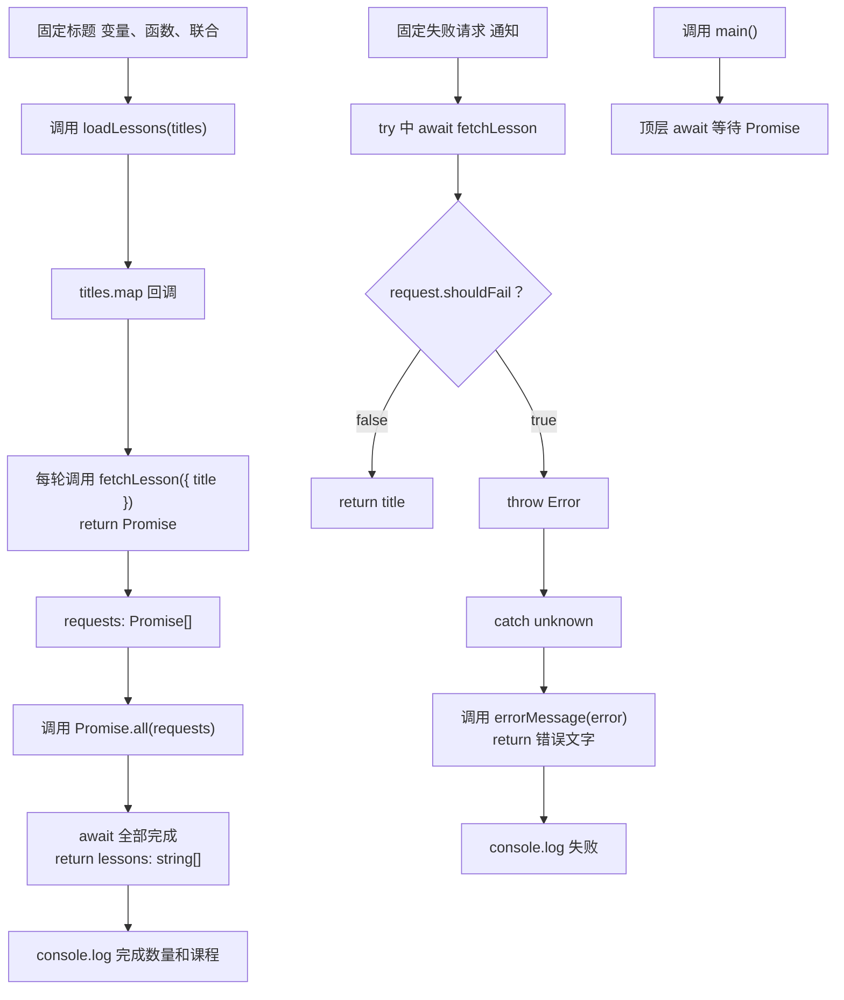

# DAY21 · Practice 01：Promise、async/await 与异步错误

[返回当天课程](../README.md)

## 文件位置

- 作答文件：[practice.ts](../../../day21/practice01/practice.ts)
- 完整参考答案：[solution.ts](../../../day21/practice01/solution.ts)
- 方案说明：[SOLUTION.md](./SOLUTION.md)

## 场景背景

你在实现课程首页的初始化流程，页面打开后要同时加载多个课程标题，以减少等待时间。课程列表加载完成后，程序还会单独请求通知服务，而该请求可能失败。你需要交付成功加载的数量和课程列表，并把异步失败转成用户能理解的提示。

这是一道完整、独立的主练习。不要导入其他 practice 文件夹中的代码。

## 数据流

先沿变量名看数据怎样分叉和汇合；`──>` 表示值被交给下一步。

```text
titles
   └── map ──> fetchLesson(title) 产生的 Promise[]
                    └── Promise.all ──> loadLessons 的 string[]
失败 request ──> Promise rejected ──> catch unknown
                                           └── errorMessage
成功数组或错误文字 ──> main 输出
```

## 代码流程图



## 起始代码

请求类型、异步函数签名、固定标题、调用和三行输出都已给出。你需要完成 `shouldFail` 判断、`map` 回调、`Promise.all`、错误收窄和 `return`。

```ts
type LessonRequest = { title: string; shouldFail?: boolean };

async function fetchLesson(request: LessonRequest): Promise<string> {
  await Promise.resolve();
  throw new Error("TODO：判断 shouldFail；失败时抛错，成功时 return title");
}
async function loadLessons(titles: readonly string[]): Promise<string[]> {
  throw new Error("TODO：map 返回 Promise 数组，再 await/return Promise.all 的结果");
}
function errorMessage(error: unknown): string {
  throw new Error("TODO：收窄 error 并 return 文字");
}
async function main(): Promise<void> {
  const lessons = await loadLessons(["变量", "函数", "联合"]);
  console.log(`完成数量：${lessons.length}`);
  console.log(`课程：${lessons.join("、")}`);
  try {
    await fetchLesson({ title: "通知", shouldFail: true });
  } catch (error: unknown) {
    console.log(`失败：${errorMessage(error)}`);
  }
}
await main();
```

请从头编写“并行课程加载器”。

必须创建：

- `LessonRequest`：`title: string`，可选 `shouldFail?: boolean`。
- `fetchLesson(request: LessonRequest): Promise<string>`：
  - 先 `await Promise.resolve()` 模拟异步边界。
  - `shouldFail` 为真时抛出 `Error("网络不可用")`。
  - 否则返回课程标题。
- `loadLessons(titles: readonly string[]): Promise<string[]>`：
  - 使用 `map` 为每个标题创建 Promise。
  - 使用 `Promise.all` 一起等待并返回结果。
- `errorMessage(error: unknown): string`：安全读取错误文字。
- `main(): Promise<void>`：加载固定标题 `变量、函数、联合`，然后单独请求一个会失败的“通知”。

精确输出：

~~~text
完成数量：3
课程：变量、函数、联合
失败：网络不可用
~~~

限制：

- 不得使用 `any`、类型断言、非空断言或 `forEach(async ...)`。
- 三个正常请求必须先通过 `map` 创建，再统一交给 `Promise.all`。
- `main` 必须 `await loadLessons`，不能把 Promise 当作字符串数组。
- 失败请求必须被 `try/catch` 等待并处理，不得留下未处理的 rejected Promise。
- `catch` 值保持 `unknown`，不得把失败伪装成成功课程。
- 文件末尾必须等待 `main()` 完成。

完成标准：右键运行后显示 PASS；能解释 `Promise<T>` 与 `T`、并行与串行、`map + Promise.all` 与异步 `forEach` 的区别。

## 本题易漏语法

async 函数返回 Promise<T>；调用先得到 Promise，await 后的变量才是 T。

## 写完后自检

- 如果三个正常请求中的第二个也设置为失败，`Promise.all` 会交付部分成功数组，还是进入失败路径？调用方应在哪里处理？
- 把 `loadLessons` 改成循环里逐个 `await`，输出内容也许相同，但请求启动顺序和总等待方式有什么变化？
- 为什么 `forEach(async ...)` 不能替代 `map + Promise.all` 来交付一个可统一等待的结果？

## 文件

- 在 `practice.ts` 中独立作答。
- 完成并运行通过后，再查看 `solution.ts` 的完整参考答案与 `SOLUTION.md` 的调用说明。
