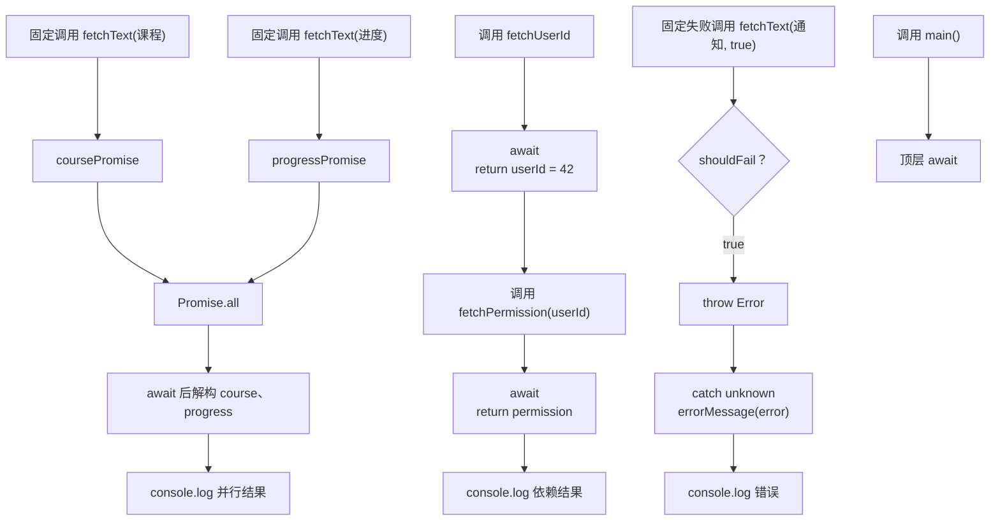

# DAY21 · Practice 02：并行还是顺序：按依赖关系等待

[返回当天课程](../README.md)

## 文件位置

- 作答文件：[practice.ts](../../../day21/practice02/practice.ts)
- 完整参考答案：[solution.ts](../../../day21/practice02/solution.ts)
- 方案说明：[SOLUTION.md](./SOLUTION.md)

## 场景背景

学习主页启动时有三类请求。课程和进度互不依赖，可以同时开始；权限查询必须先拿到用户 id，才能发出下一次请求；通知请求用于演示网络失败，必须被等待并处理。你的任务不是把所有 `await` 都改成并行，而是按数据依赖选择等待方式。

## 和 Practice 01 的区别

Practice 01 把一组同形课程请求通过 `map + Promise.all` 批量加载。本题没有同形数组：两个独立请求要手动同时启动，而权限查询是前一步输出进入后一步输入的顺序链；代码需要同时展示“可以并行”和“不能并行”的判断。

## 关联复习

并行请求的数组结果会用到 Day07 的 `map`/数组思路，失败处理延续 Day19 的 `unknown` 收窄。真正新增的判断是：第二个调用是否需要第一个调用的返回值。

## 数据流

先沿变量名看数据怎样分叉和汇合；`──>` 表示值被交给下一步。

```text
课程名 ──> fetchText ──> Promise ──┐
进度名 ──> fetchText ──> Promise ──┴──> Promise.all ──> 两个成功值

fetchUserId ── await ──> userId
                           └── fetchPermission(userId) ── await ──> 权限文字

失败请求 ──> rejected Promise ──> catch unknown ──> 错误文字

并行结果 + 依赖结果 + 错误结果 ──> main 输出
```

## 代码流程图



## 起始代码

四个函数签名、并行调用、依赖调用、失败调用和全部输出位置已经给出。你需要完成异步判断、各个 `return` 和错误收窄。

```ts
async function fetchText(name: string, shouldFail = false): Promise<string> {
  await Promise.resolve();
  throw new Error("TODO：判断 shouldFail；失败时抛错，成功时 return name");
}
async function fetchUserId(): Promise<number> {
  await Promise.resolve();
  throw new Error("TODO：return 固定用户 id 42");
}
async function fetchPermission(userId: number): Promise<string> {
  await Promise.resolve();
  throw new Error("TODO：使用 userId 并 return 权限文字");
}
function errorMessage(error: unknown): string {
  throw new Error("TODO：收窄 error 并 return 文字");
}

async function main(): Promise<void> {
  const coursePromise = fetchText("课程");
  const progressPromise = fetchText("进度");
  const [course, progress] = await Promise.all([coursePromise, progressPromise]);
  console.log(`并行结果: ${course}、${progress}`);
  const userId = await fetchUserId();
  const permission = await fetchPermission(userId);
  console.log(`依赖结果: ${permission}`);
  try {
    await fetchText("通知", true);
  } catch (error: unknown) {
    console.log(`错误: ${errorMessage(error)}`);
  }
}
await main();
```

## 要完成的功能

- `fetchText(name, shouldFail = false): Promise<string>`：经过异步边界后，失败时抛出 `Error("网络不可用")`，成功时返回 `name`。
- `fetchUserId(): Promise<number>`：经过异步边界后返回固定用户 id `42`。
- `fetchPermission(userId): Promise<string>`：根据收到的 id 返回 `用户42=editor`；它必须使用参数，不能把整行结果写死。
- `errorMessage(error: unknown): string`：只在确认是 `Error` 后读取 `message`。
- `main()`：同时创建“课程”和“进度”两个 Promise，再交给 `Promise.all`；之后顺序等待用户 id 和权限；最后等待一个失败的“通知”请求并处理错误。

## 约束

- 不得导入 `practice01` 或直接调用其他练习的实现。
- 不得使用 `any`、类型断言、非空断言或 `forEach(async ...)`。
- “课程”和“进度”两个 Promise 必须在第一次 `await` 前都已创建。
- `fetchPermission` 只能在取得 `userId` 后调用，不能伪造 id 来强行并行。
- 文件末尾必须等待 `main()` 完成。
- 输出必须由变量、计算或函数返回值产生，不把整行结果写死。
- 每个参数、局部变量和返回值都应能在流程图中找到位置。

## 精确期望输出

```text
并行结果: 课程、进度
依赖结果: 用户42=editor
错误: 网络不可用
```

完成标准：右键运行显示 PASS；课程与进度在第一次等待前都已启动，权限请求使用真实 userId 顺序执行，通知失败被明确捕获。

## 写完后自检

- 如果课程请求耗时更长，`Promise.all` 返回数组中的课程和进度顺序会不会交换？为什么？
- 把两个独立请求改成先 `await` 课程、再创建进度请求，输出可能不变，但等待过程有什么不同？
- 如果先没有 `userId`，为什么权限请求不能和前两个请求照搬同一种并行写法？

## 文件

在上方链接的 `practice.ts` 作答；独立完成后再查看 `solution.ts` 的完整参考答案。
