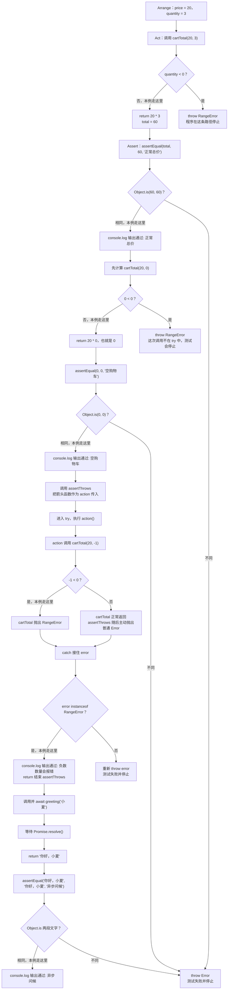

# Day 22｜测试与调试：让错误更早、更小地出现

假设你写了一个购物车总价函数：单价是 `20`，数量是 `3`，结果应该是 `60`；数量是 `0`，结果应该是 `0`；数量是 `-1`，程序应该报错。TypeScript 只能检查“单价和数量是不是数字”，不能替你判断总价算得对不对。业务结果要交给测试检查。

今天从空文件写一个小功能，再为它写正常、边界和错误测试。每条测试都按“准备数据 → 调用函数 → 比较结果”执行，这三个步骤的正式名称是 Arrange–Act–Assert（AAA）。

建议用时：60–90 分钟。

## 今天会学到

- 用 Arrange、Act、Assert 组织测试；
- 分别覆盖正常、边界和错误路径；
- 让业务函数 `return` 可断言的值，而不是只打印；
- 测试同步抛错，并在异步测试中先 `await`；
- 从第一条失败信息和最小输入开始调试。

## 写 Example 前先认识这些写法

### `Object.is`：比较两个值是不是同一个值

`Object.is(actual, expected)` 是 JavaScript 自带的比较工具，不是本课程编写的函数。点号左边的 `Object` 是 JavaScript 提供的内置对象；括号里依次放“实际值”和“期望值”；返回值是 `boolean`，相同为 `true`，不同为 `false`。

它适合放进小型断言函数中，因为测试需要一个明确的真假结果。课程里的 `assertEqual` 是我们自己写的函数，它在内部调用 `Object.is`；两者不要混为一谈。

```ts
console.log(Object.is(60, 60));
console.log(Object.is(Number.NaN, Number.NaN));
console.log(Object.is({ total: 60 }, { total: 60 }));
```

实际输出：

```text
true
true
false
```

最后一行是 `false`，因为两个对象虽然内容看起来一样，却是分别创建的两个对象。`Object.is` 不会逐层比较对象字段；本日断言只用它比较数字、字符串等简单值。还要注意拼写是大写的 `Object`、小写的 `is`。

## 核心讲解

### 一条测试实际做了什么

| 步骤 | 本例中的值 | 你在检查什么 |
| --- | --- | --- |
| Arrange（准备） | `price = 20`、`quantity = 3`、期望值 `60` | 把输入和正确答案准备好 |
| Act（执行） | 调用 `cartTotal(price, quantity)`，得到 `total` | 只运行这次要检查的函数 |
| Assert（比较） | 比较 `total` 与 `60` | 不相等就让测试失败 |

AAA 只是这三步的英文名称。写测试时先问自己：“我准备了什么？我调用了谁？最后比较哪两个值？”能答出来，测试结构通常就清楚了。

### 为什么要测三条路径

正常输入 `20 × 3` 应得到 `60`；边界输入 `20 × 0` 应得到 `0`；错误输入 `20 × -1` 应抛出 `RangeError`。只测第一条，只能证明函数在这一个输入上碰巧正确。比如代码把数量 `0` 当成错误，正常测试仍然会通过。

业务函数要用 `return` 交出结果。`console.log` 只是把文字打印到终端，测试不方便稳定地拿它和期望值比较。

### 异步测试多一步

通用地说，异步函数返回 `Promise<T>`：`T` 表示等待完成后得到的类型。调用 `greeting("小夏")` 时，先得到的是 `Promise<string>`，还不是字符串。`await` 等它完成后，`actual` 才是 `"你好，小夏"`，这时才能比较。测试抛错时也要分清两种错误：一种来自被测函数，另一种来自测试自己报告“没有按要求抛错”。

## 为什么要这样设计

没有测试时，一次看似无关的重构也可能悄悄改坏空数组或负数输入，而 TypeScript 只能确认参数是数字，不能确认 `20 × 3` 是否真的得到 `60`。测试把“输入、实际结果、正确结果”保存下来，让以后每次运行都能重复检查同一条业务约定。

断言函数或测试库负责重复执行、比较并报告差异，AAA 则把准备数据、调用功能和检查结果分开；你仍要决定哪些结果才算正确，以及正常、边界、失败和异步路径各选什么例子。测试的边界也很明确：没写进测试的情况不会自动获得保护，断言函数本身写错还可能造成假通过，因此失败测试也要故意验证一次。

## 函数变量追踪

用本日示例追踪一次：`price(20)` 和 `quantity(3)` 作为实参进入 `cartTotal`；函数计算后 `return 60`；调用处用 `total` 接住 `60`；`assertEqual` 再把实际值 `60` 与期望值 `60` 比较。每个变量都能回答“值从哪里来、下一步去了哪里”。

如果函数只执行 `console.log(60)`，调用处接不到稳定结果，断言就失去了比较对象。

## Example 实际输出

运行 `example.ts` 后，终端会按下面的顺序显示。先用代码推测结果，再逐行对照：

```text
通过: 正常总价
通过: 空购物车
通过: 负数数量会报错
通过: 异步问候
```

## Example 代码流程图

运行 `example.ts` 前先沿图预测执行顺序；运行后再把每个节点对应到代码行。



## 官方手册扩展阅读（可选）

完成当天教程后，如果还想加深理解，再到 [Day 22 官方手册索引](../OFFICIAL-READING.md#day-22) 只选 1 篇阅读；这不是开始练习前的必修内容。

## 独立练习导航

本日共有 2 道独立练习。每道题都有单独目录、题目说明、作答文件、完整参考答案和调用逻辑说明；题目之间不共享代码。

| 目录 | 场景 | 类型 |
| --- | --- | --- |
| [practice01](./practice01/README.md) | 成绩服务回归测试 | 主任务 |
| [practice02](./practice02/README.md) | 购物车回归测试 | 闭卷迁移 |

右击任意练习目录中的 `practice.ts` 即可单独检查；命令行也可运行 `npm run beginner -- day22 practice02`。

## 最容易踩的坑

- 把 `console.log` 当成返回值；
- 只测一个正常输入；
- `assertThrows` 捕获到自己抛出的测试失败；
- 直接比较 Promise，而没有先 `await`；
- 一条测试同时验证许多不相关行为。

### 错误代码示例

演出票系统规定：预订数量超过余票时必须抛出 `RangeError`。下面的测试把“被测函数的错误”和“测试自己报告的失败”放进同一个 `try`，因此正常返回也会被误报为通过：

```ts
function reserveTickets(requested: number, available: number): number {
  if (requested > available) {
    throw new RangeError("余票不足");
  }
  return available - requested;
}

try {
  reserveTickets(2, 3);
  throw new Error("测试失败：本应抛出 RangeError");
} catch {
  // ❌ reserveTickets 正常返回后，测试自己抛出的 Error 也被这里接住了。
  console.log("通过: 超过余票会报错");
}
```

这次只订 2 张、还有 3 张票，本来不该抛错，终端却仍然显示：

```text
通过: 超过余票会报错
```

持续集成会显示绿色，但“超额预订必须失败”这条规则没有真正受到保护。只要出现任意错误就算通过也有问题：即使代码因为读取 `undefined` 抛出 `TypeError`，测试仍会把它当成预期的 `RangeError`。

异步测试也可能提前宣布成功。下面的函数启动刷新后没有等待，日志先打印出来，Promise 稍后才拒绝：

```ts
async function refreshAvailability(): Promise<void> {
  throw new Error("库存服务离线");
}

void refreshAvailability();
// ❌ Promise 尚未完成，测试已经打印“通过”并结束。
console.log("通过: 库存已刷新");
```

这个拒绝可能变成未处理的 Promise 拒绝，或者在“通过”之后才出现在日志里。

### 正确写法

这里不用新的测试库，直接把捕获到的错误保存为 `unknown`，再在 `try/catch` 外核对。这样测试自己抛出的失败不会被原来的 `catch` 接住。

```ts
let reservationError: unknown;
try {
  reserveTickets(4, 3);
} catch (error: unknown) {
  reservationError = error;
}
if (!(reservationError instanceof RangeError)) {
  // ✅ 没抛错或抛了其他错误，都会在 catch 外让测试失败。
  throw new Error("预期得到余票不足的 RangeError");
}
console.log("通过: 超过余票会报错");

let refreshError: unknown;
try {
  // ✅ await 保证拒绝发生在这个 try/catch 的执行期间。
  await refreshAvailability();
} catch (error: unknown) {
  refreshError = error;
}
if (
  !(refreshError instanceof Error) ||
  refreshError.message !== "库存服务离线"
) {
  throw new Error("刷新没有按预期失败");
}
console.log("通过: 离线刷新会失败");
```

测试现在只接受约定好的失败。`reserveTickets` 没抛错、抛了其他类型，或异步刷新意外成功，都会让对应断言失败。

## 面试时怎么回答

**问：** TypeScript 已经能检查参数类型，为什么还要写业务测试？

**可以直接这样回答：**

TypeScript 检查的是静态类型关系，测试检查的是程序运行后的行为。`price + quantity` 和 `price * quantity` 在类型上都会得到 `number`，所以编译器无法知道哪一个才符合购物车规则；测试可以用具体输入比较实际值和期望值。我的用例通常至少覆盖正常值、边界值和失败路径。异步测试必须返回或等待 Promise，因为测试函数返回的 Promise 被拒绝时，测试运行器才会把它算作失败。异常测试也要核对错误类型或消息，不能只要“有任何错误”就通过。

如果继续追问测试的边界，可以补充：测试只保护已经写出的案例，断言本身也可能有错误。我会先让测试通过，再故意改错一次实现或期望值，确认它确实会失败，避免留下假通过。

官方参考：[Node.js Test Runner](https://nodejs.org/api/test.html)、[Node.js Assert](https://nodejs.org/api/assert.html)

## 拓展思考（不要求写代码）

如果 `loadScores()` 偶尔因为网络错误而拒绝 Promise，第五条测试应怎样区分“正确失败”和“意外失败”？请用 AAA 三步口述测试设计。
