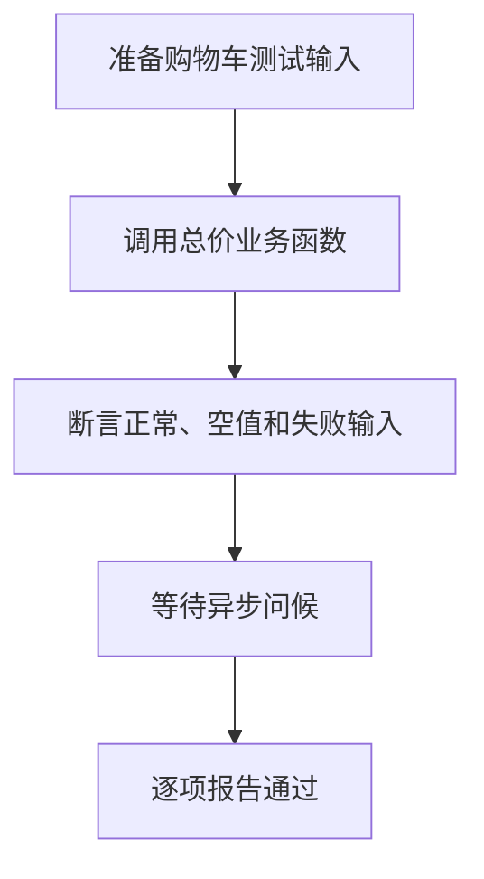

# Day 22｜测试与调试：让错误更早、更小地出现

假设你写了一个购物车总价函数：单价是 `20`，数量是 `3`，结果应该是 `60`；数量是 `0`，结果应该是 `0`；数量是 `-1`，程序应该报错。TypeScript 只能检查“单价和数量是不是数字”，不能替你判断总价算得对不对。业务结果要交给测试检查。

今天从空文件写一个小功能，再为它写正常、边界和错误测试。每条测试都按“准备数据 → 调用函数 → 比较结果”执行，这三个步骤的正式名称是 Arrange–Act–Assert（AAA）。

建议用时：60–90 分钟。

## 今天会学到

- 用 Arrange、Act、Assert 组织测试；
- 分别覆盖正常、边界和错误路径；
- 让业务函数 `return` 可断言的值，而不是只打印；
- 测试同步抛错，并在异步测试中先 `await`；
- 从第一条失败信息和最小输入开始调试。

## 核心讲解

### 一条测试实际做了什么

| 步骤 | 本例中的值 | 你在检查什么 |
| --- | --- | --- |
| Arrange（准备） | `price = 20`、`quantity = 3`、期望值 `60` | 把输入和正确答案准备好 |
| Act（执行） | 调用 `cartTotal(price, quantity)`，得到 `total` | 只运行这次要检查的函数 |
| Assert（比较） | 比较 `total` 与 `60` | 不相等就让测试失败 |

AAA 只是这三步的英文名称。写测试时先问自己：“我准备了什么？我调用了谁？最后比较哪两个值？”能答出来，测试结构通常就清楚了。

### 为什么要测三条路径

正常输入 `20 × 3` 应得到 `60`；边界输入 `20 × 0` 应得到 `0`；错误输入 `20 × -1` 应抛出 `RangeError`。只测第一条，只能证明函数在这一个输入上碰巧正确。比如代码把数量 `0` 当成错误，正常测试仍然会通过。

业务函数要用 `return` 交出结果。`console.log` 只是把文字打印到终端，测试不方便稳定地拿它和期望值比较。

### 异步测试多一步

通用地说，异步函数返回 `Promise<T>`：`T` 表示等待完成后得到的类型。调用 `greeting("小夏")` 时，先得到的是 `Promise<string>`，还不是字符串。`await` 等它完成后，`actual` 才是 `"你好，小夏"`，这时才能比较。测试抛错时也要分清两种错误：一种来自被测函数，另一种来自测试自己报告“没有按要求抛错”。

## 函数变量追踪

用本日示例追踪一次：`price(20)` 和 `quantity(3)` 作为实参进入 `cartTotal`；函数计算后 `return 60`；调用处用 `total` 接住 `60`；`assertEqual` 再把实际值 `60` 与期望值 `60` 比较。每个变量都能回答“值从哪里来、下一步去了哪里”。

如果函数只执行 `console.log(60)`，调用处接不到稳定结果，断言就失去了比较对象。

## Example 实际输出

运行 `example.ts` 后，终端会按下面的顺序显示。先用代码推测结果，再逐行对照：

```text
通过: 正常总价
通过: 空购物车
通过: 负数数量会报错
通过: 异步问候
```

## Example 代码流程图

运行 `example.ts` 前先沿图预测执行顺序；运行后再把每个节点对应到代码行。



## 独立练习导航

本日共有 2 道独立练习。每道题都有单独目录、说明、作答文件和解题结构提示；题目之间不共享代码。

| 目录 | 场景 | 类型 |
| --- | --- | --- |
| [practice01](./practice01/README.md) | Day 22 · 独立测试与调试练习 | 主任务 |
| [practice02](./practice02/README.md) | 购物车回归测试 | 闭卷迁移 |

右击任意练习目录中的 `practice.ts` 即可单独检查；命令行也可运行 `npm run beginner -- day22 practice02`。

## 最容易踩的坑

- 把 `console.log` 当成返回值；
- 只测一个正常输入；
- `assertThrows` 捕获到自己抛出的测试失败；
- 直接比较 Promise，而没有先 `await`；
- 一条测试同时验证许多不相关行为。

### 错误代码示例

```ts
function assertThrows(action: () => void): void {
  try {
    action();
    throw new Error("被测函数没有抛错");
  } catch {
    // ❌ 这里也会捕获上一行由测试自己抛出的 Error，造成“假通过”。
    console.log("测试通过");
  }
}

const actual = greeting("小夏");
// ❌ actual 是 Promise<string>，还不是最终的问候字符串。
console.log(actual === "你好，小夏");
```

### 正确写法

```ts
function assertThrows(action: () => void): void {
  try {
    action();
  } catch (error: unknown) {
    if (error instanceof RangeError) {
      console.log("测试通过");
      return;
    }
    throw error;
  }

  // ✅ 只有被测函数完全没有抛错时，才由测试在 try 外报告失败。
  throw new Error("被测函数没有抛出预期的 RangeError");
}

// ✅ 先等待 Promise 完成，再断言解析后的 string。
const actual = await greeting("小夏");
console.log(actual === "你好，小夏");
```

## 拓展思考（不要求写代码）

如果 `loadScores()` 偶尔因为网络错误而拒绝 Promise，第五条测试应怎样区分“正确失败”和“意外失败”？请用 AAA 三步口述测试设计。

## 官方资料

- [TypeScript：静态类型检查](https://www.typescriptlang.org/docs/handbook/2/basic-types.html#static-type-checking)
- [Node.js：Test runner](https://nodejs.org/api/test.html)
