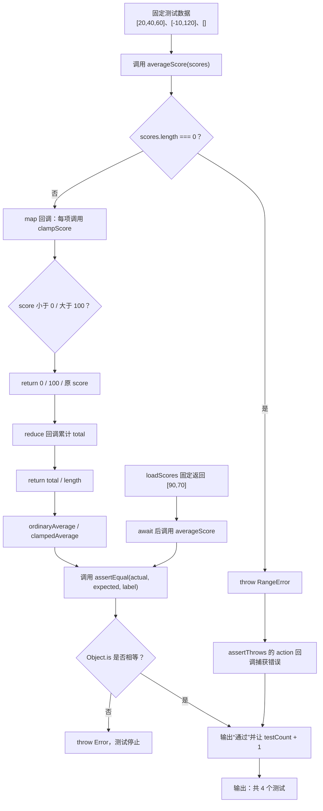

# DAY22 · Practice 01：成绩服务回归测试

[返回当天课程](../README.md)

## 文件位置

- 作答文件：[practice.ts](../../../day22/practice01/practice.ts)
- 完整参考答案：[solution.ts](../../../day22/practice01/solution.ts)
- 答案调用说明：[SOLUTION.md](./SOLUTION.md)

这是一道完整、独立的主练习。不要导入其他 practice 文件夹中的代码。

## 场景背景

一位在线课程老师需要给成绩服务增加一组回归测试，输入既可能是正常分数，也可能包含越界值、空列表或异步加载的数据。若边界处理或异常判断失效，成绩统计就会悄悄产生错误，甚至把失败路径误报为通过。你需要交付可重复运行的测试结果，分别证明正常、边界、错误和异步四条路径都符合预期。

## 数据流

先沿变量名看数据怎样分叉和汇合；`──>` 表示值被交给下一步。

```text
测试输入
   ├── clampScore ─────────┐
   ├── averageScore ───────┼──> 实际值
   └── 失败输入 ──> throw ─┘
实际值 + 期望值 ──> assertEqual ──> 通过/抛错
被测函数 ──> assertThrows ──> 是否按要求抛错
每项测试结果 ──> testCount / 报告输出
```


## 代码流程图

下面这张图按实际执行顺序展开；菱形是判断，箭头上的文字表示走哪条分支。



## 起始代码

以下代码提前给出固定数据、函数签名、调用位置和输出位置。代码可作为完整脚手架阅读；判断、循环、回调与 `return` 的正确实现仍留在 TODO 中。

```ts
// 固定签名、数据、调用与输出都已经给出；只改 TODO 所在的核心逻辑。
function clampScore(score: number): number {
  // TODO：判断下界和上界，并 return 正确分数。
  return score;
}
function averageScore(scores: readonly number[]): number {
  // TODO：空数组抛错；map 把分数交给 clampScore；reduce 求和；return 平均值。
  return 0;
}
async function loadScores(): Promise<readonly number[]> {
  await Promise.resolve();
  return [90, 70];
}
function assertEqual<T>(actual: T, expected: T, label: string): void {
  // TODO：判断 Object.is；失败时抛错。
  void actual;
  void expected;
  console.log(`通过: ${label}`);
}
function assertThrows(action: () => void, expectedMessage: string, label: string): void {
  // TODO：执行 action；只让指定 RangeError 通过，没抛错时测试必须失败。
  void action;
  void expectedMessage;
  console.log(`通过: ${label}`);
}

let testCount = 0;
const ordinaryAverage = averageScore([20, 40, 60]);
assertEqual(ordinaryAverage, 40, "普通平均分");
// TODO：断言通过后 testCount += 1。
const clampedAverage = averageScore([-10, 120]);
assertEqual(clampedAverage, 50, "分数限制在 0 到 100");
// TODO：断言通过后 testCount += 1。
assertThrows(() => averageScore([]), "成绩列表不能为空", "空列表会报错");
// TODO：断言通过后 testCount += 1。
const loadedAverage = averageScore(await loadScores());
assertEqual(loadedAverage, 80, "异步成绩");
// TODO：断言通过后 testCount += 1。
console.log(`共 ${testCount} 个测试`);
```


## 任务要求

1. 实现 `clampScore` 与 `averageScore`：分数限制为 0–100，空数组抛出指定 `RangeError`。
2. 完成 `assertEqual` 与 `assertThrows`，分别核对普通值和指定异常。
3. 按固定数据运行普通、边界、空数组和异步四条测试；每条真正通过后才增加 `testCount`。
4. 输出必须来自断言和最终计数，不能把通过结果提前写死。

## 精确期望输出

```text
通过: 普通平均分
通过: 分数限制在 0 到 100
通过: 空列表会报错
通过: 异步成绩
共 4 个测试
```

## 本题易漏语法

测试仍是实参进、返回值出；实际值与期望值作为不同实参，用逗号分开。

## 写完后自检

- 把异步成绩改成 `[100, 0]` 时，平均值断言应该期待什么？如果 `loadScores()` 拒绝 Promise，现有测试会在哪里失败？
- 为什么 `averageScore` 应该 `return` 数字，而不是在函数内部 `console.log` 平均分？
- 故意把普通平均分的期望值从 `40` 改成 `41`。你的断言是否立即停止并显示实际值与期望值？

## 文件

- 在 `practice.ts` 中独立作答。
- 独立完成后，再查看完整的 `solution.ts`，并用 `SOLUTION.md` 对照直接调用逻辑。
