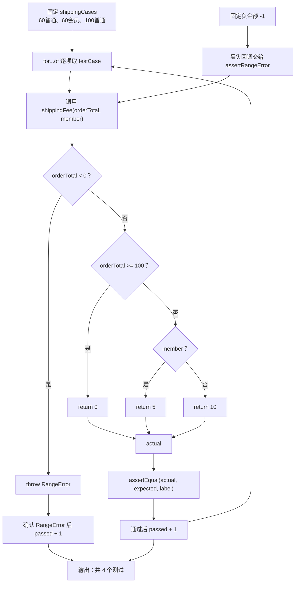

# DAY22 · Practice 02：运费规则表驱动测试

[返回当天课程](../README.md)

## 文件位置

- 作答文件：[practice.ts](../../../day22/practice02/practice.ts)
- 完整参考答案：[solution.ts](../../../day22/practice02/solution.ts)
- 答案调用说明：[SOLUTION.md](./SOLUTION.md)

这题不再逐条手写测试流程。你要把三组正常案例放进测试表中循环执行，再为负金额保留一条单独的失败测试。

## 场景背景

物流团队调整了运费规则：普通订单未满 100 元收 10 元，会员订单未满 100 元收 5 元，满 100 元免运费，负订单金额属于数据错误。分支越来越多后，复制四段 AAA 测试容易漏改标签或期望值。你需要用一张案例表驱动三条结果测试，再独立验证错误类型。

## 数据流

先沿变量名看数据怎样分叉和汇合；`──>` 表示值被交给下一步。

```text
shippingCases[]
   └── 每项 { label, orderTotal, member, expected }
          └── for...of ──> shippingFee ──> actual
                                          └── assertEqual(actual, expected, label)
负金额 ──> shippingFee ──> RangeError ──> assertRangeError
每条真正通过 ──> passed + 1 ──> 最终测试数
```


## 代码流程图

下面这张图按实际执行顺序展开；菱形是判断，箭头上的文字表示走哪条分支。



## 起始代码

以下代码提前给出固定数据、函数签名、调用位置和输出位置。代码可作为完整脚手架阅读；判断、循环、回调与 `return` 的正确实现仍留在 TODO 中。

```ts
type ShippingCase = {
  label: string;
  orderTotal: number;
  member: boolean;
  expected: number;
};
function shippingFee(orderTotal: number, member: boolean): number {
  // TODO：负数抛错；判断满额和会员；return 运费。
  void orderTotal;
  void member;
  return 0;
}
function assertEqual<T>(actual: T, expected: T, label: string): void {
  // TODO：比较实际值；失败抛错，成功才执行下面的显示语句。
  void actual;
  void expected;
  console.log(`通过: ${label}`);
}
function assertRangeError(action: () => void, label: string): void {
  // TODO：执行 action；确认 RangeError；没抛错或错误类型不对时失败。
  void action;
  console.log(`通过: ${label}`);
}

const shippingCases: ShippingCase[] = [
  { label: "普通订单运费", orderTotal: 60, member: false, expected: 10 },
  { label: "会员订单运费", orderTotal: 60, member: true, expected: 5 },
  { label: "满额免运费", orderTotal: 100, member: false, expected: 0 },
];
let passed = 0;
for (const testCase of shippingCases) {
  // TODO：把案例交给 shippingFee 和 assertEqual；通过后让 passed += 1。
  void testCase;
}
assertRangeError(() => shippingFee(-1, false), "负金额会报错");
// TODO：异常断言通过后让 passed += 1。
console.log(`共 ${passed} 个测试`);
```

## 和 Practice 01 的区别

Practice 01 为成绩服务分别手写正常、边界、错误、异步四条测试，并练习 `await`。本题的业务输入是“金额 × 会员状态”的组合，三条成功路径由案例数组和循环驱动，失败路径只核对 `RangeError`；重点是测试表如何覆盖规则矩阵，而不是重复异步流程。

## 任务要求

1. 实现 `shippingFee(orderTotal, member)`：金额小于 `0` 抛 `RangeError`；金额大于等于 `100` 返回 `0`；否则会员返回 `5`，普通用户返回 `10`。
2. 声明 `ShippingCase`，包含标签、金额、会员状态和期望运费；创建普通 60 元、会员 60 元、普通 100 元三项。
3. 实现泛型 `assertEqual(actual, expected, label)`，不相等时抛出包含标签、期望值、实际值的错误。
4. 用一次 `for...of` 执行案例表；每条断言真正通过后才增加 `passed`。
5. 实现 `assertRangeError(action, label)`，单独验证 `shippingFee(-1, false)`。没抛错或错误类型不对都不能算通过。

- 不得导入 `practice01` 或直接调用其他练习的实现。
- 输出必须由变量、计算或函数返回值产生，不把整行结果写死。
- 每个参数、局部变量和返回值都应能在流程图中找到位置。

## 精确期望输出

```text
通过: 普通订单运费
通过: 会员订单运费
通过: 满额免运费
通过: 负金额会报错
共 4 个测试
```

## 写完后自检

- 在案例表加入金额 `99.99` 和 `100`，会员状态相同但结果为何不同？边界比较符写成 `>` 会让哪条测试失败？
- 为什么本题用案例数组驱动三条成功测试，而负金额测试仍单独使用异常断言？
- 故意让 `shippingFee` 对负金额返回 `0`。你的 `assertRangeError` 是否会失败，而不是误报通过？

## 文件

在上方链接的 `practice.ts` 作答；独立完成后再查看完整的 `solution.ts`，并用 `SOLUTION.md` 对照直接调用逻辑。
