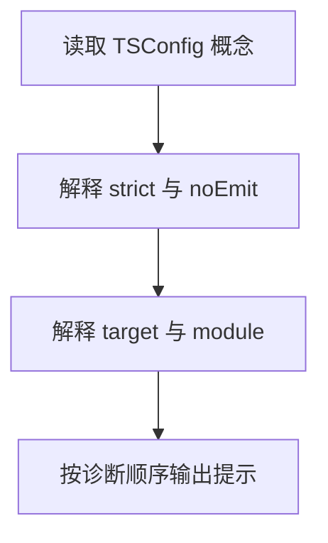

# Day 23｜读懂 TSConfig，也读懂第一条错误

`tsconfig.json` 是这个项目的 TypeScript 检查清单。比如空数组中的 `scores[0]`，实际可能拿不到值；开启对应的严格规则后，编辑器会把它标成 `number | undefined`，提醒你先处理“没有第一项”的情况。

今天从空文件写一个小程序，看看每条配置具体拦住哪种错误，再练习把第一条报错翻译成一句普通话：“这里现在可能是什么值，下一行却要求它一定是什么值？”

建议用时：60–90 分钟。

## 今天会学到

- `strictNullChecks` 要求处理 `undefined` 和 `null`；
- `noImplicitAny` 要求参数有可解释的类型；
- `noUncheckedIndexedAccess` 提醒数组索引可能越界；
- `exactOptionalPropertyTypes` 区分“属性不存在”和“值为 undefined”；
- `target`、`module`、`noEmit` 的职责；
- 多条错误出现时先修第一条。

## 核心讲解

先把配置分成两组来看：一组决定“怎样检查”，另一组决定“怎样生成 JavaScript”。

| 配置 | 它实际决定什么 | 它不负责什么 |
| --- | --- | --- |
| `strictNullChecks` | 使用值前要处理 `null` 和 `undefined` | 不判断业务结果是否正确 |
| `noImplicitAny` | 参数不能在不知不觉中变成 `any` | 不替你设计参数类型 |
| `noUncheckedIndexedAccess` | `scores[0]` 按“可能不存在”检查 | 不保证数组里一定有第一项 |
| `exactOptionalPropertyTypes` | 区分“没有 `theme`”与“`theme` 的值是 `undefined`” | 不会自动删除属性 |
| `target` | 生成哪一代 JavaScript 语法 | 不决定类型严格程度 |
| `module` | `import` / `export` 怎样组织 | 不检查业务公式 |
| `noEmit` | 只检查，不生成 JavaScript 文件 | 不等于运行了测试 |

严格规则是在暴露原本就存在的分支：`find` 可能找不到，数组索引可能越界，可选属性可能没有这个键，外部的 `unknown` 也可能根本不是数字。你要做的是把这些情况写成明确判断，不是用断言把提示盖掉。

读错误时固定做五步：只看第一条；找到行号和出错表达式；读出它现在的类型；读出当前位置需要的类型；做最小修改后重新检查。第一条消失后，后面的错误有时也会一起消失。

## 把一条错误翻译成人话

看到 `const first: number = scores[0]` 报错，可以这样读：右侧 `scores[0]` 的实际类型是 `number | undefined`，左侧却要求一定是 `number`。这条提示可以翻译成：空数组没有第一项。先把结果放进 `first`，检查 `first !== undefined`，再调用数字方法。

## Example 实际输出

运行 `example.ts` 后，终端会按下面的顺序显示。先用代码推测结果，再逐行对照：

```text
先读: 第一条错误
strict: 开启一组严格检查
noEmit: 只检查，不生成文件
target/module: 输出语法 / 模块规则
```

## Example 代码流程图

运行 `example.ts` 前先沿图预测执行顺序；运行后再把每个节点对应到代码行。



## 独立练习导航

本日共有 2 道独立练习。每道题都有单独目录、说明、作答文件和解题结构提示；题目之间不共享代码。

| 目录 | 场景 | 类型 |
| --- | --- | --- |
| [practice01](./practice01/README.md) | Day 23 · 严格配置下的独立练习 | 主任务 |
| [practice02](./practice02/README.md) | 编译配置说明器 | 闭卷迁移 |

右击任意练习目录中的 `practice.ts` 即可单独检查；命令行也可运行 `npm run beginner -- day23 practice02`。

## 最容易踩的坑

- 用类型断言或非空断言压掉提示；
- 认为 `number[]` 的任意索引必然是数字；
- 对 `unknown` 直接做乘法；
- 用 `theme: undefined` 假装删除可选属性；
- 同时猜测多条错误，而没有先处理第一条。

### 错误代码示例

```ts
interface Preferences {
  theme?: "light" | "dark";
}

function double(value) {
  // ❌ value 隐式为 any；严格模式无法检查调用者传入了什么。
  return value * 2;
}

const scores: number[] = [];
const first: number = scores[0]; // ❌ 索引可能越界，结果可能是 undefined。

const preferences: Preferences = {
  theme: undefined, // ❌ exactOptionalPropertyTypes 下，这不等于“属性不存在”。
};
```

### 正确写法

```ts
interface Preferences {
  theme?: "light" | "dark";
}

function double(value: unknown): number | undefined {
  // ✅ unknown 必须先收窄，非数字输入得到明确的缺失结果。
  return typeof value === "number" ? value * 2 : undefined;
}

const scores: number[] = [];
const first = scores[0];
if (first !== undefined) {
  console.log(first.toFixed(1)); // ✅ 使用的正是刚刚检查过的变量。
}

const preferences: Preferences = { theme: "dark" };
const { theme: _removed, ...withoutTheme } = preferences;
// ✅ withoutTheme 中真正不存在 theme 这个键。
```

## 拓展思考（不要求写代码）

如果开启 `noUncheckedIndexedAccess` 后，一个已经检查过 `scores.length > 0` 的函数仍提示 `scores[0]` 可能缺失，你会选择怎样重写代码来让“存在性”更直接地被 TypeScript 看见？

## 官方资料

- [TSConfig：strict](https://www.typescriptlang.org/tsconfig/strict.html)
- [TSConfig：noUncheckedIndexedAccess](https://www.typescriptlang.org/tsconfig/noUncheckedIndexedAccess.html)
- [TSConfig：exactOptionalPropertyTypes](https://www.typescriptlang.org/tsconfig/exactOptionalPropertyTypes.html)
- [TSConfig 总览](https://www.typescriptlang.org/tsconfig)
