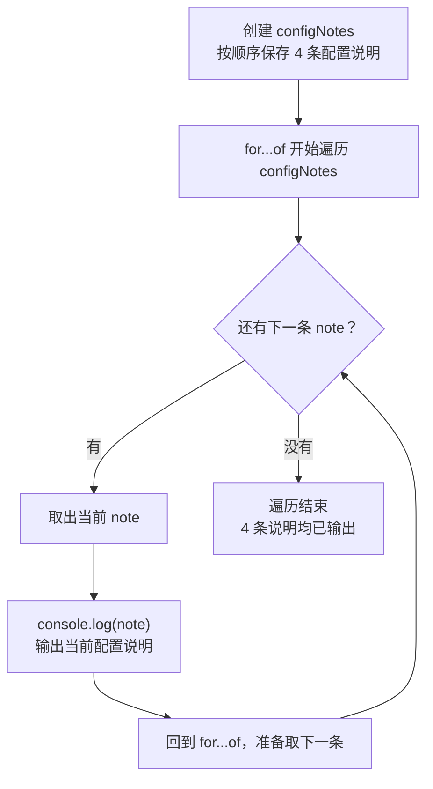

# Day 23｜读懂 TSConfig，也读懂第一条错误

`tsconfig.json` 是这个项目的 TypeScript 检查清单。比如空数组中的 `scores[0]`，实际可能拿不到值；开启对应的严格规则后，编辑器会把它标成 `number | undefined`，提醒你先处理“没有第一项”的情况。

今天从空文件写一个小程序，看看每条配置具体拦住哪种错误，再练习把第一条报错翻译成一句普通话：“这里现在可能是什么值，下一行却要求它一定是什么值？”

建议用时：60–90 分钟。

## 今天会学到

- `strictNullChecks` 要求处理 `undefined` 和 `null`；
- `noImplicitAny` 要求参数有可解释的类型；
- `noUncheckedIndexedAccess` 提醒数组索引可能越界；
- `exactOptionalPropertyTypes` 区分“属性不存在”和“值为 undefined”；
- `target`、`module`、`noEmit` 的职责；
- 多条错误出现时先修第一条。

## 核心讲解

先把配置分成两组来看：一组决定“怎样检查”，另一组决定“怎样生成 JavaScript”。

| 配置 | 它实际决定什么 | 它不负责什么 |
| --- | --- | --- |
| `strictNullChecks` | 使用值前要处理 `null` 和 `undefined` | 不判断业务结果是否正确 |
| `noImplicitAny` | 参数不能在不知不觉中变成 `any` | 不替你设计参数类型 |
| `noUncheckedIndexedAccess` | `scores[0]` 按“可能不存在”检查 | 不保证数组里一定有第一项 |
| `exactOptionalPropertyTypes` | 区分“没有 `theme`”与“`theme` 的值是 `undefined`” | 不会自动删除属性 |
| `target` | 生成哪一代 JavaScript 语法 | 不决定类型严格程度 |
| `module` | `import` / `export` 怎样组织 | 不检查业务公式 |
| `noEmit` | 只检查，不生成 JavaScript 文件 | 不等于运行了测试 |

### 本课程怎样演示这两条额外规则

`strict` 不包含 `noUncheckedIndexedAccess` 和 `exactOptionalPropertyTypes`。本项目的主配置 `beginner/tsconfig.json` 当前也没有打开它们，因为直接改主配置会让其他天的代码一起接受新检查，初学时很难分清报错来自哪一天。

Day 23 单独准备了 `beginner/day23/tsconfig.json`，只给当天代码增加这两项检查。要亲自观察数组索引和可选属性的提示，在项目根目录运行：

```bash
npm run day23:strict
```

常见编辑器会按文件位置自动识别离 Day 23 最近的这份配置；上面的命令则是在终端里明确使用同一配置，方便确认命令行和持续集成也能得到相同结果。看到报错时先看文件路径，确认它来自 Day 23，再按本节的方法处理第一条。

严格规则是在暴露原本就存在的分支：`find` 可能找不到，数组索引可能越界，可选属性可能没有这个键，外部的 `unknown` 也可能根本不是数字。你要做的是把这些情况写成明确判断，不是用断言把提示盖掉。

读错误时固定做五步：只看第一条；找到行号和出错表达式；读出它现在的类型；读出当前位置需要的类型；做最小修改后重新检查。第一条消失后，后面的错误有时也会一起消失。

## 为什么要这样设计

如果项目没有一份共同配置，同一段代码可能在一个人的编辑器里没有提示，到了持续集成或另一台电脑却检查失败；数组越界和缺失属性也容易被当成“一定存在”。`tsconfig.json` 让编译器对整批文件使用同一组检查规则，并统一决定目标 JavaScript 和模块输出方式。

编译器负责追踪 `undefined`、隐式 `any`、索引访问和生成选项；你仍要决定项目支持哪些运行环境、采用多严格的规则，以及每个缺失值在业务上该怎样处理。严格检查会增加旧项目迁移时要处理的提示，`noEmit` 也只代表不生成文件，不会替你运行程序或测试业务结果。

## 把一条错误翻译成人话

看到 `const first: number = scores[0]` 报错，可以这样读：右侧 `scores[0]` 的实际类型是 `number | undefined`，左侧却要求一定是 `number`。这条提示可以翻译成：空数组没有第一项。修复时要先去掉错误的 `: number`，让 `first` 保留 `number | undefined`；然后检查 `first !== undefined`，再调用数字方法。也可以明确写成 `const first: number | undefined = scores[0]`。

## Example 实际输出

运行 `example.ts` 后，终端会按下面的顺序显示。先用代码推测结果，再逐行对照：

```text
先读: 第一条错误
strict: 开启一组严格检查
noEmit: 只检查，不生成文件
target/module: 输出语法 / 模块规则
```

## Example 代码流程图

运行 `example.ts` 前先沿图预测执行顺序；运行后再把每个节点对应到代码行。



## 官方手册扩展阅读（可选）

完成当天教程后，如果还想加深理解，再到 [Day 23 官方手册索引](../OFFICIAL-READING.md#day-23) 只选 1 篇阅读；这不是开始练习前的必修内容。

## 独立练习导航

本日共有 2 道独立练习。每道题都有单独目录、题目说明、作答文件、完整参考答案和调用逻辑说明；题目之间不共享代码。

| 目录 | 场景 | 类型 |
| --- | --- | --- |
| [practice01](./practice01/README.md) | 严格模式下的课程入口 | 主任务 |
| [practice02](./practice02/README.md) | 编译配置说明器 | 闭卷迁移 |

右击任意练习目录中的 `practice.ts` 即可单独检查；命令行也可运行 `npm run beginner -- day23 practice02`。

## 最容易踩的坑

- 用类型断言或非空断言压掉提示；
- 认为 `number[]` 的任意索引必然是数字；
- 对 `unknown` 直接做乘法；
- 给可选属性写入 `undefined`，误以为这样就等于“没有这个键”；
- 同时猜测多条错误，而没有先处理第一条。

### 错误代码示例

批量导入工具开始使用 Day 23 的专用严格配置后，编译器指出了两个原本就存在的问题：用户选择的文件序号可能越界，可选的追踪编号也可能根本没有提供。为了赶发布，有人用 `!` 压掉第一条提示，又把 `undefined` 当成“没有这个字段”：

```ts
interface ImportRequest {
  fileName: string;
  traceId?: string;
}

function selectImportFile(
  fileNames: readonly string[],
  selectedIndex: number,
): string {
  // ❌ 非空断言只让 TypeScript 暂时相信这个位置有 string，
  // 不会给越界的序号创建文件名。
  return fileNames[selectedIndex]!.toUpperCase();
}

function createImportRequestWrong(
  fileName: string,
  traceId: string | undefined,
): ImportRequest {
  return {
    // ❌ 开启 exactOptionalPropertyTypes 后会报错：
    // 可选字段缺失时应不创建这个键，而不是写入 undefined。
    fileName,
    traceId,
  };
}

console.log(selectImportFile(["users.csv"], 3));
```

选择序号 `3` 时，数组里没有对应文件，程序会在 `undefined` 上调用 `toUpperCase`，运行时得到 `TypeError`。`traceId: undefined` 也不等于字段缺失：`"traceId" in object` 仍然是 `true`。如果日志系统用“字段是否存在”判断要不要关联一次追踪记录，就会走错分支。

### 正确写法

```ts
function selectImportFile(
  fileNames: readonly string[],
  selectedIndex: number,
): string {
  const selected = fileNames[selectedIndex];
  if (selected === undefined) {
    // ✅ 这里的业务选择是拒绝无效序号，而不是返回占位文字。
    throw new RangeError(`没有序号为 ${selectedIndex} 的导入文件`);
  }
  return selected.toUpperCase();
}

function createImportRequest(
  fileName: string,
  traceId: string | undefined,
): ImportRequest {
  if (traceId === undefined) {
    // ✅ 没有追踪编号时，直接创建一份不含 traceId 键的对象。
    return { fileName };
  }
  return { fileName, traceId };
}

const request = createImportRequest("users.csv", undefined);
console.log(selectImportFile(["users.csv"], 0));
console.log("traceId" in request);
```

实际输出：

```text
USERS.CSV
false
```

## 面试时怎么回答

**问：** `strict`、`noUncheckedIndexedAccess` 和 `skipLibCheck` 分别管什么？

**可以直接这样回答：**

`strict` 是一组严格类型检查的总开关，打开后会启用多项严格规则，而且 TypeScript 升级时这组规则还可能加入更严格的检查。`noUncheckedIndexedAccess` 专门处理索引读取：对类型没有明确保证存在的键或数组下标，结果会增加 `undefined`，因此 `scores[0]` 要先检查再使用。`skipLibCheck` 只跳过声明文件本身的完整检查，用编译速度和迁移便利换取一部分类型准确性；它不会跳过项目自己的 `.ts` 文件，也不会修复错误声明。

如果项目因为依赖中出现两份互相冲突的类型而考虑 `skipLibCheck`，我会先尝试统一依赖版本。确实要临时开启时，也会记录原因和退出条件。`target`、`module`、`moduleResolution` 则要和实际 Node、浏览器或打包器的运行方式匹配，不能照抄一份所谓万能配置。

官方参考：[strict](https://www.typescriptlang.org/tsconfig/strict.html)、[noUncheckedIndexedAccess](https://www.typescriptlang.org/tsconfig/noUncheckedIndexedAccess.html)、[skipLibCheck](https://www.typescriptlang.org/tsconfig/skipLibCheck.html)

## 拓展思考（不要求写代码）

如果开启 `noUncheckedIndexedAccess` 后，一个已经检查过 `scores.length > 0` 的函数仍提示 `scores[0]` 可能缺失，你会选择怎样重写代码来让“存在性”更直接地被 TypeScript 看见？
