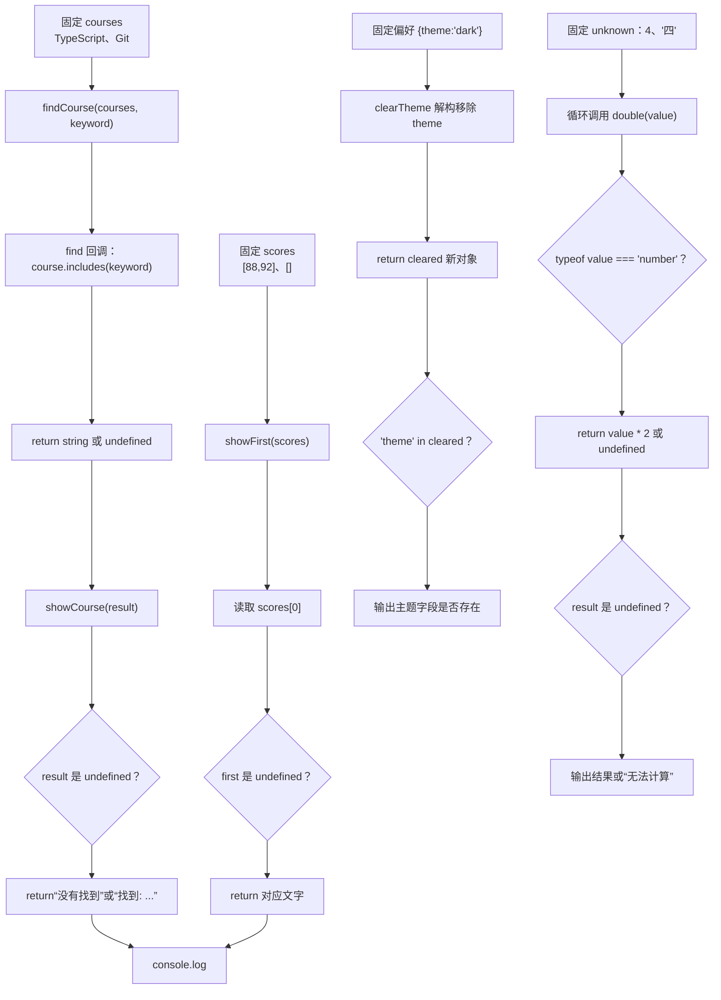

# DAY23 · Practice 01：严格模式下的课程入口

[返回当天课程](../README.md)

## 文件位置

- 作答文件：[practice.ts](../../../day23/practice01/practice.ts)
- 完整参考答案：[solution.ts](../../../day23/practice01/solution.ts)
- 答案调用说明：[SOLUTION.md](./SOLUTION.md)

这是一道完整、独立的主练习。不要导入其他 practice 文件夹中的代码。

## 场景背景

课程管理后台正在启用严格 TypeScript 配置，页面会接收课程搜索结果、可能为空的成绩列表、可选主题设置和来源不明的待计算值。若直接读取缺失项或把可选属性错误地赋为 `undefined`，严格检查会报警，运行时也可能出现不可预测的显示。你需要把这些不确定输入安全转换为明确文本，并在不修改原偏好的前提下产出新的设置对象。

## 数据流

先沿变量名看数据怎样分叉和汇合；`──>` 表示值被交给下一步。

```text
courses + keyword ──> findCourse ──> string | undefined ──> showCourse
scores[0] ──> undefined 检查 ──> showFirst
preferences ──> clearTheme ──> cleared ──> theme 是否仍存在
unknown value ──> typeof ──> double ──> number | undefined
四条严格模式结果 ──> 输出
```


## 代码流程图

下面这张图按实际执行顺序展开；菱形是判断，箭头上的文字表示走哪条分支。



## 起始代码

以下代码提前给出固定数据、函数签名、调用位置和输出位置。代码可作为完整脚手架阅读；判断、循环、回调与 `return` 的正确实现仍留在 TODO 中。

```ts
interface Preferences { theme?: "light" | "dark"; }
function findCourse(courses: readonly string[], keyword: string): string | undefined {
  // TODO：使用 find 回调并 return 结果。
  void courses;
  void keyword;
  return undefined;
}
function showCourse(course: string | undefined): string {
  // TODO：判断 undefined 并 return 显示文字。
  void course;
  return "";
}
function showFirst(scores: readonly number[]): string {
  // TODO：读取索引 0、判断并 return。
  void scores;
  return "";
}
function clearTheme(preferences: Preferences): Preferences {
  // TODO：解构移除 theme，return 新对象。
  return preferences;
}
function double(value: unknown): number | undefined {
  // TODO：typeof 判断并 return。
  void value;
  return undefined;
}

const courses = ["TypeScript", "Git"];
console.log(showCourse(findCourse(courses, "Type")));
console.log(showCourse(findCourse(courses, "Python")));
console.log(showFirst([88, 92]));
console.log(showFirst([]));
const cleared = clearTheme({ theme: "dark" });
console.log("theme" in cleared ? "主题字段: 仍然存在" : "主题字段: 不存在");
for (const value of [4, "四"] as const) {
  const result = double(value);
  console.log(result === undefined ? "无法计算" : `结果: ${result}`);
}
```


## 任务要求

1. `findCourse` 返回课程或 `undefined`，`showCourse` 把两种情况变成明确文字。
2. `showFirst` 安全读取索引 0；`clearTheme` 返回真正没有 `theme` 键的新对象。
3. `double` 只处理数字，其他 `unknown` 输入返回 `undefined`。
4. 使用起始代码中的固定输入，保持七行输出顺序不变。

## 精确期望输出

```text
找到: TypeScript
没有找到
第一项: 88
列表为空
主题字段: 不存在
结果: 8
无法计算
```

## 本题易漏语法

JSON 配置中属性名与值用冒号、项目用逗号；尾随逗号是否允许取决于文件格式。

## 写完后自检

- 把 `scores` 改成 `[0]`、把关键词改成空字符串时，各自会走哪个分支？先预测再运行。
- 为什么 `scores[0]!` 只能消除提示，却不能让空数组真的出现第一项？
- `clearTheme` 为什么要返回一个没有 `theme` 键的新对象，而不是写成 `{ ...preferences, theme: undefined }`？

## 文件

- 在 `practice.ts` 中独立作答。
- 独立完成后，再查看完整的 `solution.ts`，并用 `SOLUTION.md` 对照直接调用逻辑。
