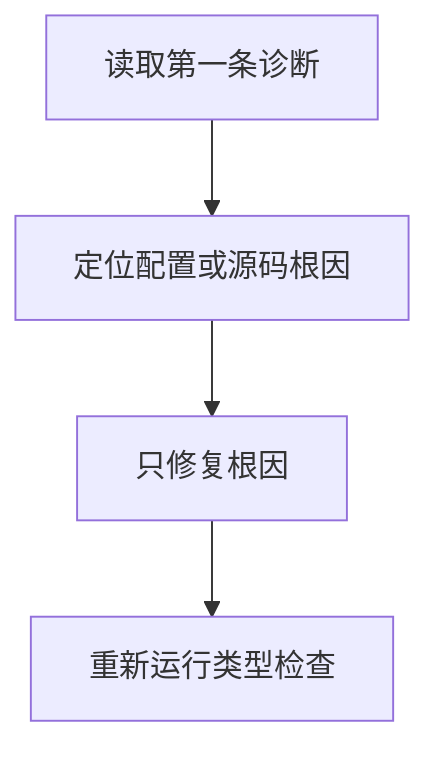

# DAY23 · Practice 01：Day 23 · 严格配置下的独立练习

[返回当天课程](../README.md)

## 文件位置

- 作答文件：[practice.ts](../../../day23/practice01/practice.ts)
- 结构提示代码：[solution.ts](../../../day23/practice01/solution.ts)
- 方案说明：[SOLUTION.md](./SOLUTION.md)

这是一道完整、独立的主练习。不要导入其他 practice 文件夹中的代码。

## 场景背景

课程管理后台正在启用严格 TypeScript 配置，页面会接收课程搜索结果、可能为空的成绩列表、可选主题设置和来源不明的待计算值。若直接读取缺失项或把可选属性错误地赋为 `undefined`，严格检查会报警，运行时也可能出现不可预测的显示。你需要把这些不确定输入安全转换为明确文本，并在不修改原偏好的前提下产出新的设置对象。

## 代码流程图



在 `practice.ts` 中从零完成“严格配置下的安全读取”程序。

必须使用这些名称：`Preferences`、`findCourse`、`showCourse`、`showFirst`、`clearTheme`、`double`。

需求：

1. `findCourse(courses, keyword)` 返回找到的课程或 `undefined`；`showCourse` 把两种情况转换成文字。
2. `showFirst(scores)` 安全读取第一项，空数组返回 `列表为空`。
3. `Preferences` 有可选的 `theme: "light" | "dark"`；`clearTheme` 返回真正移除该属性的新对象，不能把它赋成 `undefined`。
4. `double(value: unknown)` 只把数字乘 2，其他类型返回 `undefined`。
5. 使用固定输入依次打印下面的精确输出。

精确输出：

```text
找到: TypeScript
没有找到
第一项: 88
列表为空
主题字段: 不存在
结果: 8
无法计算
```

固定输入：课程为 `["TypeScript", "Git"]`，关键词依次为 `Type`、`Python`；成绩依次为 `[88, 92]`、`[]`；偏好为 `{ theme: "dark" }`；待计算值为 `4`、`"四"`。

限制：不使用 `any`、`as`、非空断言 `!`、`@ts-ignore` 或 `@ts-expect-error`；不要关闭严格规则。

完成标准：右击运行 `practice.ts` 后类型检查通过且输出完全一致；能解释每个 `undefined` 来自哪里，以及为什么删除属性不等于赋值为 `undefined`。

## 本题易漏语法

JSON 配置中属性名与值用冒号、项目用逗号；尾随逗号是否允许取决于文件格式。

## 文件

- 在 `practice.ts` 中独立作答。
- 独立完成后，再查看 `solution.ts` 的 TODO 代码骨架与 `SOLUTION.md` 的解题结构；两者都不提供完整答案。
