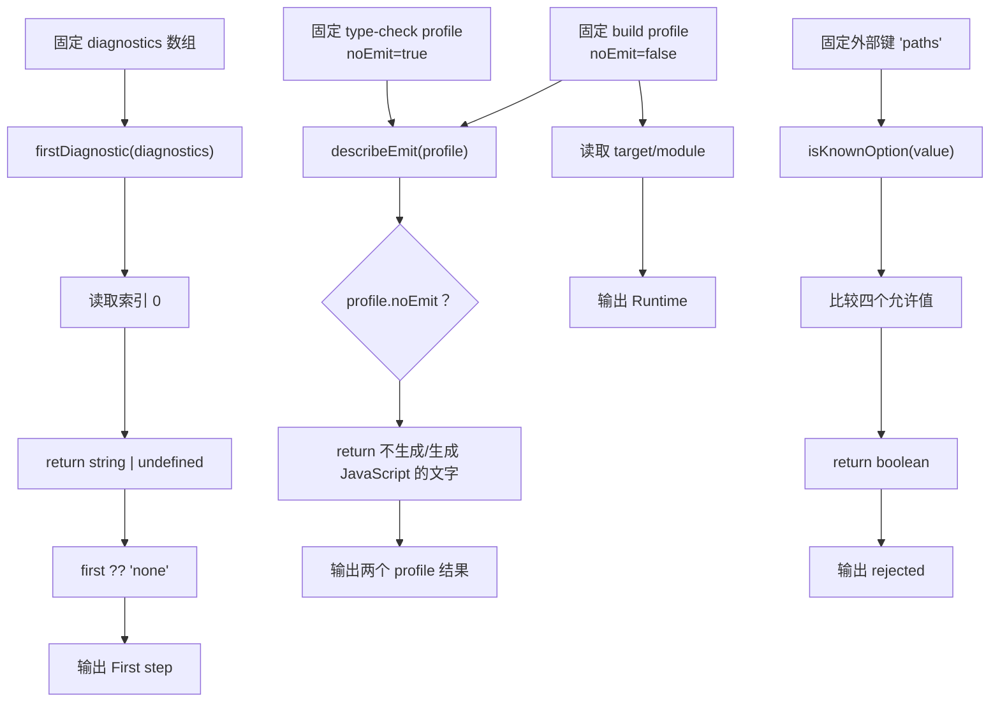

# DAY23 · Practice 02：严格配置发布前检查

[返回当天课程](../README.md)

## 文件位置

- 作答文件：[practice.ts](../../../day23/practice02/practice.ts)
- 完整参考答案：[solution.ts](../../../day23/practice02/solution.ts)
- 答案调用说明：[SOLUTION.md](./SOLUTION.md)

这题不重复修复空值代码。你要比较“只做类型检查”和“正式构建”两份配置，并验证外部传入的配置键是否是团队支持的选项。

## 场景背景

团队在编辑器和持续集成中使用 `noEmit: true`，发布构建则要生成 JavaScript。两份配置使用相同的 `target`、`module`，但输出行为不同；命令行工具还会收到一个来源不明的配置键。你需要先选出第一条诊断，再比较两个构建配置，并拒绝不支持的键，避免把关闭严格检查当成修复。

## 数据流

先沿变量名看数据怎样分叉和汇合；`──>` 表示值被交给下一步。

```text
diagnostics ──> firstDiagnostic ──> 第一条待处理问题
typeCheckProfile(noEmit=true) ──> describeEmit ──> 不生成文件
buildProfile(noEmit=false) ─────> describeEmit ──> 生成 JavaScript
buildProfile.target + module ──> 运行环境说明
外部 option "paths" ──> isKnownOption ──> rejected
```


## 代码流程图

下面这张图按实际执行顺序展开；菱形是判断，箭头上的文字表示走哪条分支。



## 起始代码

以下代码提前给出固定数据、函数签名、调用位置和输出位置。代码可作为完整脚手架阅读；判断、循环、回调与 `return` 的正确实现仍留在 TODO 中。

```ts
type BuildProfile = {
  name: "type-check" | "build";
  noEmit: boolean;
  target: "ES2022";
  module: "NodeNext";
};
type KnownOption = "strict" | "noEmit" | "target" | "module";
function firstDiagnostic(diagnostics: readonly string[]): string | undefined {
  // TODO：读取第一项并 return。
  void diagnostics;
  return undefined;
}
function describeEmit(profile: BuildProfile): string {
  // TODO：判断 noEmit 并 return 描述。
  void profile;
  return "";
}
function isKnownOption(value: string): value is KnownOption {
  // TODO：比较四个允许值并 return boolean。
  void value;
  return false;
}
const typeCheckProfile: BuildProfile = {
  name: "type-check", noEmit: true, target: "ES2022", module: "NodeNext",
};
const buildProfile: BuildProfile = {
  name: "build", noEmit: false, target: "ES2022", module: "NodeNext",
};
const first = firstDiagnostic(["fix first diagnostic", "check related diagnostics"]);
console.log(`First step: ${first ?? "none"}`);
console.log(describeEmit(typeCheckProfile));
console.log(describeEmit(buildProfile));
console.log(`Runtime: ${buildProfile.target}/${buildProfile.module}`);
console.log(`Unknown option: ${isKnownOption("paths") ? "accepted" : "rejected"}`);
```

## 和 Practice 01 的区别

Practice 01 在严格规则下处理 `undefined`、可选属性和 `unknown`，输入是业务值。本题处理两份 TSConfig 资料和一个外部配置键；控制流是“取第一条诊断 → 比较两个 profile → 验证 option”，不会再次实现课程查找或数值收窄。

## 任务要求

1. 声明 `BuildProfile`，包含名称、`noEmit`、`target: "ES2022"` 和 `module: "NodeNext"`。
2. `firstDiagnostic(diagnostics)` 返回第一项或 `undefined`；固定诊断第一项为 `fix first diagnostic`。
3. `describeEmit(profile)` 根据 `noEmit` 返回 `配置名: no files emitted` 或 `配置名: JavaScript emitted`。
4. 创建 `type-check / true` 与 `build / false` 两份 profile，共用 ES2022、NodeNext。
5. 声明 `KnownOption = "strict" | "noEmit" | "target" | "module"`，实现 `isKnownOption(value)`。固定外部输入 `"paths"` 必须被拒绝。
6. 不修改真实 `tsconfig.json`，也不要把 `noEmit` 或 `strict` 解释成业务测试。

- 不得导入 `practice01` 或直接调用其他练习的实现。
- 输出必须由变量、计算或函数返回值产生，不把整行结果写死。
- 每个参数、局部变量和返回值都应能在流程图中找到位置。

## 精确期望输出

```text
First step: fix first diagnostic
type-check: no files emitted
build: JavaScript emitted
Runtime: ES2022/NodeNext
Unknown option: rejected
```

## 写完后自检

- 诊断数组改成空数组时，`firstDiagnostic` 应返回什么？调用处要怎样避免把 `undefined` 当成错误文字？
- 为什么 `noEmit: false` 只改变是否写出文件，不会自动修复第一条类型错误？
- `target`、`module` 与 `strict` 都在 `compilerOptions` 中，为什么前两项描述输出环境，后一项描述检查强度？

## 文件

在上方链接的 `practice.ts` 作答；独立完成后再查看完整的 `solution.ts`，并用 `SOLUTION.md` 对照直接调用逻辑。
