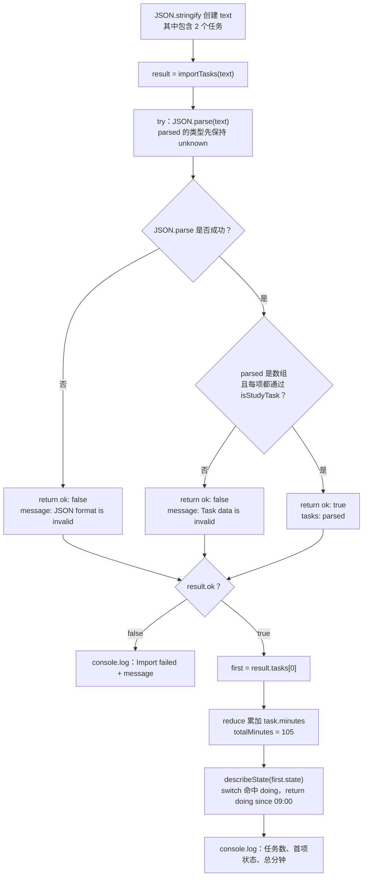

# Day 24｜结课项目（一）：模型与外部数据边界

结课项目要从一段 JSON 导入学习任务。即使文件名叫“任务数据”，里面仍可能出现 `null`、缺少 `title` 的对象、负数分钟，或者拼错的状态。程序必须先检查，检查通过后才能把它当作任务使用。

今天先建立任务模型，再把 `JSON.parse` 的结果保留为 `unknown`。你会从最外层数组开始，一层一层检查对象、字段和状态。检查结束后，再按题目选择一种汇总方式：整批数据必须全部通过，或者保留有效项并统计被拒绝的数量。

建议用时：60–90 分钟。

## 今天会学到

- 用判别联合表达待开始、进行中、已完成状态；
- 用类型谓词验证对象、嵌套状态和数组元素；
- 区分编译期类型与运行时数据；
- 比较“整批通过才导入”和“保留有效项并统计拒绝项”两种汇总策略；
- 用完整 `switch` 安全读取不同状态的字段。

## 写 Example 前先认识这些写法

### `reduce`：把数组中的多项累计成一个结果

`.reduce` 是 JavaScript 数组提供的方法。在 `tasks.reduce(callback, 0)` 中，点号左边的 `tasks` 是任务数组；第二个参数 `0` 是累计值的初始值；回调每轮接到“上轮累计值”和“当前数组项”，并返回新的累计值。数组处理完后，`reduce` 返回一个最终值，而不是新数组。

```ts
const minutes = [30, 45, 15];
const total = minutes.reduce(
  (sum, currentMinutes) => sum + currentMinutes,
  0,
);

const emptyMinutes: number[] = [];
const emptyTotal = emptyMinutes.reduce(
  (sum, currentMinutes) => sum + currentMinutes,
  0,
);

console.log(total);
console.log(emptyTotal);
```

实际输出：

```text
90
0
```

第一轮中，`sum` 是初始值 `0`，`currentMinutes` 是 `30`，回调交回 `30`；下一轮的 `sum` 就变成 `30`。本日的写法同理：`sum` 保存已经累计的分钟，`task` 是当前任务，`task.minutes` 加入后必须交回给下一轮。

初始值不能随手省略。空数组没有“第一项”可拿来充当累计值，不传初始值会在运行时报 `TypeError`；传入 `0` 后，空数组会稳定返回 `0`。拼写是小写的 `reduce`，回调使用花括号时还必须明确写 `return`。

## 核心讲解

```text
JSON 文本 → JSON.parse → unknown → 逐层检查 → StudyTask[]
                                  ↘ 失败原因或拒绝数量
```

先分清两件事：JSON 语法正确，只表示文本能被解析；它不表示字段符合 `StudyTask`。`type` 和 `interface` 在编译后会消失，因此不会在程序运行时替你检查文件、网络或本地存储中的内容。

一次可靠导入按下面的顺序进行：

1. `JSON.parse` 成功后，把结果放进 `parsed: unknown`。
2. 用 `Array.isArray(parsed)` 确认最外层是数组。
3. 对数组中的每一项检查：它不是 `null`，并且确实是对象。
4. 检查 `id`、`title`、`minutes` 和 `state`；其中 `minutes` 还要是有限且不小于 `0` 的数字。
5. 逐项验证后，再按当前题目的策略汇总：Example 和 practice02 只有所有元素都通过才返回 `StudyTask[]`；practice01 则保留通过的项目，并统计 `rejected`。

状态也要按实际可能出现的形状拆开：`todo` 不需要时间；`doing` 必须有 `startedAt`；`done` 必须同时有 `startedAt` 和 `completedAt`。`status` 是区分这三种对象的字段，所以正式名称叫“判别字段”，整组类型叫“判别联合”。当代码判断 `state.status === "doing"` 后，TypeScript 才知道这一分支一定能读取 `startedAt`。

## 为什么要这样设计

如果把 `JSON.parse` 的结果直接断言成 `StudyTask[]`，缺少字段、分钟为字符串甚至 `null` 的数据都会伪装成可信任务，错误要到统计或渲染时才暴露。`unknown` 先阻止代码随意读取字段，类型守卫再把运行时检查结果告诉 TypeScript，让后续代码只处理已经确认的形状。

类型守卫返回 `true`，是在承诺“当前值已经通过非空对象、字段类型、数值范围和状态结构等检查”，TypeScript 因此把它收窄为目标类型；返回 `false` 表示至少一项检查未通过，不能作出这份承诺。语言只负责根据这个布尔结果收窄类型，具体检查哪些字段、整批拒绝还是保留合法项、错误怎样说明，仍由你决定。代价是模型变化时守卫也必须同步更新，而且每次导入都会做真实的运行时检查。

## 变量与数据追踪

`text` 是原始 JSON 字符串；`parsed` 是解析后但尚未确认的 `unknown`；验证函数再让每一项得到 `true` 或 `false`。Example 和 practice02 使用整批策略：全部通过后，`result.tasks` 才是可信的 `StudyTask[]`；否则进入失败分支读取 `message`。practice01 使用部分接收策略：合法项进入 `tasks`，不合法项只增加 `rejected`。两种策略都必须先验证，之后才能安全读取 `minutes`。

## Example 实际输出

运行 `example.ts` 后，终端会按下面的顺序显示。先用代码推测结果，再逐行对照：

```text
Import succeeded: 2 tasks
First: Validate data (doing since 09:00)
Total planned minutes: 105
```

## Example 代码流程图

运行 `example.ts` 前先沿图预测执行顺序；运行后再把每个节点对应到代码行。



## 官方手册扩展阅读（可选）

完成当天教程后，如果还想加深理解，再到 [Day 24 官方手册索引](../OFFICIAL-READING.md#day-24) 只选 1 篇阅读；这不是开始练习前的必修内容。

## 独立练习导航

本日共有 3 道独立练习。每道题都有单独目录、题目说明、作答文件、完整参考答案和调用逻辑说明；题目之间不共享代码。

| 目录 | 场景 | 类型 |
| --- | --- | --- |
| [practice01](./practice01/README.md) | 任务 JSON 导入审查器 | 主任务 |
| [practice02](./practice02/README.md) | 任务导入边界 | 闭卷迁移 |
| [practice03](./practice03/README.md) | 订单 JSON 导入边界 | 综合应用 |

右击任意练习目录中的 `practice.ts` 即可单独检查；命令行也可运行 `npm run beginner -- day24 practice02`。

## 常见错误

- 写 `JSON.parse(text) as StudyTask[]`；
- 忘记 `typeof null === "object"`；
- 只检查 `Array.isArray`；
- 用 `status: string` 接受任意拼写。

### 错误代码示例

假设合作方把课程时长从数字改成了字符串，但没有提前通知。JSON 仍然能解析，下面的断言也能让类型检查通过：

```ts
type ImportedLesson = {
  id: string;
  minutes: number;
  status: "draft" | "published";
};

const text = JSON.stringify([
  { id: "a", minutes: 45, status: "published" },
  { id: "b", minutes: "30", status: "draft" },
]);

// ❌ 断言只改编译器的看法，不会把字符串 "30" 转成 number。
const lessons = JSON.parse(text) as ImportedLesson[];
const total = lessons.reduce((sum, lesson) => sum + lesson.minutes, 0);

console.log(total);
```

TypeScript 会把 `lesson.minutes` 当成 `number`，但第二项在运行时仍是字符串。JavaScript 执行 `45 + "30"` 时会做字符串拼接，实际输出是：

```text
4530
```

报表没有立即崩溃，反而生成了一个看似合理的错误总数，这正是外部数据断言在项目里危险的地方。若数组中混入 `null`，访问字段时还可能直接出现 `TypeError`。`as ImportedLesson[]` 只改变编译器的看法，不会遍历或转换 JSON。

### 正确写法

```ts
function isRecord(value: unknown): value is Record<string, unknown> {
  // ✅ typeof null 也是 "object"，所以必须先排除 null。
  return value !== null && typeof value === "object";
}

function isImportedLesson(value: unknown): value is ImportedLesson {
  return (
    isRecord(value) &&
    typeof value.id === "string" &&
    typeof value.minutes === "number" &&
    Number.isFinite(value.minutes) &&
    value.minutes >= 0 &&
    (value.status === "draft" || value.status === "published")
  );
}

const parsed: unknown = JSON.parse(text);
// ✅ 数组外形和每一个元素都通过后，才进入统计。
if (!Array.isArray(parsed) || !parsed.every(isImportedLesson)) {
  throw new Error("Lesson data is invalid");
}

const total = parsed.reduce((sum, lesson) => sum + lesson.minutes, 0);
console.log(total);
```

对于上面的坏数据，程序会在统计前明确失败：

```text
Error: Lesson data is invalid
```

真实项目还可以把验证失败记录成字段路径，例如 `items[1].minutes must be a finite number`。重点是让错误停在导入边界，而不是等报表或页面使用坏数据时才发现。

## 面试时怎么回答

**问：** 为什么外部 JSON 要先放进 `unknown`，类型守卫又做了什么？

**可以直接这样回答：**

`JSON.parse` 只负责把合法 JSON 文本转换成 JavaScript 值，不保证这个值符合我的业务模型。我会把解析结果放进 `unknown`，先确认它是不是数组、每项是不是非空对象，再逐字段检查字符串、有限数字和判别字段。`value is StudyTask` 这种类型谓词把运行时布尔检查与编译器收窄连接起来：返回 `true` 后，调用处可以按 `StudyTask` 使用；返回 `false` 时不能作出这份承诺。

类型谓词本身不是自动验证器，TypeScript 会相信函数实现。如果守卫漏了 `minutes >= 0`，负数仍会被当成合法任务。JSON 也不会自动恢复 `Date` 或 `bigint`；日期通常先是字符串，需要验证格式后再显式转换。整批失败还是保留合法项，要由导入协议决定：事务性操作常用 `every` 全部通过，批量清洗可以用 `filter` 保留合法项并报告拒绝数。

官方参考：[TypeScript Narrowing 与类型谓词](https://www.typescriptlang.org/docs/handbook/2/narrowing.html)、[TypeScript 的 `unknown`](https://www.typescriptlang.org/docs/handbook/release-notes/typescript-3-0.html#new-unknown-top-type)、[MDN `JSON.parse`](https://developer.mozilla.org/en-US/docs/Web/JavaScript/Reference/Global_Objects/JSON/parse)

## 拓展思考（不要求写代码）

如果新增 `{ status: "paused"; reason: string }`，模型、运行时验证器和 `describeState` 分别会在哪些位置提醒你补充逻辑？
