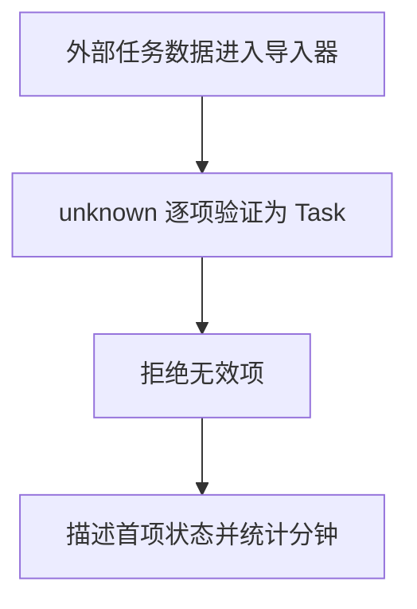

# Day 24｜结课项目（一）：模型与外部数据边界

结课项目要从一段 JSON 导入学习任务。即使文件名叫“任务数据”，里面仍可能出现 `null`、缺少 `title` 的对象、负数分钟，或者拼错的状态。程序必须先检查，检查通过后才能把它当作任务使用。

今天先建立任务模型，再把 `JSON.parse` 的结果保留为 `unknown`。你会从最外层数组开始，一层一层检查对象、字段和状态。检查结束后，再按题目选择一种汇总方式：整批数据必须全部通过，或者保留有效项并统计被拒绝的数量。

建议用时：60–90 分钟。

## 今天会学到

- 用判别联合表达待开始、进行中、已完成状态；
- 用类型谓词验证对象、嵌套状态和数组元素；
- 区分编译期类型与运行时数据；
- 比较“整批通过才导入”和“保留有效项并统计拒绝项”两种汇总策略；
- 用完整 `switch` 安全读取不同状态的字段。

## 核心讲解

```text
JSON 文本 → JSON.parse → unknown → 逐层检查 → StudyTask[]
                                  ↘ 失败原因或拒绝数量
```

先分清两件事：JSON 语法正确，只表示文本能被解析；它不表示字段符合 `StudyTask`。`type` 和 `interface` 在编译后会消失，因此不会在程序运行时替你检查文件、网络或本地存储中的内容。

一次可靠导入按下面的顺序进行：

1. `JSON.parse` 成功后，把结果放进 `parsed: unknown`。
2. 用 `Array.isArray(parsed)` 确认最外层是数组。
3. 对数组中的每一项检查：它不是 `null`，并且确实是对象。
4. 检查 `id`、`title`、`minutes` 和 `state`；其中 `minutes` 还要是有限且不小于 `0` 的数字。
5. 逐项验证后，再按当前题目的策略汇总：Example 和 practice02 只有所有元素都通过才返回 `StudyTask[]`；practice01 则保留通过的项目，并统计 `rejected`。

状态也要按实际可能出现的形状拆开：`todo` 不需要时间；`doing` 必须有 `startedAt`；`done` 必须同时有 `startedAt` 和 `completedAt`。`status` 是区分这三种对象的字段，所以正式名称叫“判别字段”，整组类型叫“判别联合”。当代码判断 `state.status === "doing"` 后，TypeScript 才知道这一分支一定能读取 `startedAt`。

## 为什么要这样设计

如果把 `JSON.parse` 的结果直接断言成 `StudyTask[]`，缺少字段、分钟为字符串甚至 `null` 的数据都会伪装成可信任务，错误要到统计或渲染时才暴露。`unknown` 先阻止代码随意读取字段，类型守卫再把运行时检查结果告诉 TypeScript，让后续代码只处理已经确认的形状。

类型守卫返回 `true`，是在承诺“当前值已经通过非空对象、字段类型、数值范围和状态结构等检查”，TypeScript 因此把它收窄为目标类型；返回 `false` 表示至少一项检查未通过，不能作出这份承诺。语言只负责根据这个布尔结果收窄类型，具体检查哪些字段、整批拒绝还是保留合法项、错误怎样说明，仍由你决定。代价是模型变化时守卫也必须同步更新，而且每次导入都会做真实的运行时检查。

## 变量与数据追踪

`text` 是原始 JSON 字符串；`parsed` 是解析后但尚未确认的 `unknown`；验证函数再让每一项得到 `true` 或 `false`。Example 和 practice02 使用整批策略：全部通过后，`result.tasks` 才是可信的 `StudyTask[]`；否则进入失败分支读取 `message`。practice01 使用部分接收策略：合法项进入 `tasks`，不合法项只增加 `rejected`。两种策略都必须先验证，之后才能安全读取 `minutes`。

## Example 实际输出

运行 `example.ts` 后，终端会按下面的顺序显示。先用代码推测结果，再逐行对照：

```text
Import succeeded: 2 tasks
First: Validate data (doing since 09:00)
Total planned minutes: 105
```

## Example 代码流程图

运行 `example.ts` 前先沿图预测执行顺序；运行后再把每个节点对应到代码行。



## 独立练习导航

本日共有 3 道独立练习。每道题都有单独目录、说明、作答文件和解题结构提示；题目之间不共享代码。

| 目录 | 场景 | 类型 |
| --- | --- | --- |
| [practice01](./practice01/README.md) | Day 24 · 结课项目（一）独立综合题 | 主任务 |
| [practice02](./practice02/README.md) | 任务导入边界 | 闭卷迁移 |
| [practice03](./practice03/README.md) | 订单 JSON 导入边界 | 综合应用 |

右击任意练习目录中的 `practice.ts` 即可单独检查；命令行也可运行 `npm run beginner -- day24 practice02`。

## 常见错误

- 写 `JSON.parse(text) as StudyTask[]`；
- 忘记 `typeof null === "object"`；
- 只检查 `Array.isArray`；
- 用 `status: string` 接受任意拼写。

### 错误代码示例

```ts
type StudyTask = {
  id: string;
  minutes: number;
  status: "todo" | "done";
};

const tasks = JSON.parse(text) as StudyTask[];
// ❌ 类型断言不会检查运行时数据；null、错误字段和错误状态都可能混进来。
console.log(tasks[0].minutes.toFixed(0));
```

### 正确写法

```ts
function isRecord(value: unknown): value is Record<string, unknown> {
  // ✅ typeof null 也是 "object"，所以必须先排除 null。
  return value !== null && typeof value === "object";
}

function isStudyTask(value: unknown): value is StudyTask {
  return (
    isRecord(value) &&
    typeof value.id === "string" &&
    typeof value.minutes === "number" &&
    Number.isFinite(value.minutes) &&
    (value.status === "todo" || value.status === "done")
  );
}

const parsed: unknown = JSON.parse(text);
// ✅ 数组外形和每一个元素都通过后，才得到可信的 StudyTask[]。
const tasks = Array.isArray(parsed) && parsed.every(isStudyTask) ? parsed : [];
```

## 面试时怎么回答

**问：** 为什么外部 JSON 要先放进 `unknown`，类型守卫又做了什么？

**答：** `JSON.parse` 成功只代表文本语法正确，不代表字段符合模型。比如 `{ "id": "a", "minutes": "20" }` 能解析，但 `minutes` 不是数字。把结果保留为 `unknown`，代码就不能直接读取字段；`isStudyTask(value): value is StudyTask` 在运行时逐项检查非空对象、`id`、`title`、有限非负的 `minutes` 和嵌套状态。它返回 `true`，是在向 TypeScript 承诺这些检查全部通过；返回 `false`，表示不能把当前值当成任务。

**容易答错或追问：** 类型谓词不是自动验证器，TypeScript 会相信你写的布尔逻辑。若守卫无条件 `return true`，类型看似安全，坏数据仍会进入程序。JSON 没有 `Date` 类型，日期字段通常以字符串传输；把响应标成 `{ createdAt: Date }` 不会自动创建 `Date`，必须验证格式并显式转换。面试官还可能问整批与部分导入：`every(isStudyTask)` 适合任一失败就拒绝，`filter(isStudyTask)` 适合保留合法项并统计拒绝数；选择哪种是业务协议，不是语言替你决定。

## 拓展思考（不要求写代码）

如果新增 `{ status: "paused"; reason: string }`，模型、运行时验证器和 `describeState` 分别会在哪些位置提醒你补充逻辑？

## 官方资料

- [Narrowing](https://www.typescriptlang.org/docs/handbook/2/narrowing.html)
- [Everyday Types](https://www.typescriptlang.org/docs/handbook/2/everyday-types.html)
- [Type Declarations](https://www.typescriptlang.org/docs/handbook/2/type-declarations.html)
