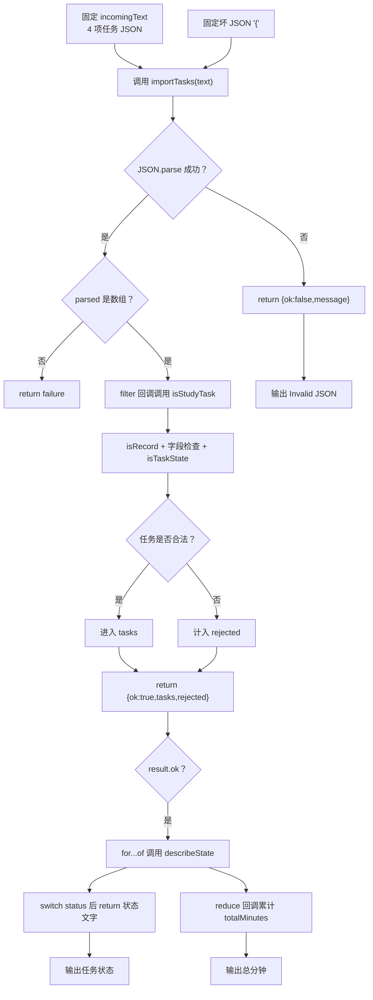

# DAY24 · Practice 01：任务 JSON 导入审查器

[返回当天课程](../README.md)

## 文件位置

- 作答文件：[practice.ts](../../../day24/practice01/practice.ts)
- 完整参考答案：[solution.ts](../../../day24/practice01/solution.ts)
- 答案调用说明：[SOLUTION.md](./SOLUTION.md)

这是一道完整、独立的主练习。不要导入其他 practice 文件夹中的代码。

## 场景背景

学习计划平台允许用户从外部文件导入任务，因此入口收到的只是未经信任的 JSON 文本，其中可能有语法错误、错误字段类型或互相矛盾的嵌套状态。若只相信 TypeScript 类型声明而不做运行时验证，坏数据会污染任务面板和分钟统计。你需要产出可信任务、拒绝数量、状态说明与总计划时间，并为无法解析的文本返回明确失败信息。

## 数据流

先沿变量名看数据怎样分叉和汇合；`──>` 表示值被交给下一步。

```text
incomingText
   └── importTasks ──> JSON.parse ──> parsed: unknown
                                └── 数组每一项 ──> isStudyTask
                                                     ├── isRecord
                                                     └── isTaskState
合法项 ──> tasks ──> describeState / 分钟合计
非法项 ──> rejected
坏 JSON ──> message
```


## 代码流程图

下面这张图按实际执行顺序展开；菱形是判断，箭头上的文字表示走哪条分支。



## 起始代码

以下代码提前给出固定数据、函数签名、调用位置和输出位置。代码可作为完整脚手架阅读；判断、循环、回调与 `return` 的正确实现仍留在 TODO 中。

```ts
type TaskState =
  | { status: "todo" }
  | { status: "doing"; startedAt: string }
  | { status: "done"; startedAt: string; completedAt: string };
type StudyTask = {
  readonly id: string;
  title: string;
  minutes: number;
  state: TaskState;
};
type ImportResult =
  | { ok: true; tasks: StudyTask[]; rejected: number }
  | { ok: false; message: string };

function isRecord(value: unknown): value is Record<string, unknown> {
  // TODO：判断 null 与 object，并 return。
  void value;
  return false;
}
function isTaskState(value: unknown): value is TaskState {
  // TODO：按 status 检查各分支，并 return。
  void value;
  return false;
}
function isStudyTask(value: unknown): value is StudyTask {
  // TODO：检查字段，并把 state 交给 isTaskState。
  void value;
  return false;
}
function importTasks(text: string): ImportResult {
  // TODO：parse、数组判断、filter，并 return 成功或失败。
  void text;
  return { ok: false, message: "" };
}
function describeState(state: TaskState): string {
  // TODO：switch status 并 return 描述。
  void state;
  return "";
}

const incomingText = JSON.stringify([
  { id: "a", title: "Plan", minutes: 30, state: { status: "todo" } },
  { id: "b", title: "Practice", minutes: 45, state: { status: "doing", startedAt: "09:00" } },
  { id: "c", title: "Review", minutes: 30, state: { status: "done", startedAt: "10:00", completedAt: "10:30" } },
  { id: "d", title: "Broken", minutes: "20", state: { status: "todo" } },
]);
const result = importTasks(incomingText);
if (result.ok) {
  console.log(`Import succeeded: ${result.tasks.length} tasks`);
  console.log(`Rejected: ${result.rejected}`);
  for (const task of result.tasks) {
    console.log(`${task.title}: ${describeState(task.state)}`);
  }
  // TODO：用 reduce 回调求 totalMinutes。
  const totalMinutes = 0;
  console.log(`Total planned minutes: ${totalMinutes}`);
}
const invalidJson = importTasks("{");
if (!invalidJson.ok) console.log(`Invalid JSON: ${invalidJson.message}`);
```


## 任务要求

1. 声明 `TaskState`、`StudyTask` 和部分成功/失败两分支的 `ImportResult`。
2. 组合 `isRecord`、`isTaskState`、`isStudyTask`，逐字段验证外部数据。
3. `importTasks` 捕获坏 JSON；合法数组用 `filter` 保留好任务，并计算 `rejected`。
4. 成功分支循环显示状态并用 `reduce` 汇总分钟；坏 JSON 输出指定消息。

## 精确期望输出

```text
Import succeeded: 3 tasks
Rejected: 1
Plan: todo
Practice: doing since 09:00
Review: done at 10:30
Total planned minutes: 105
Invalid JSON: JSON format is invalid
```

## 要完成的功能

在 `practice.ts` 中从零完成“任务 JSON 导入器”。

先在文件顶层**分别声明**下面三个类型：

```ts
type TaskState =
  | { status: "todo" }
  | { status: "doing"; startedAt: string }
  | {
      status: "done";
      startedAt: string;
      completedAt: string;
    };

type StudyTask = {
  readonly id: string;
  title: string;
  minutes: number;
  state: TaskState;
};

type ImportResult =
  | {
      ok: true;
      tasks: StudyTask[];
      rejected: number;
    }
  | {
      ok: false;
      message: string;
    };
```

- `TaskState` 是状态类型：`status` 决定当前对象还能读取哪些时间字段。
- `StudyTask` 是任务类型：`state` 字段必须使用刚才声明的 `TaskState`。
- `ImportResult` 是函数返回对象的类型：成功对象有 `tasks` 和 `rejected`，失败对象有 `message`。

把这些对象结构直接写进变量或函数签名，在 TypeScript 中可能仍然合法，但不符合本题“声明并复用三个命名类型”的结构练习。

接着实现五个函数：

1. 类型守卫函数 `isRecord(value: unknown): value is Record<string, unknown>`：判断未知值能否作为普通对象读取字段。
2. 类型守卫函数 `isTaskState(value: unknown): value is TaskState`：分别验证 todo、doing、done 三个分支及其时间字段。
3. 类型守卫函数 `isStudyTask(value: unknown): value is StudyTask`：验证 `id`、`title`、非负有限数字 `minutes`，并把 `state` 交给 `isTaskState`。
4. 函数 `importTasks(text: string): ImportResult`：
   - 捕获无法解析的 JSON，返回含 `message` 的失败对象；
   - 顶层不是数组时也返回失败对象；
   - 顶层是数组时保留通过 `isStudyTask` 的元素，并把坏数据数量放进成功对象的 `rejected` 字段。
5. 函数 `describeState(state: TaskState): string`：用 `switch` 返回 `todo`、`doing since 时间` 或 `done at 时间`。

可以先用下面的签名确定“谁接收什么、返回什么”，函数体仍由你完成：

```ts
function isTaskState(
  value: unknown,
): value is TaskState {
  // TODO：验证三个状态分支。
}

function importTasks(
  text: string,
): ImportResult {
  // TODO：解析、验证和汇总。
}

function describeState(
  state: TaskState,
): string {
  // TODO：根据 state.status 生成文字。
}
```

最后声明这些变量：

- `incomingText`：包含 Plan（todo，30）、Practice（doing since 09:00，45）、Review（done at 10:30，30），以及一条 `minutes: "20"` 的坏数据。
- `result`：保存 `importTasks(incomingText)` 的返回对象。
- `invalidJson`：保存 `importTasks("{")` 的返回对象，用来测试坏 JSON。

精确输出：

```text
Import succeeded: 3 tasks
Rejected: 1
Plan: todo
Practice: doing since 09:00
Review: done at 10:30
Total planned minutes: 105
Invalid JSON: JSON format is invalid
```

限制：不使用 `any`、非空断言 `!` 或未经验证的类型断言；不能只检查数组外壳，嵌套 `state` 也要逐字段验证。

完成标准：右击运行 `practice.ts` 后输出完全一致；能解释为什么类型声明不能验证 JSON，以及判别联合如何避免矛盾状态。

## 本题易漏语法

守卫返回类型写 value is Task；只有返回 true 的路径后才能把 unknown 当 Task。

## 写完后自检

- 给 `done` 状态删掉 `completedAt`，或把顶层 JSON 改成对象而不是数组时，结果应该进入哪条失败路线？
- 为什么 `JSON.parse(text) as StudyTask[]` 不能代替 `isStudyTask` 的逐字段检查？
- 如果以后增加 `cancelled` 状态，哪些类型、守卫和描述分支必须一起修改，才能避免静默遗漏？

## 文件

- 在 `practice.ts` 中独立作答。
- 独立完成后，再查看完整的 `solution.ts`，并用 `SOLUTION.md` 对照直接调用逻辑。
