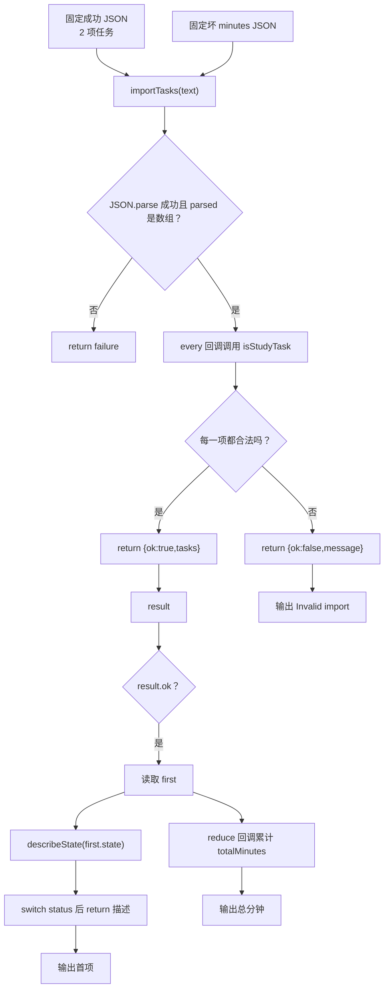

# DAY24 · Practice 02：任务导入边界

[返回当天课程](../README.md)

## 文件位置

- 作答文件：[practice.ts](../../../day24/practice02/practice.ts)
- 完整参考答案：[solution.ts](../../../day24/practice02/solution.ts)
- 答案调用说明：[SOLUTION.md](./SOLUTION.md)

这题采用“整批通过或整批拒绝”的导入协议。成功批次用于报表，另一个字段类型错误的批次用来确认失败边界。

## 场景背景

学习平台正在把旧存储中的任务迁移到新面板，导入层收到的是类型未知的外部数组，数组项可能缺字段或带有不合法状态。若无效项混入业务模型，首项状态展示和总分钟数都会失真。你需要只接纳通过逐字段验证的任务，并交付成功数量、第一项描述和可信的计划时长。

## 数据流

先沿变量名看数据怎样分叉和汇合；`──>` 表示值被交给下一步。

```text
text ──> importTasks ──> parsed: unknown
                         └── every(isStudyTask)
                                ├── isRecord
                                └── isTaskState
全部合法 ──> result.tasks ──> describeState + minutes 合计
任一非法/坏 JSON ──> result.message
```


## 代码流程图

下面这张图按实际执行顺序展开；菱形是判断，箭头上的文字表示走哪条分支。



## 起始代码

以下代码提前给出固定数据、函数签名、调用位置和输出位置。代码可作为完整脚手架阅读；判断、循环、回调与 `return` 的正确实现仍留在 TODO 中。

```ts
type TaskState =
  | { status: "todo" }
  | { status: "doing"; startedAt: string }
  | { status: "done"; startedAt: string; completedAt: string };
type StudyTask = {
  readonly id: string;
  title: string;
  minutes: number;
  state: TaskState;
};
type ImportResult =
  | { ok: true; tasks: StudyTask[] }
  | { ok: false; message: string };

function isRecord(value: unknown): value is Record<string, unknown> {
  // TODO：return 对象检查结果。
  void value;
  return false;
}
function isTaskState(value: unknown): value is TaskState {
  // TODO：判断 todo/doing/done。
  void value;
  return false;
}
function isStudyTask(value: unknown): value is StudyTask {
  // TODO：检查全部字段。
  void value;
  return false;
}
function importTasks(text: string): ImportResult {
  // TODO：解析，并用 every 进行整批验证后 return。
  void text;
  return { ok: false, message: "" };
}
function describeState(state: TaskState): string {
  // TODO：switch 并 return。
  void state;
  return "";
}
const text = JSON.stringify([
  { id: "ts-24", title: "Validate data", minutes: 45, state: { status: "doing", startedAt: "09:00" } },
  { id: "ts-25", title: "Build report", minutes: 60, state: { status: "todo" } },
]);
const result = importTasks(text);
if (result.ok) {
  const first = result.tasks[0];
  // TODO：reduce 得到 totalMinutes。
  const totalMinutes = 0;
  console.log(`Import succeeded: ${result.tasks.length} tasks`);
  console.log(first ? `First: ${first.title} (${describeState(first.state)})` : "First: none");
  console.log(`Total planned minutes: ${totalMinutes}`);
}
const invalidText = JSON.stringify([
  { id: "broken", title: "Broken", minutes: "45", state: { status: "todo" } },
]);
const invalidResult = importTasks(invalidText);
if (!invalidResult.ok) console.log(`Invalid import: ${invalidResult.message}`);
```

## 和 Practice 01 的区别

Practice 01 允许部分成功：保留合法任务，并用 `rejected` 记录坏项。本题用于迁移事务，任何一项不合法都让整批失败；除了成功批次，还必须运行一份坏 `minutes` 批次，控制流会进入 `ImportResult` 的 failure 分支。

## 任务要求

1. 声明 `TaskState`、`StudyTask` 与成功/失败两分支的 `ImportResult`；`doing`、`done` 必须携带各自需要的时间字段。
2. 实现 `isRecord`、`isTaskState`、`isStudyTask`，逐层验证对象、字段类型、有限非负分钟数和嵌套状态。
3. `importTasks(text)` 先捕获 JSON 语法错误，再要求顶层数组中的每一项都合法；任一项失败就返回失败结果。
4. `describeState` 根据 `status` 读取该分支才有的字段。固定数据为 `Validate data / 45 / doing since 09:00` 与 `Build report / 60 / todo`。
5. 成功后安全读取第一项，并从已验证任务中计算总分钟；不要在验证前断言成 `StudyTask[]`。
6. 再导入一批 `minutes: "45"` 的数据，输出消息为 `Task data is invalid` 的失败结果。

- 不得导入 `practice01` 或直接调用其他练习的实现。
- 输出必须由变量、计算或函数返回值产生，不把整行结果写死。
- 每个参数、局部变量和返回值都应能在流程图中找到位置。

> **先看清输出标点：** 本题的输出是英文，所以 `(doing since 09:00)` 使用英文半角括号，标签后的 `:` 也是英文半角冒号。代码语法里的函数括号同样使用英文半角 `()`。运行器不会因显示文字中的括号或冒号全半角差异判你失败，但其他文字、数字和顺序仍要一致。

## 精确期望输出

```text
Import succeeded: 2 tasks
First: Validate data (doing since 09:00)
Total planned minutes: 105
Invalid import: Task data is invalid
```

## 写完后自检

- 把第二项的 `minutes` 改成 `-1`，或者把输入改成合法空数组 `[]` 时，程序分别应该返回什么？
- 为什么本题选择“任一坏项则整体失败”，而 Practice 01 选择“保留好项并统计 rejected”？这两种策略各适合什么导入场景？
- `switch (state.status)` 后为什么能读取 `startedAt`，在分支外却不能直接读取？

## 文件

在上方链接的 `practice.ts` 作答；独立完成后再查看完整的 `solution.ts`，并用 `SOLUTION.md` 对照直接调用逻辑。
