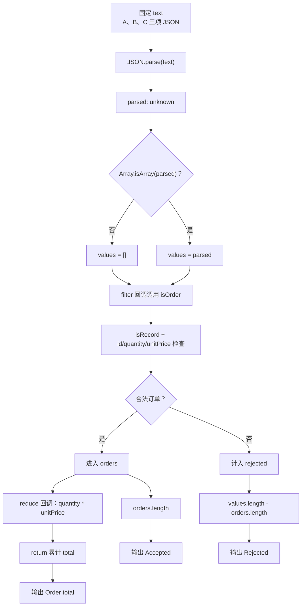

# DAY24 · Practice 03：订单 JSON 导入边界

[返回当天课程](../README.md)

## 文件位置

- 作答文件：[practice.ts](../../../day24/practice03/practice.ts)
- 完整参考答案：[solution.ts](../../../day24/practice03/solution.ts)
- 答案调用说明：[SOLUTION.md](./SOLUTION.md)

从 unknown JSON 中筛出合法订单并统计金额，拒绝字段类型错误的数据。

## 场景背景

电商运营每天会导入合作方提供的订单 JSON，入口数据可能包含正确订单，也可能把金额或其他字段写成错误类型。若错误订单进入统计，财务报表的订单量和收入都会被放大或缩小。你需要筛出合法订单，并给运营返回接受数、拒绝数和可以入账的总金额。

## 数据流

先沿变量名看数据怎样分叉和汇合；`──>` 表示值被交给下一步。

```text
订单 JSON 文本 ──> JSON.parse ──> parsed: unknown
                                      └── 数组 values
                                             ├── filter(isOrder) ──> orders
                                             │                        └── reduce ──> total
                                             └── values.length - orders.length ──> rejected
orders.length + rejected + total ──> 导入报告
```


## 代码流程图

下面这张图按实际执行顺序展开；菱形是判断，箭头上的文字表示走哪条分支。



## 起始代码

以下代码提前给出固定数据、函数签名、调用位置和输出位置。代码可作为完整脚手架阅读；判断、循环、回调与 `return` 的正确实现仍留在 TODO 中。

```ts
type Order = { readonly id: string; quantity: number; unitPrice: number };
function isRecord(value: unknown): value is Record<string, unknown> {
  // TODO：检查对象并 return。
  void value;
  return false;
}
function isOrder(value: unknown): value is Order {
  // TODO：检查 id、正 quantity、有限非负 unitPrice，并 return。
  void value;
  return false;
}
const text = JSON.stringify([
  { id: "A", quantity: 2, unitPrice: 30 },
  { id: "B", quantity: 1, unitPrice: 100 },
  { id: "C", quantity: "2", unitPrice: 20 },
]);
const parsed: unknown = JSON.parse(text);
const values: unknown[] = Array.isArray(parsed) ? parsed : [];
// TODO：filter 回调得到 orders；reduce 回调得到 total。
const orders: Order[] = [];
const total = 0;
console.log(`Accepted orders: ${orders.length}`);
console.log(`Rejected orders: ${values.length - orders.length}`);
console.log(`Order total: ${total}`);
```

## 任务要求

- 声明 `Order`，包含只读字符串 `id`、大于 `0` 的数字 `quantity` 和有限且不小于 `0` 的数字 `unitPrice`。
- 实现 `isRecord` 与 `isOrder`。JSON 解析结果先保留为 `unknown`，确认顶层为数组后再用守卫筛选。
- 固定订单为 A（2 × 30）、B（1 × 100）和数量写成字符串的 C；只有 A、B 能进入 `orders`。
- 从通过验证的订单计算总额，并用原始项数与合法项数之差计算拒绝数。
- 不得导入其他 practice 文件夹。
- 计算必须来自参数和局部变量；函数用 return 交付结果。
- 保持原数据不变，并按流程图处理边界或状态。

## 精确期望输出

```text
Accepted orders: 2
Rejected orders: 1
Order total: 160
```

## 写完后自检

- 如果新增 `{ id: "D", quantity: 1, unitPrice: Number.NaN }`，它会被接受还是拒绝？你的检查依据是什么？
- 为什么要先把解析结果保留为 `unknown`，而不是直接声明成 `Order[]`？
- 本题用 `filter(isOrder)` 跳过坏项。如果这是支付扣款接口，你是否仍会选“部分接受”，还是让整批失败？说明你的选择。

## 文件

在上方链接的 `practice.ts` 作答；完成后再查看完整的 `solution.ts`，并用 `SOLUTION.md` 对照直接调用逻辑。
