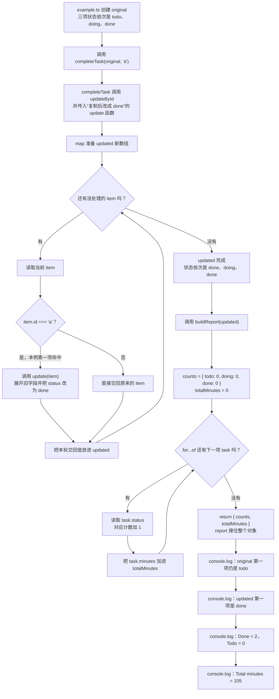

# Day 25｜结课项目（二）：业务逻辑、不可变更新与模块

昨天导入了可信任务。今天要把任务 `a` 从 `todo` 改成 `done`，同时保留修改前的数据：`original` 中的任务仍是 `todo`，`updated` 中对应任务才是 `done`。这样旧页面、历史记录或其他调用者不会被一次更新偷偷改掉。

你会从空文件实现更新、筛选、排序和统计。示例用多个模块展示代码怎样分工；独立练习只写一个入口文件，先把“旧值不能变、新值怎样产生”练清楚。

建议用时：60–90 分钟。

## 今天会学到

- 用 `map` 和对象展开替换一个任务，不修改旧数据；
- 区分新数组、新对象与复用的旧引用；
- 避免 `sort` 原地修改调用者数组；
- 用 `Record` 保证每种状态都有统计位置；
- 用受约束泛型保留实体的具体类型。

## 核心讲解

### `map` 这一行到底发生了什么

假设 `original` 有三个任务：`a/todo`、`b/doing`、`c/done`。调用 `completeTask(original, "a")` 后，`map` 依次查看每一项：

1. 看到任务 `a`，id 命中，于是用对象展开创建一个新对象，并把新对象的状态改成 `done`。
2. 看到任务 `b` 和 `c`，id 没命中，直接返回原来的对象。
3. `map` 把三次返回值装进一个新数组 `updated`。

| 比较 | 结果 | 原因 |
| --- | --- | --- |
| `original === updated` | `false` | `map` 创建了新数组 |
| `original[0] === updated[0]` | `false` | 命中的任务创建了新对象 |
| `original[1] === updated[1]` | `true` | 没变化的任务复用了旧对象 |

这就是“不可变更新”：不改原值，另外创建能表示新状态的值。对象展开只复制当前这一层。如果任务里还有可修改的 `details.notes`，只复制任务对象仍会共享内部的 `details` 和 `notes`。

### 排序与统计

`sort` 会直接改变调用它的数组顺序。参数如果是调用者传进来的原数组，应先复制、`filter` 或 `map` 得到新数组，再排序。`Record<TaskStatus, number>` 要求 `todo`、`doing`、`done` 每个状态都有一个数字位置；以后新增状态时，TypeScript 会提醒你补上对应统计。

### 泛型在这里保留什么

`T extends { readonly id: string }` 可以拆成两句：`T` 可以是任务、商品或其他对象；但它至少要有只读字符串 `id`。函数接收 `T[]`，更新回调也处理 `T`，最后仍返回 `T[]`，所以任务自己的 `title`、`minutes` 等字段不会因为经过通用函数而丢失。

## 为什么要这样设计

同一个任务对象可能同时被页面、缓存和历史记录引用。若业务函数直接改 `status` 或在原数组上 `sort`，所有引用都会看到变化，调用者也很难知道数据是在什么时候被改掉的。不可变更新用新数组表示新版本，使修改前后的值可以同时存在并比较。

`map` 负责逐项收集返回值并创建新数组，对象展开负责复制当前对象这一层，泛型则保留调用者原有的字段类型；你仍要决定哪一个 id 命中、哪些字段改变、是否需要深层复制，以及排序规则。代价是会创建额外数组和目标对象，而且对象展开只是浅复制：嵌套对象若也会修改，必须继续复制相应层级。

## 函数变量追踪

示例中的值按这条路线移动：`original` 和目标 id `"a"` 进入 `completeTask`；`map` 产生 `updated`；`updated` 再进入 `buildReport`；统计结果由 `report` 接住。最后同时打印 `original[0].status` 和 `updated[0].status`，你可以直接确认旧值是 `todo`，新值是 `done`。

给每一步结果取新名称，不只是写法偏好。它让你能在同一处比较更新前后，也能看出下一个函数拿到的是哪一版数据。

## Example 实际输出

运行 `example.ts` 后，终端会按下面的顺序显示。先用代码推测结果，再逐行对照：

```text
Original first status: todo
Updated first status: done
Done: 2
Todo: 0
Total minutes: 105
```

## Example 代码流程图

运行 `example.ts` 前先沿图预测执行顺序；运行后再把每个节点对应到代码行。



## 官方手册扩展阅读（可选）

完成当天教程后，如果还想加深理解，再到 [Day 25 官方手册索引](../OFFICIAL-READING.md#day-25) 只选 1 篇阅读；这不是开始练习前的必修内容。

## 独立练习导航

本日共有 3 道独立练习。每道题都有单独目录、题目说明、作答文件、完整参考答案和调用逻辑说明；题目之间不共享代码。

| 目录 | 场景 | 类型 |
| --- | --- | --- |
| [practice01](./practice01/README.md) | 学习任务快照更新 | 主任务 |
| [practice02](./practice02/README.md) | 任务更新与统计 | 闭卷迁移 |
| [practice03](./practice03/README.md) | 库存不可变更新 | 综合应用 |

右击任意练习目录中的 `practice.ts` 即可单独检查；命令行也可运行 `npm run beginner -- day25 practice02`。

## 常见错误

- 直接写 `task.status = "done"`；
- 对参数数组直接 `sort`；
- 误以为对象展开会深复制；
- 用任意字符串键统计状态。

### 错误代码示例

课程看板把同一批任务同时交给“当前列表”和“操作历史”。下面这种写法看起来已经复制了数组，但目标任务对象和嵌套字段仍然与原数据共享：

```ts
type BoardTask = {
  readonly id: string;
  title: string;
  minutes: number;
  status: "todo" | "done";
  details: {
    labels: string[];
  };
};

function completeForBoard(tasks: BoardTask[], id: string): BoardTask[] {
  // ❌ 这里只复制了数组，数组里的任务对象仍与调用者共享。
  const copied = [...tasks];
  const target = copied.find((task) => task.id === id);

  if (target) {
    target.status = "done";
    target.details.labels.push("completed");
  }

  return copied.sort((a, b) => a.minutes - b.minutes);
}

const history: BoardTask[] = [
  {
    id: "a",
    title: "Types",
    minutes: 30,
    status: "todo",
    details: { labels: ["beginner"] },
  },
];

const board = completeForBoard(history, "a");
console.log(history[0]?.status);
console.log(history[0]?.details.labels.join(", "));
```

实际输出：

```text
done
beginner, completed
```

`copied` 确实是新数组，但里面仍放着原来的任务对象；对象内部的 `details` 和 `labels` 也没有复制。于是“历史记录”一起变成已完成。另一个常见问题是直接对函数参数调用 `tasks.sort(...)`：`sort` 会修改原数组顺序，其他页面会在没有执行更新操作的情况下突然重排。

### 正确写法

```ts
function completeForBoard(
  tasks: readonly BoardTask[],
  id: string,
): BoardTask[] {
  const updated = tasks.map((task) =>
    task.id === id
      ? {
          ...task,
          status: "done" as const,
          details: {
            ...task.details,
            labels: [...task.details.labels, "completed"],
          },
        }
      : task,
  );

  // ✅ map 已创建新数组，sort 只会重排 updated，不会重排参数 tasks。
  return updated.sort((a, b) => a.minutes - b.minutes);
}
```

这里一共复制了四层：数组、命中的任务、它的 `details`、要修改的 `labels`。未命中的任务没有变化，可以继续复用旧引用。需要复制哪些层，不取决于对象有多深，而取决于这次更新会改到哪一条引用链。

## 面试时怎么回答

**问：** TypeScript 的结构化类型和不可变更新有什么关系？

**可以直接这样回答：**

TypeScript 使用结构化类型，兼容性主要看成员是否匹配，不要求对象声明过同一个类型名称。因此 `updateById<T extends { readonly id: string }>` 可以处理任务或商品，只要值至少有字符串 `id`；返回 `T[]` 又能保留各自的其他字段。不可变更新属于运行时的数据更新策略：`map` 创建新数组，命中项用对象展开创建新对象，未变化项可以复用旧引用。

`readonly` 主要在类型检查阶段阻止写操作，不会执行 `Object.freeze`。对象展开也是浅复制；如果要改 `details.labels`，需要继续复制 `details` 和 `labels`。`Array.prototype.sort` 会原地修改调用它的数组，所以我只在已经复制、筛选或映射得到的新数组上排序。这样调用者持有的旧快照和顺序都不会被业务函数偷偷改变。

官方参考：[TypeScript Type Compatibility](https://www.typescriptlang.org/docs/handbook/type-compatibility)、[TypeScript Generics](https://www.typescriptlang.org/docs/handbook/2/generics.html)、[MDN `Array.prototype.sort`](https://developer.mozilla.org/en-US/docs/Web/JavaScript/Reference/Global_Objects/Array/sort)

## 拓展思考（不要求写代码）

如果任务新增可修改的 `details: { notes: string[] }`，更新其中一条 notes 时需要复制哪几层，才能保证旧任务完全不变？
